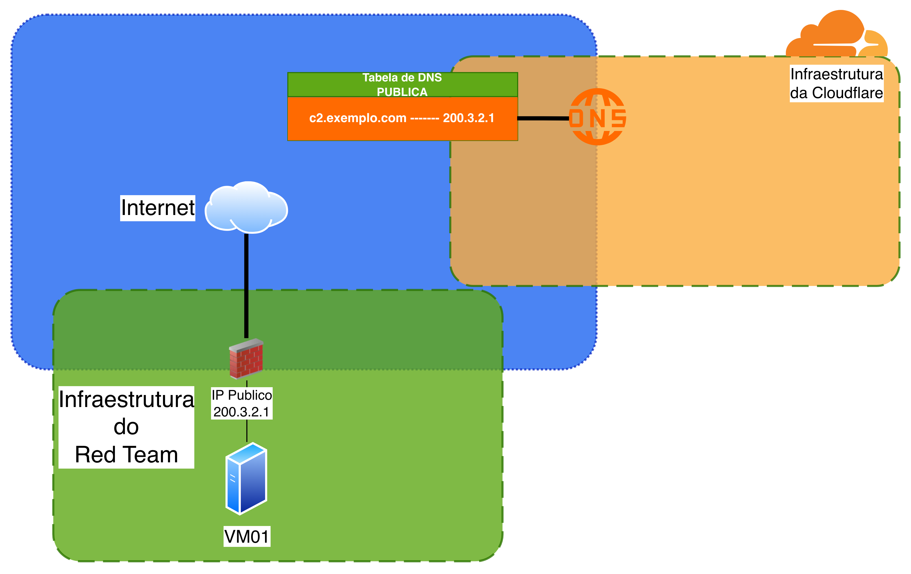
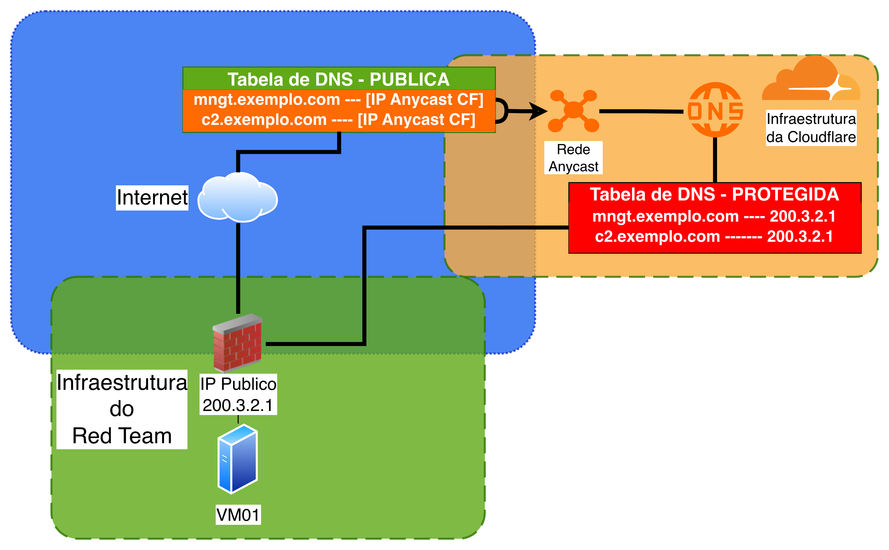
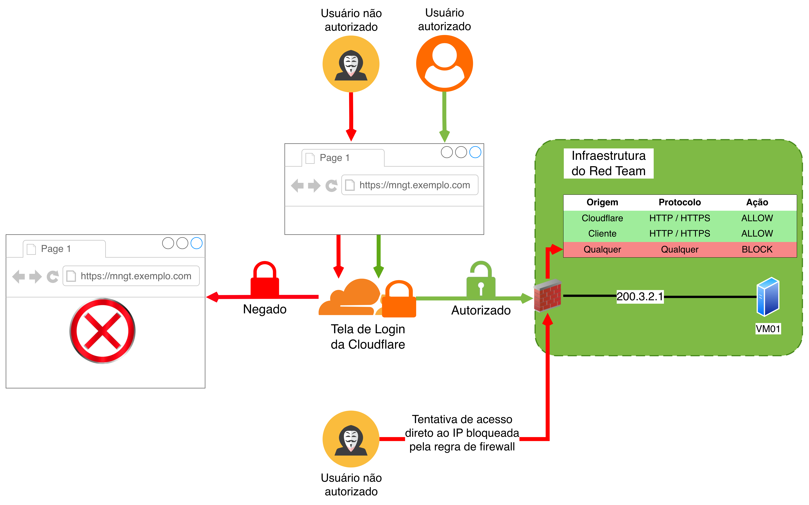

import Tabs from '@theme/Tabs';
import TabItem from '@theme/TabItem';

Durante minha jornada no Blue Team, "ZeroTrust", e como vários gestores e palestrantes gostavam de chamar, "A Morte da VPN", eram temas centrais no cotidiano do *chão da fábrica*, em vários momentos, era necessário pensar qual feature, dentre as várias que ferramentas como Cloudflare e ZScaler oferecem, podem servir para solucionar nossos problemas e desafios.

<!-- truncate -->

# Minha experiência com arquiteturas Zero Trust

Pode-se dizer que eu tive o privilégio de pegar a crista da onda dessa época, naquele momento, todos ainda estavam aprendendo como o modelo Zero Trust que estava vindo para revolucionar a arquitetura tradicional, porém ultrapassada, de "castle and moat" (VPN). Repensar a forma que nossos usuários acessam as coisas durante seu dia a dia de trabalho, era uma atividade intelectualmente complicada. Foi necessário que eu buscasse a teoria fundamental por trás da necessidade dessas tecnologias e depois me preocupasse com a parte prática da coisa.

Os projetos que participei desse ponto em diante foram fáceis do ponto de vista técnico pois eu possuía uma base sólida, e isso me deu bagagem para olhar para diferentes cenários e conseguir aplicar os mesmos princípios mesmo sem ninguém citar nada sobre esse tipo de arquitetura explicitamente.

# Infraestrutura de Red Team e o Zero Trust

Apesar do tema ser mais comumente associado a profissionais de defesa, os mesmos conceitos podem ser aplicados ao se pensar em infraestrutura de Red Team.

Quando pensamos em operações ofensivas, especialmente em cenários mais realistas, alguns requisitos começam a surgir:
- Reduzir ao máximo a superfície de exposição;
- Evitar identificação trivial da infraestrutura;
- Controlar rigorosamente quem pode acessar componentes críticos;
- Simular comportamentos modernos de aplicações e ambientes corporativos;
- **Simular comportamentos de atacantes sofisticados**;

:::warning[Sobre a infraestrutura de atacantes sofisticados]

Acredito que seja de conhecimento comum que o cenário clássico, onde o domínio controlado pelo atacante é algo como an00n.h4ck3r.xyz, sem TLS, com certificado inválido, gerando alertas em antivírus e aparecendo imediatamente como IoC **já está completamente defasado**.

Infraestruturas modernas de ataque evoluíram junto com os mecanismos de defesa. Isso muda completamente o jogo: a detecção passa a depender muito mais de comportamento do que de indicadores estáticos.

:::

Portanto, ter uma infraestrutura robusta não só deixa o time mais seguro, como também torna o teste significativamente mais realista.

Curiosamente, esses objetivos se alinham quase perfeitamente com os princípios de Zero Trust. Ao invés de confiar na rede, no IP de origem ou no fato de um serviço estar “dentro” da infraestrutura, o modelo Zero Trust parte do princípio de que:
- Nada é confiável por padrão;
- Todo acesso deve ser autenticado e autorizado;
- A exposição deve ser mínima e controlada;
- Maioria dos serviços (principalmente cloud) já nascem expostos;

Quando aplicamos isso ao contexto de Red Team, a mudança de mentalidade é imediata. Serviços que tradicionalmente ficariam expostos, como painéis administrativos, SSH ou interfaces de gerenciamento, passam a ser protegidos por camadas de autenticação forte. Ao mesmo tempo, apenas os componentes que realmente precisam ser acessíveis externamente (como endpoints de callback para SSRF ou OAST) permanecem visíveis.

Essa separação cria uma arquitetura mais limpa pois teremos a **superfície pública controlada** onde será exposto apenas o necessário para interação com o alvo do teste, e também a **superfície privada protegida**, onde o acesso será restrito, autenticado e auditável.

Então para concluir aqui, como ficaria do ponto de vista técnico:
- Temos um asset (pode ser um EC2, VPS, tanto faz) que temos a necessidade de expor para nossos testes OAST;
- Essa exposição será controlada para que seja o mais segura possível à nível de rede (não estou falando de hardening de SO);
- Esse mesmo asset precisa ser administrado, porém diferente do objetivo anterior, não existe a necessidade de que ele esteja exposto no mesmo nível.

Foi exatamente com esse objetivo que montei o ambiente descrito neste post. A ideia não era apenas “fazer funcionar”, mas sim construir algo que:
- fosse seguro o suficiente para não virar alvo trivial na internet;
- fosse realista o suficiente para simular infraestrutura moderna de atacante;
- e simples o suficiente para ser reproduzido sem grande complexidade operacional;

Para isso, utilizei o Cloudflare como peça central da arquitetura, explorando três componentes principais:
- DNS (gestão de domínio e resolução);
- Proxy/WAF (controle de exposição);
- Zero Trust (autenticação e controle de acesso);

No próximo passo, vou mostrar como essa arquitetura foi construída na prática, desde a configuração dos domínios até a integração com o servidor OAST.

# Visão geral da arquitetura inicial

Para entender como cheguei ao cenário final, primeiro vamos partir de uma estrutura genérica e simplificada da infraestrutura e dos recursos disponíveis.

A situação é bem direta: temos um servidor contratado em algum provedor (Cloud, on-premises, tanto faz), com:
- Um IP público exposto para internet;
- DNS configurado na Cloudflare apontando diretamente para esse IP público;
- Um firewall de borda;
- Total controle sobre os serviços que rodam nesse host;

:::note

Observe que a função da Cloudflare nesse momento é apenas *expor o DNS para o mundo* e avisar todos que tentarem acessar `c2.exemplo.com` que o IP associado ao domínio é o `200.3.2.1`.

:::

Nesse cenário, existe um ponto importante que muitas vezes passa despercebido:
> **O domínio `c2.exemplo.com` resolve diretamente para o IP público da VPS.**

Ou seja, qualquer pessoa consegue facilmente resolver o domínio, descobrir o IP real da infraestrutura e interagir diretamente com o servidor. Isso significa que controles mais superficiais, como regras básicas de firewall ou obscuridade de serviços, podem ser contornados com relativa facilidade. Além disso, qualquer porta exposta passa a ser imediatamente um alvo para scanners automatizados e tentativas de exploração. Em outras palavras, um ataque direto é totalmente viável, já que não existe nenhum componente intermediário protegendo ou abstraindo o IP da VPS nesse cenário.

# Inserindo Cloudflare na arquitetura
Como já foi mencionado anteriormente, a base dessa arquitetura será o uso do Cloudflare.

De forma simplificada, a Cloudflare passa a atuar como uma camada intermediária entre o usuário e a infraestrutura real. Ao invés de o cliente se comunicar diretamente com a VPS, toda a interação passa primeiro pela rede da Cloudflare, que então decide como e quando encaminhar esse tráfego para o servidor de origem. Dentro desse modelo, três componentes principais entram em jogo: a rede Anycast (CDN), o proxy reverso com capacidades de WAF e o mecanismo de Zero Trust Access.

## CDN / Rede Anycast
A Cloudflare opera uma rede global distribuída baseada em Anycast, e esse é um dos pontos mais importantes para entender a mudança de comportamento da arquitetura.

Na prática, quando um usuário acessa `c2.exemplo.com`, ele não recebe mais como resposta o IP real da VPS. Em vez disso, o DNS retorna um IP pertencente à rede anycast da própria Cloudflare. É como se a Cloudflare anunciasse para a internet que aquele domínio “vive” dentro da sua infraestrutura.

A partir desse momento, todo o tráfego do usuário é direcionado para um ponto de presença (PoP) da Cloudflare, normalmente o mais próximo geograficamente. E é aí que acontece a mágica: a Cloudflare mantém internamente a relação real entre o domínio e o IP de origem. Ou seja, apenas ela sabe para onde encaminhar aquele tráfego.

Para o usuário externo, o servidor real deixa de existir diretamente. Já para a Cloudflare, a VPS continua acessível e funcional. Esse desacoplamento é fundamental, pois permite esconder o IP da VPS, reduzir a superfície de exposição e introduzir camadas adicionais de controle antes que qualquer requisição chegue de fato ao servidor.

## Proxy Reverso / WAF
Além da resolução DNS e da rede Anycast, outro componente fundamental dessa arquitetura é o funcionamento da Cloudflare como proxy reverso, geralmente combinado com capacidades de WAF (Web Application Firewall).

Quando o proxy está ativado (o famoso botão “laranja” no painel DNS), a Cloudflare deixa de atuar apenas como resolvedor de DNS e passa a efetivamente intermediar toda a comunicação HTTP/HTTPS entre o cliente e o servidor de origem. Na prática, isso significa que nenhuma requisição chega diretamente à VPS e toda interação passa primeiro pela Cloudflare, que pode, inspecionar o tráfego, aplicar regras de bloqueio, filtrar padrões conhecidos de ataque e decidir se aquela requisição deve ou não ser encaminhada ao backend.

Antes, qualquer requisição enviada ao IP público do servidor chegava diretamente ao serviço. Agora, existe uma camada intermediária com capacidade de controle, inspeção e mitigação. Isso não apenas aumenta a segurança, mas também dá ao operador da infraestrutura um nível muito maior de visibilidade e governança sobre o tráfego.

Outro ponto importante é que, ao utilizar o proxy da Cloudflare, o servidor passa a receber requisições originadas dos IPs da própria Cloudflare, e não do cliente final. Isso permite implementar uma estratégia bastante comum nesse tipo de arquitetura:

> **Bloquear todo o tráfego direto na VPS e permitir apenas conexões vindas da Cloudflare.**

Com isso, mesmo que alguém descubra o IP real do servidor, não será capaz de interagir com ele diretamente, pois qualquer tentativa de conexão fora da rede da Cloudflare será bloqueada pelo firewall. No contexto de Red Team, isso traz dois benefícios claros.

Primeiro, reduz drasticamente a superfície de ataque da infraestrutura, evitando que serviços auxiliares ou mal configurados sejam acessados diretamente. Segundo, aproxima o comportamento da infraestrutura de cenários reais, onde aplicações modernas frequentemente estão protegidas por CDNs e proxies reversos.

No entanto, é importante entender que essa camada não é apenas defensiva. Ela também permite controlar de forma muito precisa quais endpoints estarão realmente expostos ao mundo externo. Isso é algo essencial quando queremos, por exemplo, disponibilizar um servidor de OAST para callbacks, sem abrir desnecessariamente toda a infraestrutura.

Essa capacidade de exposição seletiva é o que permite equilibrar segurança e funcionalidade dentro do laboratório.

## Zero Trust Access

Se a rede Anycast “esconde” a infraestrutura e o proxy/WAF controla o tráfego que chega até ela, o componente que realmente muda o modelo de acesso é o Zero Trust Access.

Tradicionalmente, o controle de acesso a serviços administrativos depende de mecanismos como exposição de portas específicas (ex: SSH), whitelist de IP e VPN.

O problema dessas abordagens é que todas elas ainda partem de algum nível de confiança implícita na rede. Se você está “dentro”, então pode acessar.

Já com o Cloudflare Access, o serviço continua tecnicamente exposto na internet, mas deixa de ser acessível sem autenticação. Antes mesmo de qualquer requisição chegar ao servidor, a Cloudflare intercepta o acesso e exige que o usuário prove sua identidade.

Na prática, o fluxo passa a ser:

<Stepper>
  <Step title="Acesso externo">
    O usuário acessa vps01.exemplo.com e é direcionado para rede anycast da Cloudflare.
  </Step>
  <Step title="Rede Anycast e Proxy Reverso">
    A Cloudflare intercepta a requisição de verifica as regras implementadas.
  </Step>
  <Step title="Zero Trust Access">
    A Cloudflare direciona o usuário para o processo de autenticação implementado (Google, GitHub, SSO, etc)"
  </Step>
  <Step title="Acesso final">
    Apenas após a validação bem sucedida, o usuário é direcionado para a aplicação final
  </Step>
</Stepper>

Isso significa que o serviço deixa de ser publicamente acessível, mesmo estando “online”. Do ponto de vista da infraestrutura, isso elimina a necessidade de expor portas administrativas, confiar em IPs fixos e manter túneis VPN tradicionais.

Um destaque importante é que o **controle passa a ser baseado em identidade, não em localização na rede.**

No contexto deste laboratório, isso permite separar claramente dois mundos:

- **Superfície pública controlada**: endpoints que precisam estar acessíveis (ex: OAST);
- **Superfície privada protegida**: acesso administrativo da VPS;

O acesso ao servidor, que normalmente seria feito via SSH exposto na internet, passa a ser mediado por um túnel autenticado (cloudflared), onde apenas usuários autorizados conseguem sequer estabelecer conexão.

Isso traz um ganho significativo não só em segurança, mas também em realismo. Infraestruturas modernas, tanto defensivas quanto ofensivas. Cada vez mais utilizam modelos baseados em identidade e acesso contextual, ao invés de confiar em perímetros de rede. No final, o Zero Trust não apenas protege a infraestrutura, mas também reforça a proposta central deste setup: manter o que é sensível invisível e sob controle, enquanto apenas o necessário permanece exposto.

# Desenho final 
A estrutura final proposta se baseia na separação clara de responsabilidades dentro da infraestrutura.

Foram definidos dois domínios distintos:
- `c2.exemplo.com`: utilizado para callbacks (OAST, SSRF, etc.), sem qualquer tipo de autenticação;
- `mngt.exemplo.com`: utilizado exclusivamente para acesso administrativo, protegido por autenticação via Zero Trust;

Essa separação é essencial. Durante testes de SSRF ou execução de payloads remotos, não queremos que o endpoint de callback exija autentação, pois isso inviabilizaria o funcionamento do teste. Por outro lado, o acesso administrativo à VPS deve ser rigidamente controlado.

Além disso, toda a comunicação direta com o IP público da VPS (`200.3.2.1`) é bloqueada via firewall, permitindo apenas tráfego originado da infraestrutura da Cloudflare. Isso garante que mesmo que o IP real seja descoberto, ele não poderá ser utilizado para acesso direto.

## Acesso ao domínio de gerenciamento - `mngt.exemplo.com`
O fluxo de acesso ao domínio de gerenciamento ilustra bem como os componentes se integram, dê uma boa olhada nele e logo após vamos destrincha-lo:

Quando um usuário tenta acessar `https://mngt.exemplo.com`, a requisição não chega diretamente ao servidor. Ela é interceptada pela Cloudflare, que atua como ponto de controle inicial. 

Nesse momento, o comportamento depende da identidade do usuário. Se o usuário não estiver autenticado ou não atender às políticas definidas (por exemplo, e-mail permitido ou MFA), o acesso é imediatamente negado. A requisição sequer chega ao servidor de origem, sendo bloqueada ainda na borda da Cloudflare. Por outro lado, se o usuário for autorizado, a Cloudflare realiza o processo de autenticação (via Google, SSO, etc.) e, somente após validação, encaminha a requisição para a VPS.

Um detalhe importante é o comportamento do firewall no servidor. Mesmo após a autenticação, o acesso só é permitido porque a requisição chega com origem nos IPs da Cloudflare. Qualquer tentativa de acessar diretamente o IP público da VPS como ilustrado na parte inferior do diagrama, é bloqueada, independentemente de autenticação.

Isso cria uma propriedade interessante, onde não basta conhecer o IP ou o domínio, é necessário passar pelo fluxo de autenticação da Cloudflare para que o acesso sequer seja possível.

## Acesso ao domínio de callbacks - `c2.exemplo.com` 

Diferente do domínio de gerenciamento, o c2.exemplo.com foi projetado para ser utilizado exclusivamente durante os testes, servindo como endpoint para callbacks de OAST, SSRF e outros cenários onde o alvo precisa interagir com a infraestrutura controlada.

Nesse caso, o comportamento da arquitetura muda de forma intencional.

Ao acessar `https://c2.exemplo.com`, a requisição continua passando pela Cloudflare, porém nenhuma política de autenticação é aplicada. Isso é fundamental, pois em cenários de SSRF ou execução remota, o sistema alvo não possui contexto nem capacidade de autenticação interativa. Se houvesse qualquer exigência de login, os testes simplesmente não funcionariam. Mesmo sem autenticação, o tráfego ainda se beneficia da camada de proxy da Cloudflare. Ou seja, a requisição não vai diretamente para o IP da VPS, passa primeiro pela infraestrutura da Cloudflare, é então encaminhada ao backend (Interactsh ou outro serviço de callback).

Isso garante que o IP real do servidor continue oculto, mesmo em um endpoint propositalmente exposto.

# Segurança e trade-offs

O domínio `c2.exemplo.com` tem que ser, por definição, publicamente acessível. No entanto, o risco é mitigado por alguns fatores. Primeiro, o serviço exposto é controlado e limitado em escopo (por exemplo, apenas um servidor OAST). Não há interfaces administrativas ou funcionalidades sensíveis disponíveis nesse endpoint. Segundo, mesmo exposto, ele ainda está atrás da Cloudflare, o que permite:
- aplicar rate limiting, se necessário;
- bloquear padrões abusivos;
- monitorar tráfego;

Terceiro, e mais importante, toda a superfície administrativa permanece isolada no domínio `mngt.exemplo.com`, protegido por Zero Trust.

# Referências

- Cloudflare, Inc. **SSH with Cloudflared Authentication**. Disponível em: https://developers.cloudflare.com/cloudflare-one/networks/connectors/cloudflare-tunnel/use-cases/ssh/ssh-cloudflared-authentication. Acesso em: 05 abr. 2026.

- Cloudflare, Inc. **You Can Now Use Google Authenticator with Cloudflare Access**. Disponível em: https://blog.cloudflare.com/you-can-now-use-google-authenticator. Acesso em: 05 abr. 2026.

- Cloudflare, Inc. **Google Identity Provider Integration**. Disponível em: https://developers.cloudflare.com/cloudflare-one/integrations/identity-providers/google. Acesso em: 05 abr. 2026.