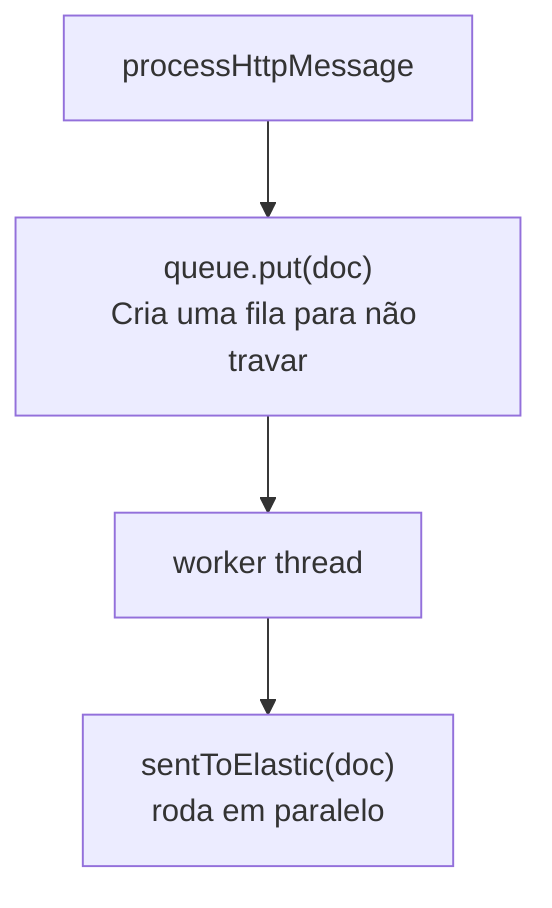

import Tabs from '@theme/Tabs';
import TabItem from '@theme/TabItem';

Eu estava procurando uma extensão que conseguisse enviar os logs para o elasticsearch, porém as extensões existentes não funcionavam corretamente. Então veio a péssima/ótima idéia de criar eu mesmo uma extensão. Gostaria muito de ter feito em Java, porém como não estou tão habituado como gostaria, optei por python.

<!-- truncate -->

# Elastico - Journal da minha primeira extensão com Python

## Introdução
Antes de mostrar como foi codar essa extensão gostaria de mostrar os resultados.

Eu pessoalmente acho que ter um indexador dedicado a buscar o tráfego HTTP, pode melhorar a busca por alguns itens durante o pentest, veja alguns exemplos de visualizações e detecções que criei

### Superfície de ataque

```sql title="Query genérica para agrupar hosts"
FROM burplogs* 
| WHERE host NOT LIKE "*google*"
| STATS total = COUNT(*) BY host, http.request.method, http.response.status
| SORT host ASC, total DESC
```


### Controle de cache
```sql title="Query de Controle de cache"
FROM burplogs*
| WHERE http.response.status == 200
| WHERE host NOT LIKE "*google*"
| EVAL cache = `http.response.headers.Cache-Control`
| EVAL tipo = CASE(
    cache IS NULL, "sem header",
    cache LIKE "*no-store*", "no-store (seguro)",
    cache LIKE "*no-cache*", "no-cache (seguro)",
    cache LIKE "*private*", "private (seguro)",
    cache LIKE "*public*", "public (atencao)",
    cache LIKE "*max-age*", "max-age (verificar)",
    "outro"
  )
| STATS total = COUNT(*) BY host, tipo, cache
| SORT host ASC, total DESC
```


## Vibecodei 
Como eu nunca tinha codado um extensão do burp antes, utilizei o Claude Code ao longo do processo porém eu realmente queria aprender para posteriormente escrever outras extensões de forma mais indepentente e por isso utilizei um prompt em que a ideia era progredir aos poucos com o código:
```
Você é um líder de RedTeam especializado em desenvolvimento de ferramentas ofensivas e integração com SIEM.

Quero aprender a escrever uma extensão do Burp Suite em Python do zero, sem nunca ter feito isso antes.

Me ensine no formato de missões progressivas:
- Cada missão tem um objetivo claro e criterio de sucesso
- Antes de cada missão, me aponte a documentação oficial para eu ler
- Não me dê a resposta de cara, me ajude a raciocinar
- Quando eu errar, aponte o problema sem resolver por mim
- Quando eu acertar, explique o que aconteceu antes de avançar

O objetivo final é uma extensão chamada Elastico que:
- Intercepta todo tráfego HTTP do Proxy do Burp
- Monta um documento JSON hierárquico com request, response, headers e body
- Envia para o Elasticsearch via fila assíncrona para não travar o Proxy
- Tem interface gráfica no Burp para configurar host, porta e índice
- Tem aba de Help com documentação em HTML

Stack: Jython (Python 2), API do Burp, Elasticsearch rodando em Docker sem TLS.
```

## Missão 00 - Primeiros passos

O Burp tem uma interface chamada `IBurpExtender` que exige que sua classe implemente o método `registerExtenderCallbacks`. Quando o Burp carrega a extensão, ele chama esse método automaticamente e passa um objeto `callbacks` como argumento.

Esse objeto `callbacks` é a sua porta de entrada para tudo que o Burp expõe, como por exemplo, interceptar requests, registrar listeners, acessar o histórico do proxy, etc.

O método `registerExtenderCallbacks` é o equivalente a um `main()` da extensão. É o ponto de entrada, chamado uma única vez pelo Burp na inicialização.

```python title="elastico.py"
from burp import IBurpExtender

class BurpExtender(IBurpExtender):
    # highlight-next-line
    def registerExtenderCallbacks(self, callbacks):
        self._callbacks = callbacks
        callbacks.setExtensionName("Elastico")
        print("[*] Elastic Exporter carregado.")
```

Salvamos o `callbacks` como atributo da classe (`self._callbacks`) porque outros métodos da classe vão precisar dele depois. Se não salvar aqui, o objeto some quando o método termina e você perde o acesso à ele.

## Missão 01 - Logando tráfego de forma básica

### Import e Registro
Para interceptar tráfego HTTP, precisamos implementar a interface `IHttpListener` (visite a [doc](https://portswigger.net/burp/extender/api/burp/ihttplistener.html)). Para acessar essa interface, é necessário cumprir com uma regra, onde qualquer classe que a implemente precisa ter o método `processHttpMessage`, que o Burp vai chamar automaticamente a cada mensagem HTTP.

Além de implementar a interface, precisamos avisar o Burp que nossa classe quer receber esses eventos. Isso é feito com `callbacks.registerHttpListener(self)`. O `self` aqui é a própria instância da classe, dizendo ao Burp: *"quando tiver tráfego HTTP, chama os métodos dessa instância aqui"*.

```python title="elastico.py"
from burp import IBurpExtender
# highlight-next-line
from burp import IHttpListener

class BurpExtender(IBurpExtender, IHttpListener):
    def registerExtenderCallbacks(self, callbacks):
        self._callbacks = callbacks
        callbacks.setExtensionName("Elastico")
        print("[*] Elastic Exporter carregado.")
        # highlight-next-line
        callbacks.registerHttpListener(self)
```

Os imports (`IBurpExtender`, `IHttpListener`) vêm do próprio Burp, não de bibliotecas externas. O Jython expõe essas classes Java diretamente para o Python. Por isso não precisa instalar nada.

### Lendo mensagens HTTP
O método `processHttpMessage` é chamado pelo Burp a cada mensagem HTTP que passa pelo listener. Ele recebe três argumentos:
- `toolFlag`: identifica qual ferramenta do Burp gerou a mensagem (Proxy, Repeater, Scanner, etc.)
- `messageIsRequest`: booleano, `True` se for uma request, `False` se for uma response
- `messageInfo`: objeto que contém tanto a request quanto a response daquele ciclo HTTP

```python title="elastico.py"
def processHttpMessage(self, toolFlag, messageIsRequest, messageInfo):
    if messageIsRequest:
        print "[+] Request: ", messageInfo
    else:
        print "[+] Response: ", messageInfo
```

Ao executar, o output é algo como `Response: burp.Zmnu@18c7df7b`. Isso é a representação Java do objeto, não os dados em si. O Burp trafega tudo internamente como array de bytes (o nível mais baixo possível, bytes puros do TCP), e precisamos de ferramentas para converter isso em algo legível.
### Helpers dando um help

O `helpers` é um objeto utilitário que o Burp fornece para não termos que parsear os bytes na mão. Ele fica disponível via `callbacks.getHelpers()` e não precisa de import separado porque já vem do mesmo contexto Java do `callbacks`.

```python title="elastico.py"
from burp import IBurpExtender
from burp import IHttpListener

class BurpExtender(IBurpExtender, IHttpListener):
    def registerExtenderCallbacks(self, callbacks):
        self._callbacks = callbacks
        callbacks.setExtensionName("Elastico")
        print("[*] Elastic Exporter carregado.")
        callbacks.registerHttpListener(self)
        # highlight-next-line
        self._helpers = callbacks.getHelpers()
```

Para entender o valor do `helpers`, veja a diferença de pegar só o método HTTP com e sem ele:
<Tabs>
  <TabItem value="nohelpers" label="Código sem Helpers" default>
```python title:"Sem helpers"
raw = messageInfo.getRequest()
texto = "".join(chr(b & 0xff) for b in raw)
metodo = texto.split(" ")[0]  # pega "GET", "POST", etc
```
  </TabItem>

  <TabItem value="withhelpers" label="Código com Helpers">

```python title:"Com helpers"
request_info = self._helpers.analyzeRequest(messageInfo)
metodo = request_info.getMethod()
url = request_info.getUrl()
```
  </TabItem>
</Tabs>

O `helpers` parseia o protocolo HTTP por você e devolve objetos com métodos prontos. Os métodos disponíveis para requests estão em: https://portswigger.net/burp/extender/api/burp/irequestinfo.html

### analyzeRequest vs analyzeResponse

O `analyzeRequest` aceita o `messageInfo` inteiro como argumento porque a API do Burp tem uma sobrecarga desse método que recebe um `IHttpRequestResponse`. Internamente ele sabe que deve extrair os bytes da request. É um atalho muito do conveniente.

O `analyzeResponse` não tem esse atalho. Ele só aceita `byte[]` sabe Deus por que. Como o `messageInfo` carrega os dois lados do ciclo HTTP (request e response juntos), você precisa ser explícito e dizer qual quer, no caso seria o `.getResponse()` que só extrai os bytes da response.

```python title="elastico.py" info:3,4,5,12,13
    def processHttpMessage(self, toolFlag, messageIsRequest, messageInfo):
        if messageIsRequest:
            #highlight-start
            request_info = self._helpers.analyzeRequest(messageInfo)
            metodo = request_info.getMethod()
            url = request_info.getUrl()
            #highlight-end
            print "[+] Request: "
            print "[|] ", metodo
            print "[|] ", url
            print "[+] ________FIM_______"

        else:
            #highlight-start
            response_info = self._helpers.analyzeResponse(messageInfo.getResponse())
            statuscode = response_info.getStatusCode()
            #highlight-end
            print "[+] Response: ", statuscode
            print "[+] ________FIM_______"
```

Output até aqui:

```text title="Output"
[*] Elastic Exporter carregado.
[+] Request:
[|]  POST
[|]  https://exemplo.com.br/api/endpoint
[+] ________FIM_______
[+] Response:  200
[+] ________FIM_______
```

Quando cheguei nessa parte já imaginei o problema de que request e response estão sendo logadas em blocos separados, mas para o Elasticsearch vamos querer um único documento por ciclo HTTP completo. O `processHttpMessage` é chamado duas vezes por ciclo (uma para request, uma para response), então precisamos de uma estratégia para correlacionar os dois.

Spoiler: o `messageInfo` na chamada da response já carrega os dados da request também. Isso resolve na Missão 3.

## Missão 3: Correlacionar request e response
Referência: https://portswigger.net/burp/extender/api/burp/ihttprequestresponse.html

O `messageInfo` é um objeto que representa o ciclo HTTP completo, não só um lado (demorei para entender isso). Ele carrega os dois lados juntos desde o início.
Quando o Burp chama `processHttpMessage` para a response, o ciclo já terminou, então tanto a request quanto a response estão disponíveis no mesmo `messageInfo`. Então podemos chamar `analyzeRequest(messageInfo)` e `analyzeResponse(messageInfo.getResponse())` no mesmo bloco.
Quando é chamado para a request, só a metade está preenchida. A response ainda não aconteceu, então `getResponse()` retorna null, o que vamos fazer é adicionar um `if` para ele só executar quando já estiver com a resposta disponível!

```python title="elastico.py"
    def processHttpMessage(self, toolFlag, messageIsRequest, messageInfo):
        #highlight-start
        if not messageIsRequest:
            requestInfo = self._helpers.analyzeRequest(messageInfo)
            responseInfo = self._helpers.analyzeResponse(messageInfo.getResponse())
            #highlight-end
            method = requestInfo.getMethod()
            url = requestInfo.getUrl()
            statusCode = responseInfo.getStatusCode()
            print "[+] %s %s %s" % (method, url, statusCode)
```

> "Mas e se eu enviar um request que não tive resposta por time out?"

Então aguarde a próxima versão nessa aqui é isso que tenho para oferecer (humor).


## Missão 4: Salvar o documento JSON em arquivo

Antes de mandar para o ES, decidi validar o documento JSON localmente. Faz sentido garantir que o schema está certo antes de indexar errado e ter que recriar o índice.

O schema que defini:
```json
{
  "timestamp": "",
  "host": "",
  "port": 0,
  "protocol": "",
  "http": {
    "request": {
      "method": "",
      "url": "",
      "length": 0,
      "headers": {
        "Host": "exemplo.com",
        "User-Agent": "Mozilla/5.0"
      },
      "body": ""
    },
    "response": {
      "status": 0,
      "length": 0,
      "headers": {
        "Content-Type": "application/json"
      },
      "body": ""
    }
  }
}
```

Lembrando que não quero pegar esses headers de forma estática e sim dinamica, os pares de `Header: Valor` seriam criados conforme aparecessem, assim eu consigo incluir headers customizados!
### Montando o documento

Criei o método `buildJson` que recebe tudo que precisa e devolve o dicionário pronto. Um ponto importante: o `getUrl()` retorna um objeto Java, não uma string Python. O `print` não reclama porque ele chama `__str__()` automaticamente em qualquer objeto, mas o `json.dump` não faz isso, ele só serializa tipos nativos do Python. Solução simples:

```python
url = str(requestInfo.getUrl())
```

> Fiquei com dúvida em por que o `print` funcionava mas o `json.dump` explodia, e descobri que o `print` converte qualquer coisa para string automaticamente, enquanto o `json.dump` só conhece tipos nativos do Python.

### Pegando os headers

O `getHeaders()` retorna uma lista de strings no formato `"Nome: Valor"`, não objetos com `getName()` e `getValue()` como eu esperava. Por isso precisei do `split(':', 1)`, que divide a string no primeiro `:` encontrado, com limite de 1 corte. O limite é importante para não quebrar valores que contém `:`, como timestamps e tokens.

```python title="elastico.py"
def buildHeadersDict(self, info):
    headers_dict = {}
    for header in info.getHeaders():
        parts = header.split(':', 1)
        if len(parts) > 1:
            headers_dict[parts[0].strip()] = parts[1].strip()
    return headers_dict
```

O `if len(parts) > 1` descarta a primeira linha do HTTP, que é algo como `GET /path HTTP/1.1` ou `HTTP/1.1 200 OK`, que não tem o formato `chave: valor`.

O mesmo método serve para request e response, porque ambos retornam o mesmo tipo de lista.

### Pegando o body

O body começa após os headers. O `getBodyOffset()` diz exatamente em qual posição dos bytes brutos o body começa, então é só fatiar a partir daí e converter para string com o `helpers`.

```python title="elastico.py"
def buildBodyString(self, rawData, info):
    offset = info.getBodyOffset()
    bodyBytes = rawData[offset:]
    try:
        body = self._helpers.bytesToString(bodyBytes)
        json.loads(body)
        return body
    except:
        return self._helpers.bytesToString(bodyBytes).encode('utf-8', errors='replace').decode('utf-8')
```

O `try/except` serve para dois casos. Quando body que é JSON válido passa direto, e quando body com caracteres especiais ou JavaScript minificado passa pelo `encode/decode` com `errors='replace'` para não explodir o JSON do documento.

> Fiquei com dúvida se devia usar `getBodyOffset()` direto no array de bytes ou em outro objeto, e descobri que o offset vem do objeto analisado (`requestInfo` ou `responseInfo`), mas os bytes vêm do `getRequest()` ou `getResponse()`. Precisei passar os dois para o método.

### Escrevendo no arquivo

Modo `'a'` de append para acumular uma linha por request sem apagar o arquivo. O `\n` no final é o que garante o formato NDJSON, um documento por linha.

```python title="elastico.py"
def writeLog(self, logLine):
    with open('burp-logs.json', 'a') as logfile:
        json.dump(logLine, logfile)
        logfile.write('\n')
```

> Usei `'w'` no primeiro teste e percebi que o arquivo era apagado a cada request. Claro, `'w'` é write (sobrescreve), `'a'` é append (acumula).

### Validação

Rodei um script de validação no arquivo gerado e das 67 linhas, 4 tinham JSON inválido. O culpado era o body de responses com JavaScript minificado contendo sequências `\uXXXX` malformadas e aspas escapadas de forma inválida. O `encode('utf-8', errors='replace')` resolveu na segunda tentativa.

```bash 
cat burp-logs.json | python3 -m json.tool | head -50
```

<details>
  <summary>Estado atual da extensão completa</summary>
```python title="elastico.py"
from burp import IBurpExtender
from burp import IHttpListener
import json
import datetime

class BurpExtender(IBurpExtender, IHttpListener):
    def registerExtenderCallbacks(self, callbacks):
        self._callbacks = callbacks
        callbacks.setExtensionName("Elastico")
        print("[*] Elastic Exporter carregado.")
        callbacks.registerHttpListener(self)
        self._helpers = callbacks.getHelpers()

    def processHttpMessage(self, toolFlag, messageIsRequest, messageInfo):
        if not messageIsRequest:
            requestRaw = messageInfo.getRequest()
            responseRaw = messageInfo.getResponse()
            requestInfo = self._helpers.analyzeRequest(messageInfo)
            responseInfo = self._helpers.analyzeResponse(responseRaw)
            jsonLogLine = self.buildJson(messageInfo, requestInfo, responseInfo, requestRaw, responseRaw)
            self.writeLog(jsonLogLine)
            print "[+] Novo log criado"

    def buildJson(self, messageInfo, requestInfo, responseInfo, requestRaw, responseRaw):
        timestamp = datetime.datetime.utcnow().isoformat()
        host = messageInfo.getHttpService().getHost()
        port = messageInfo.getHttpService().getPort()
        protocol = messageInfo.getHttpService().getProtocol()
        method = requestInfo.getMethod()
        url = str(requestInfo.getUrl())
        statusCode = responseInfo.getStatusCode()
        requestLength = len(requestRaw)
        responseLength = len(responseRaw)
        requestHeaders = self.buildHeadersDict(requestInfo)
        responseHeaders = self.buildHeadersDict(responseInfo)
        requestBody = self.buildBodyString(requestRaw, requestInfo)
        responseBody = self.buildBodyString(responseRaw, responseInfo)
        return {
            "timestamp": timestamp,
            "http": {
                "request": {
                    "method": method,
                    "url": url,
                    "length": requestLength,
                    "headers": requestHeaders,
                    "body": requestBody
                },
                "response": {
                    "status": statusCode,
                    "length": responseLength,
                    "headers": responseHeaders,
                    "body": responseBody
                }
            },
            "host": host,
            "port": port,
            "protocol": protocol
        }

    def buildHeadersDict(self, info):
        headers_dict = {}
        for header in info.getHeaders():
            parts = header.split(':', 1)
            if len(parts) > 1:
                headers_dict[parts[0].strip()] = parts[1].strip()
        return headers_dict

    def buildBodyString(self, rawData, info):
        offset = info.getBodyOffset()
        bodyBytes = rawData[offset:]
        try:
            body = self._helpers.bytesToString(bodyBytes)
            json.loads(body)
            return body
        except:
            return self._helpers.bytesToString(bodyBytes).encode('utf-8', errors='replace').decode('utf-8')

    def writeLog(self, logLine):
        with open('burp-logs.json', 'a') as logfile:
            json.dump(logLine, logfile)
            logfile.write('\n')
```

</details>


Próximo passo: Missão 5, enviar direto para o Elasticsearch.


## Missão 5: Enviar logs para o Elasticsearch
Com o schema validado localmente, chegou a hora de mandar direto para o ES. O endpoint para criar um documento é:

```
POST http://localhost:9200/<index>/_doc
```

Defini as constantes no topo do arquivo para não ter strings mágicas espalhadas pelo código:

```python title:elastico.py info:1,2,3,4
ELASTIC_HOST = "localhost"
ELASTIC_PORT = "9200"
ELASTIC_INDEX = "burplogstest"
ELASTIC_URL = "http://"+ELASTIC_HOST+":"+ELASTIC_PORT+"/"+ELASTIC_INDEX+"/_doc"
```

Como o Jython é Python 2, o módulo HTTP é `urllib2` e não `requests`. A estrutura é um pouco mais verbosa mas funciona igual:

```python title:elastico.py
def sentToElastic(self, logLine):
    try:
        data = json.dumps(logLine)
        req = urllib2.Request(
            ELASTIC_URL,
            data,
            {"Content-Type": "application/json"}
        )
        urllib2.urlopen(req, timeout=5)
        print("[+] Log Indexado: %s %s -> %d" % (
            logLine["http"]["request"]["method"],
            logLine["http"]["request"]["url"],
            logLine["http"]["response"]["status"]
        ))
    except urllib2.HTTPError as e:
        print("[!] HTTP Error %d: %s" % (e.code, e.read()))
    except Exception as e:
        print("[!] Erro: %s" % str(e))
```

Separei o `urllib2.HTTPError` do `Exception` genérico porque o `HTTPError` tem o método `.read()` que retorna o corpo da resposta de erro do ES. Sem isso, um 400 apareceria só como "HTTP Error 400" sem dizer o motivo.

> Fiquei com dúvida em por que o ES retornava 400. Adicionei o `.read()` no except do `HTTPError` e descobri que o índice tinha letra maiúscula (`burplogsTest`). O ES exige que o nome do índice seja todo lowercase.

> Fiquei com dúvida também em como acessar `method`, `url` e `status` no print, já que o schema é hierárquico. Não estão na raiz do documento, estão em `logLine["http"]["request"]["method"]` e `logLine["http"]["response"]["status"]`.

## Missão 6: Fila assíncrona para não travar o Burp

O problema de chamar `sentToElastic` direto no `processHttpMessage` é que o Proxy fica bloqueado esperando a resposta HTTP do ES antes de continuar. Com muito tráfego isso trava tudo.

A solução é uma fila: o `processHttpMessage` só empurra o documento na fila e volta imediatamente, e uma thread separada consome a fila e envia para o ES em paralelo.



Os módulos necessários:

```python title:elastico.py info:3,4
from threading import Thread
from Queue import Queue
```

No `registerExtenderCallbacks`, inicializa a fila e sobe a thread worker:

```python title:elastico.py info:3,4,5
self.queue = Queue()
self.worker = Thread(target=self.processQueue)
self.worker.setDaemon(True)
self.worker.start()
```

O `setDaemon(True)` é importante pois faz a thread morrer junto com o processo principal quando o Burp descarregar a extensão. Sem isso a thread ficaria rodando em background como zumbi.

O worker fica em loop infinito, bloqueando no `queue.get()` até ter algo para processar:

```python title:elastico.py
def processQueue(self):
    while True:
        nextJsonLine = self.queue.get()
        self.sentToElastic(nextJsonLine)
        self.queue.task_done()
```

O `queue.get()` bloqueia a thread worker até um documento chegar. Quando chega, processa e chama `task_done()` para avisar a fila que terminou. O Proxy nunca espera porque só faz `queue.put()` e segue em frente.

> Não entendi de primeira por que precisava do `self.queue` e não só `queue`. Python não tem variáveis globais de instância, então tudo que pertence ao objeto precisa do `self`. Sem ele, o Python procura uma variável local chamada `queue` no escopo do método, não encontra, e explode com `NameError`.

Estado atual da extensão:

<details>
  <summary>Estado atual do script</summary>
```python title:elastico.py
from burp import IBurpExtender
from burp import IHttpListener
from threading import Thread
from Queue import Queue
import json
import datetime
import urllib2

ELASTIC_HOST = "localhost"
ELASTIC_PORT = "9200"
ELASTIC_INDEX = "burplogstest"
ELASTIC_URL = "http://"+ELASTIC_HOST+":"+ELASTIC_PORT+"/"+ELASTIC_INDEX+"/_doc"

class BurpExtender(IBurpExtender, IHttpListener):
    def registerExtenderCallbacks(self, callbacks):
        self._callbacks = callbacks
        callbacks.setExtensionName("Elastico")
        callbacks.registerHttpListener(self)
        self._helpers = callbacks.getHelpers()
        self.queue = Queue()
        self.worker = Thread(target=self.processQueue)
        self.worker.setDaemon(True)
        self.worker.start()
        print("[*] Elastic Exporter carregado.")

    def processHttpMessage(self, toolFlag, messageIsRequest, messageInfo):
        if not messageIsRequest:
            requestRaw = messageInfo.getRequest()
            responseRaw = messageInfo.getResponse()
            requestInfo = self._helpers.analyzeRequest(messageInfo)
            responseInfo = self._helpers.analyzeResponse(responseRaw)
            jsonLogLine = self.buildJson(messageInfo, requestInfo, responseInfo, requestRaw, responseRaw)
            self.queue.put(jsonLogLine)

    def buildJson(self, messageInfo, requestInfo, responseInfo, requestRaw, responseRaw):
        timestamp = datetime.datetime.utcnow().isoformat()
        host = messageInfo.getHttpService().getHost()
        port = messageInfo.getHttpService().getPort()
        protocol = messageInfo.getHttpService().getProtocol()
        method = requestInfo.getMethod()
        url = str(requestInfo.getUrl())
        statusCode = responseInfo.getStatusCode()
        requestLength = len(requestRaw)
        responseLength = len(responseRaw)
        requestHeaders = self.buildHeadersDict(requestInfo)
        responseHeaders = self.buildHeadersDict(responseInfo)
        requestBody = self.buildBodyString(requestRaw, requestInfo)
        responseBody = self.buildBodyString(responseRaw, responseInfo)
        return {
            "timestamp": timestamp,
            "http": {
                "request": {
                    "method": method,
                    "url": url,
                    "length": requestLength,
                    "headers": requestHeaders,
                    "body": requestBody
                },
                "response": {
                    "status": statusCode,
                    "length": responseLength,
                    "headers": responseHeaders,
                    "body": responseBody
                }
            },
            "host": host,
            "port": port,
            "protocol": protocol
        }

    def buildHeadersDict(self, info):
        headers_dict = {}
        for header in info.getHeaders():
            parts = header.split(':', 1)
            if len(parts) > 1:
                headers_dict[parts[0].strip()] = parts[1].strip()
        return headers_dict

    def buildBodyString(self, rawData, info):
        offset = info.getBodyOffset()
        bodyBytes = rawData[offset:]
        try:
            body = self._helpers.bytesToString(bodyBytes)
            json.loads(body)
            return body
        except:
            return self._helpers.bytesToString(bodyBytes).encode('utf-8', errors='replace').decode('utf-8')

    def processQueue(self):
        while True:
            nextJsonLine = self.queue.get()
            self.sentToElastic(nextJsonLine)
            self.queue.task_done()

    def sentToElastic(self, logLine):
        try:
            data = json.dumps(logLine)
            req = urllib2.Request(
                ELASTIC_URL,
                data,
                {"Content-Type": "application/json"}
            )
            urllib2.urlopen(req, timeout=5)
            print("[+] Log Indexado: %s %s -> %d" % (
                logLine["http"]["request"]["method"],
                logLine["http"]["request"]["url"],
                logLine["http"]["response"]["status"]
            ))
        except urllib2.HTTPError as e:
            print("[!] HTTP Error %d: %s" % (e.code, e.read()))
        except Exception as e:
            print("[!] Erro: %s" % str(e))
```
</details>

## Missão 8: Interface gráfica para configuração
Até aqui as variáveis de configuração ficavam fixas no topo do arquivo. Para mudar o host ou o índice era preciso editar o código e recarregar a extensão. A missão foi criar uma aba no Burp com campos editáveis.

### ITab

Para adicionar uma aba no Burp, a classe precisa implementar a interface `ITab`. Ela exige dois métodos:
- `getTabCaption()`: retorna o nome que aparece na aba
- `getUiComponent()`: retorna o componente visual que será renderizado

```python title:elastico.py info:3
from burp import IBurpExtender
from burp import IHttpListener
from burp import ITab
```

E no `registerExtenderCallbacks`, registra a aba, assim como chamar os métodos que iniciam a GUI(vamos falar dele mais adiante):

```python title:elastico.py info:3,4
    def registerExtenderCallbacks(self, callbacks):
        # ...
        self.initGui()
        self.callbacks.addSuiteTab(self)
```

A ordem importa: `initGui` precisa ser chamado antes do `addSuiteTab`, porque o Burp chama `getUiComponent` imediatamente ao registrar a aba. Se o painel ainda não tiver sido criado, explode com `AttributeError: object has no attribute 'tab'`.

### Componentes Swing

O Jython tem acesso direto às classes Java do Swing, sem install. Os imports necessários:

```python title:elastico.py
from javax.swing import JPanel, JLabel, JTextField, JButton, JTabbedPane, JEditorPane, JScrollPane
from java.awt import GridLayout, BorderLayout
```

### Layout

O `GridLayout` expande os componentes para preencher todo o espaço disponível, o que deixava o formulário gigante. A solução foi usar um painel externo com `BorderLayout` e ancorar o formulário em `BorderLayout.NORTH`, que usa o tamanho natural dos componentes sem esticar:

```python title:elastico.py
def initGui(self):
    self.tab = JPanel(BorderLayout())
    self.tabbedPane = JTabbedPane()
    self.tab.add(self.tabbedPane, BorderLayout.CENTER)

    settingsWrapper = JPanel(BorderLayout())
    formPanel = JPanel(GridLayout(4, 2, 5, 5))

    formPanel.add(JLabel("Host:"))
    self.hostField = JTextField(ELASTIC_HOST, 20)
    formPanel.add(self.hostField)

    formPanel.add(JLabel("Port:"))
    self.portField = JTextField(ELASTIC_PORT, 20)
    formPanel.add(self.portField)

    formPanel.add(JLabel("Index:"))
    self.indexField = JTextField(ELASTIC_INDEX, 20)
    formPanel.add(self.indexField)

    formPanel.add(JLabel(""))
    saveButton = JButton("Salvar", actionPerformed=self.saveConfig)
    formPanel.add(saveButton)

    settingsWrapper.add(formPanel, BorderLayout.NORTH)
    self.tabbedPane.addTab("Settings", settingsWrapper)
```

O `JTabbedPane` permite ter múltiplas abas dentro da aba principal. Adicionei Settings e Help como sub-abas.

### Salvando a configuração

O botão chama `saveConfig` via `actionPerformed`. O método precisa usar `global` para modificar as variáveis definidas fora da classe, caso contrário o Python cria variáveis locais e as globais ficam intocadas:

```python title:elastico.py info:2
def saveConfig(self, event):
    global ELASTIC_HOST, ELASTIC_PORT, ELASTIC_INDEX, ELASTIC_URL
    ELASTIC_HOST = self.hostField.getText()
    ELASTIC_PORT = self.portField.getText()
    ELASTIC_INDEX = self.indexField.getText()
    ELASTIC_URL = "http://"+ELASTIC_HOST+":"+ELASTIC_PORT+"/"+ELASTIC_INDEX+"/_doc"
    print "[*] Config atualizada: %s" % ELASTIC_URL
```

### Aba Help

Para texto formatado, o componente certo é o `JEditorPane` com `text/html`. Envolvi em `JScrollPane` para ter scroll quando o conteúdo for longo:

```python title:elastico.py
helpPanel = JEditorPane("text/html", ELASTIC_HELP)
helpPanel.setEditable(False)
self.tabbedPane.addTab("Help", JScrollPane(helpPanel))
```

O conteúdo do `ELASTIC_HELP` é HTML comum com CSS inline. Usei a cor laranja do Burp (`#e8912d`) para os títulos para manter consistência visual com o tema da ferramenta.

### Estado final da extensão
Você pode verificar no [github](https://github.com/imgodes/elastico) assim como as intruções de como instalar.

### O que aprendi nessa missão

No finalzinho fiquei com dúvida em por que o `AttributeError: object has no attribute 'tab'` aparecia. Era porque o `addSuiteTab` chama `getUiComponent` imediatamente, antes do `initGui` ter rodado. A ordem de chamada no `registerExtenderCallbacks` é crítica. Depois não entendia por que o formulário ficava gigante. O `GridLayout` estica os componentes para preencher todo o espaço disponível. O `BorderLayout.NORTH` resolve isso ancorando o form no topo com tamanho aceitável. E muitas outras dúvidas, porém me sinto mais confiante para ir para extensões mais avançadas e com mais funcionalidades. A real é que baseado nos exemplos que já existem, somados com a doc do burp, já dá para fazer muita coisa legal, só precisava desse primeiro passo.

