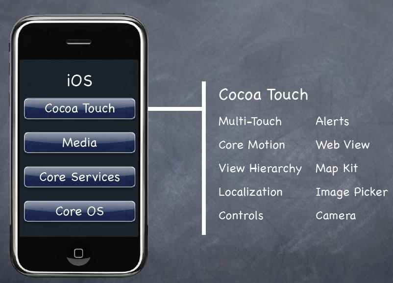
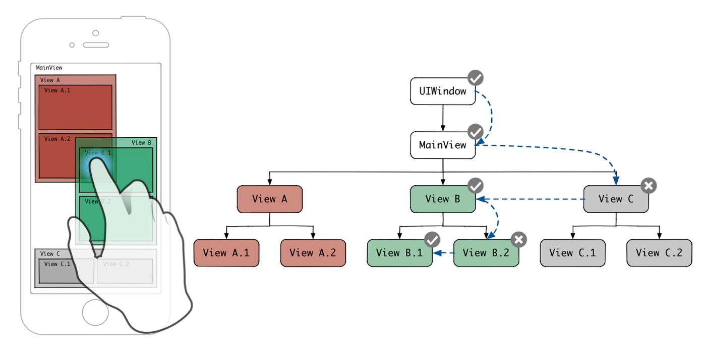
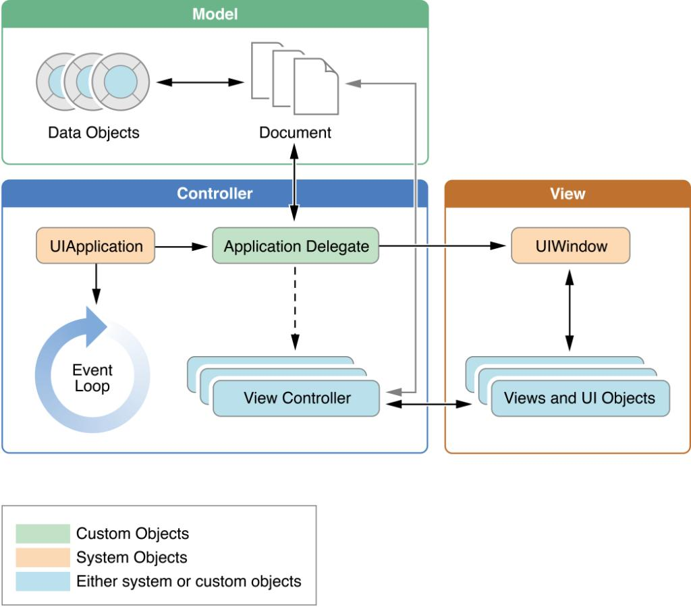

# Cocoa Touch

O Cocoa Touch é a camada mais alta da arquitetura do iOS. É nela que vivem as aplicações e toda a interação com o usuário, já que as camadas anteriores existem justamente para sustentar o que acontece aqui em cima.

## Principais componentes

<Stepper>
  <Step title="UIKit e SwiftUI">
    Os dois frameworks responsáveis pela construção da interface do usuário. O UIKit segue a abordagem tradicional, baseada em views e controllers, enquanto o SwiftUI propõe um modelo declarativo, onde a interface é descrita como uma função do estado da aplicação.
  </Step>
  <Step title="View Controllers">
    Responsáveis por gerenciar a lógica de cada tela, controlando o ciclo de vida das views, a navegação entre telas e a comunicação com os dados que elas exibem.
  </Step>
  <Step title="Gestão de eventos">
    Sistema que captura toques, swipes e gestures, propagando esses eventos pela hierarquia de views até encontrar o objeto responsável por tratá-los.
  </Step>
  <Step title="Notificações">
    Mecanismo de comunicação assíncrona entre componentes, cobrindo desde notificações locais e push notifications até eventos internos trocados entre partes do app.
  </Step>
  <Step title="App Lifecycle">
    Define os estados possíveis de uma aplicação, como ativo, em background ou suspenso, e os eventos disparados em cada transição, permitindo que o app ajuste seu comportamento conforme o estado atual.
  </Step>
</Stepper>

O Cocoa Touch concentra boa parte da lógica que um pentester encontra ao analisar um app, já que é nessa camada que ficam as validações de tela, os fluxos de navegação e o código que reage às ações do usuário. Um app pode ter uma validação forte no backend e ainda assim expor uma lógica client-side fraca nesta camada, permitindo bypass de telas de autenticação ou de checagens que deveriam ocorrer no servidor.

Os pontos de maior interesse durante uma avaliação são o reverse engineering do app para entender os fluxos de UI, o hooking de métodos de View Controllers com ferramentas como Frida ou Cycript, e a exploração de validações fracas em formulários e telas de decisão, como confirmações de pagamento ou de permissão.

## Referências

- Apple Developer Documentation. App Programming Guide for iOS. Disponível em: https://developer.apple.com/library/archive/documentation/iPhone/Conceptual/iPhoneOSProgrammingGuide/Introduction/Introduction.html
