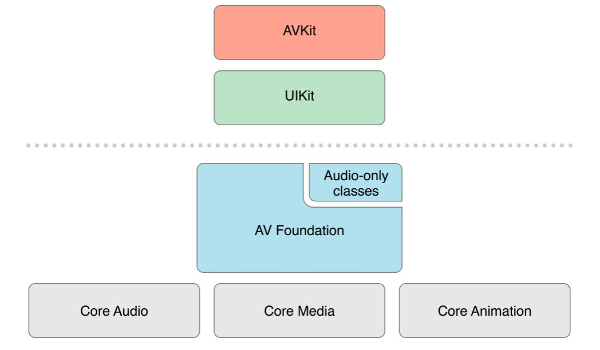

# Media

A camada Media fica entre o Core Services e o Cocoa Touch, e é responsável por tudo que envolve gráficos, áudio e vídeo dentro de uma aplicação iOS.

## Principais componentes

<Stepper>
  <Step title="Core Graphics">
    Framework responsável pela renderização 2D, cobrindo desenho de textos, formas, imagens e manipulação de contextos gráficos. É a base de praticamente tudo que envolve UI estática.
  </Step>
  <Step title="Core Animation">
    Cuida das animações e da renderização de elementos visuais na tela, usando aceleração por hardware. Trabalha com camadas, as CALayer, para manter a performance fluida mesmo em interfaces complexas.
  </Step>
  <Step title="AVFoundation">
    Framework de alto nível para captura, processamento e reprodução de áudio e vídeo. É a base usada para câmera, gravação, streaming e manipulação de mídia em geral.
  </Step>
  <Step title="Core Audio">
    Camada de baixo nível para processamento de áudio, oferecendo controle fino sobre buffers, latência e fluxo de dados sonoros.
  </Step>
  <Step title="Metal e OpenGL ES">
    APIs de renderização gráfica acelerada por GPU. O Metal é a API moderna e de alta performance da Apple, enquanto o OpenGL ES é a API mais antiga, hoje depreciada, mas ainda encontrada em apps legados.
  </Step>
</Stepper>

Frameworks de mídia recebem e processam arquivos que muitas vezes vêm de fontes não confiáveis, como imagens baixadas da rede ou vídeos recebidos de outro usuário. Isso torna o parsing de arquivos de mídia um alvo relevante, já que entradas maliciosas em formatos de imagem ou vídeo podem explorar falhas de parsing nessas bibliotecas.

Outro ponto de interesse é o hook em funções de renderização com Frida ou outras ferramentas de instrumentação, útil para observar ou manipular como o app trata determinados conteúdos em tempo real.

## Referências

- Apple Developer Documentation. Media Layer. Disponível em: https://developer.apple.com/library/archive/documentation/MacOSX/Conceptual/OSX_Technology_Overview/MediaLayer/MediaLayer.html
