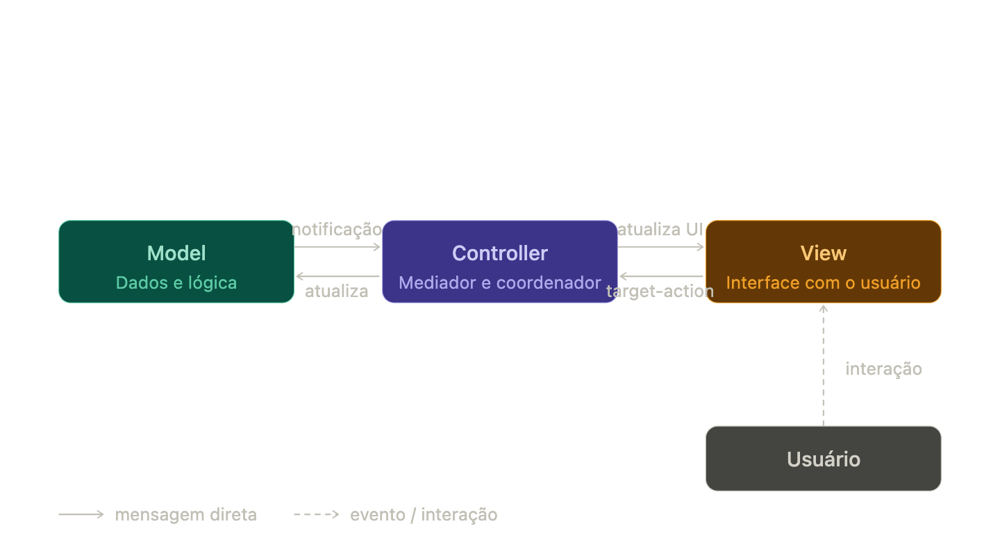

> *Aqui eu fiz bastante tradução literal de textos em inglês, mas confesso que não entendi por completo o conteúdo. Se for do seu interesse se aprofundar no modelo MVC, recomendo que continue realizando suas pesquisas.*

# Arquitetura Model-View-Controller

O MVC é o padrão arquitetural central do Cocoa e do desenvolvimento iOS. É um padrão de alto nível, que trata da arquitetura global de uma aplicação classificando objetos de acordo com os papéis gerais que eles desempenham. Entender o MVC não é apenas uma questão de organização de código, já que muitas tecnologias do Cocoa, como bindings, a arquitetura de documentos e scriptability, são baseadas nesse padrão e exigem que objetos customizados assumam um dos papéis por ele definidos.

## Os três papéis

<Stepper>
  <Step title="Model">
    Representa o conhecimento e a expertise específicos de um domínio. Mantém os dados da aplicação e define a lógica que os manipula. Idealmente, um objeto de Model não tem conexão explícita com a interface usada para apresentá-lo ou editá-lo. No iOS, o Model costuma ser uma struct simples, uma entidade do Core Data, ou qualquer objeto Swift que encapsule estado e regras de negócio.
  </Step>
  <Step title="View">
    Sabe exibir dados e pode permitir que o usuário os edite, mas não deve ser responsável por armazená-los. Objetos de View tendem a ser reutilizáveis e configuráveis, o que garante consistência entre diferentes aplicações. No UIKit, qualquer subclasse de UIView ocupa esse papel. No SwiftUI, são as Views conformadas ao protocolo homônimo.
  </Step>
  <Step title="Controller">
    Atua como intermediário entre View e Model. É frequentemente responsável por garantir que as views tenham acesso aos objetos de model que precisam exibir, e funciona como o canal pelo qual as views tomam conhecimento de mudanças no model. No iOS, o UIViewController é o exemplo mais claro desse papel.
  </Step>
</Stepper>

## Como a comunicação funciona no Cocoa

O MVC do Cocoa difere da concepção original do Smalltalk em um ponto importante, já que as notificações de mudança de estado nos objetos de model são comunicadas às views através dos objetos de controller. Isso preserva o desacoplamento entre Model e View, tornando ambos mais reutilizáveis em contextos diferentes.

O fluxo típico de uma interação do usuário segue esse caminho, o usuário interage com a View, que dispara uma ação para o Controller através do mecanismo target-action. O Controller interpreta essa ação, atualiza o Model quando necessário, e então instrui a View a refletir o novo estado.

## View Controllers e a fusão de papéis

É possível fundir papéis do MVC em um único objeto. Um view controller, por exemplo, desempenha simultaneamente os papéis de controller e view, já que suas responsabilidades primárias são gerenciar a interface e se comunicar com o model. O UIViewController no iOS é exatamente isso, ele possui a hierarquia de views e coordena o fluxo de dados entre elas e o model.

Embora essa fusão de papéis seja aceitável em casos simples, a melhor estratégia geral é manter a separação entre eles, pois isso aumenta a reusabilidade dos objetos e a extensibilidade do programa como um todo. Um UIViewController com centenas de linhas misturando lógica de rede, parsing de dados e configuração de UI é o antipadrão clássico que essa separação busca evitar, frequentemente chamado de Massive View Controller.

## MVC e as tecnologias do Cocoa

O MVC não é apenas uma convenção de organização de código, ele está diretamente incorporado nas principais tecnologias da plataforma. O Core Data gerencia grafos de objetos de model e garante sua persistência, sendo fortemente integrado com o Cocoa bindings. A arquitetura de desfazer, o undo e redo, também coloca os objetos de model no papel central, geralmente implementando as operações primitivas de undo e redo diretamente nos métodos do model.

## Referências

- Apple Developer Documentation. Model-View-Controller. Disponível em: https://developer.apple.com/library/archive/documentation/General/Conceptual/DevPedia-CocoaCore/MVC.html
