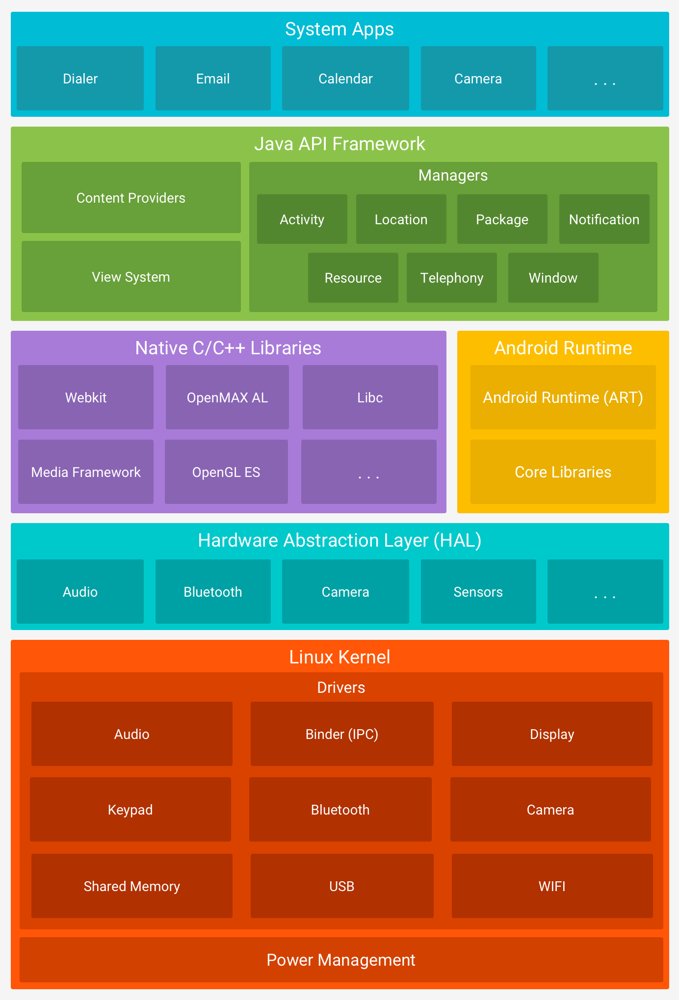

O Android é um sistema operacional baseado em Linux e, uma vez que alguém consiga acesso a um shell no dispositivo, comandos Linux podem ser executados. O shell Linux oferece uma interface de entrada e saída baseada em texto entre os usuários e o kernel do sistema.

## Arquitetura do Android

A plataforma Android é composta por seis camadas principais, que formam sua pilha de software baseada em Linux:
1. Kernel Linux
2. Hardware Abstraction Layer (HAL)
3. Android Runtime
4. Bibliotecas Nativas (C/C++)
5. Java API Framework
6. System Apps

> Fonte: https://developer.android.com/guide/platform

### Kernel Linux

Base da plataforma Android, responsável por controlar o hardware do dispositivo. Oferece recursos importantes de segurança como:

- Isolamento de processos
- Modelo de permissões baseado em usuários
  - Impedir que os usuários leiam os arquivos uns dos outros
  - Impedir que os usuários esgotem a memória uns dos outros
  - Impedir que os usuários esgotem os recursos da CPU
  - Evitar que os usuários esgotem os recursos dos dispositivos, como telefonia, GPS e Bluetooth

### Hardware Abstraction Layer (HAL)

A HAL é uma camada de software que oferece uma interface padrão para o Android interagir com componentes de hardware, como câmeras, sensores, Bluetooth e entrada de dados. Ela funciona como uma ponte entre o hardware e o framework Android de alto nível, permitindo que fabricantes adaptem suas implementações específicas sem afetar a compatibilidade com a plataforma. A HAL é implementada como bibliotecas compartilhadas dinâmicas, carregadas pelo Android em tempo de execução.

### Android Runtime

O Android Runtime (ART) é o ambiente de execução gerenciado do Android, introduzido no Android 5.0 (Lollipop), substituindo a antiga Dalvik VM.

:::note[O que significa "ambiente de execução gerenciado"]
Significa que o Android executa os aplicativos dentro de um ambiente controlado, que isola os apps uns dos outros, gerencia automaticamente recursos como memória, threads e coleta de lixo (Garbage Collection) e controla permissões e impede acesso direto à memória do sistema ou de outros aplicativos.

:::

Diferente de programas nativos em C/C++, que são executados diretamente pelo kernel, os aplicativos Android escritos em Java ou Kotlin rodam dentro desse ambiente controlado pelo ART.

A principal diferença entre Dalvik e ART está na forma como o código é compilado:

| Ambiente | Tipo de Compilação | Descrição |
| --- | --- | --- |
| **Dalvik** | Just-in-Time (JIT) | Compila o código durante a execução do app |
| **ART** | Ahead-of-Time (AOT) | Compila o código para linguagem de máquina nativa no momento da instalação |

Mais detalhes sobre essa diferença estão na página sobre a [Máquina Virtual Dalvik](../appseg/dalvikvm).

### Bibliotecas Nativas (C/C++)

São bibliotecas escritas em C/C++ incluídas no Android para implementar funcionalidades de alto desempenho e interações de baixo nível com o hardware. Componentes como ART e HAL são construídos usando essas bibliotecas. Apps podem acessá-las via JNI (Java Native Interface) ou diretamente pelo Android NDK.

### Java API Framework

É a estrutura de APIs Java que fornece as ferramentas e interfaces para o desenvolvimento de apps Android. Principais componentes:

| Componente | Descrição |
| --- | --- |
| **View System** | UI e Layouts |
| **Resource Manager** | Recursos como imagens e strings |
| **Notification Manager** | Gerenciamento de notificações |
| **Activity Manager** | Controle de ciclo de vida de apps |
| **Content Providers** | Compartilhamento estruturado de dados |
| **Location Manager** | Localização |
| **Package Manager** | Informações sobre apps instalados |

Falaremos mais sobre cada um desses componentes na seção sobre [Componentes e IPC](../componentes/).

### System Apps

É a camada mais alta da arquitetura. Contém os apps pré-instalados no Android, como Contatos, Mensagens, Câmera, Navegador, Calendário e Mapas.

Apps de sistema só podem ser alterados em dispositivos com root. No entanto, os desenvolvedores podem utilizar APIs públicas para interagir com esses apps, como por exemplo, criar um app que acesse a câmera para ler QR codes.
