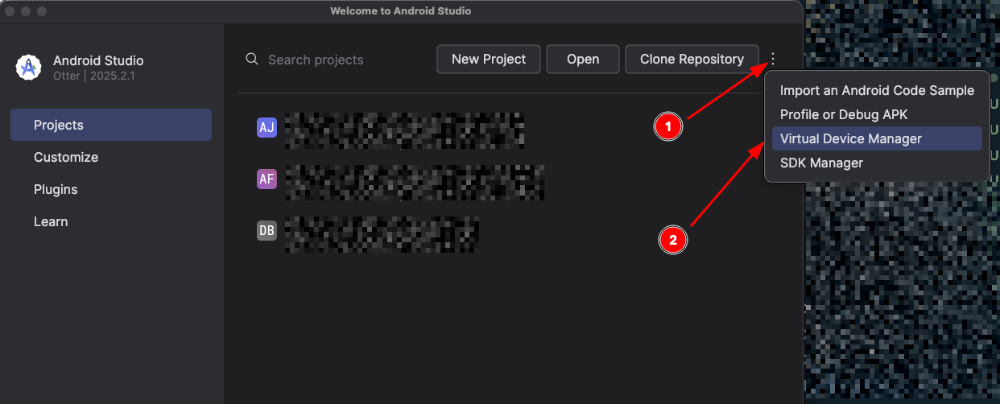
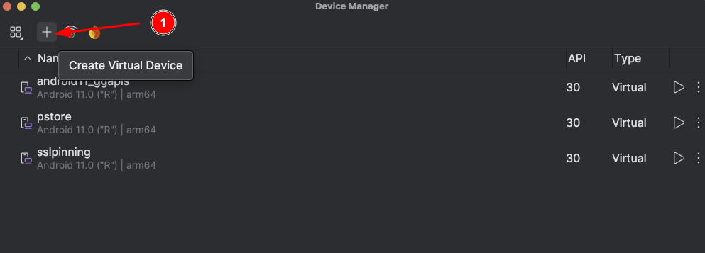
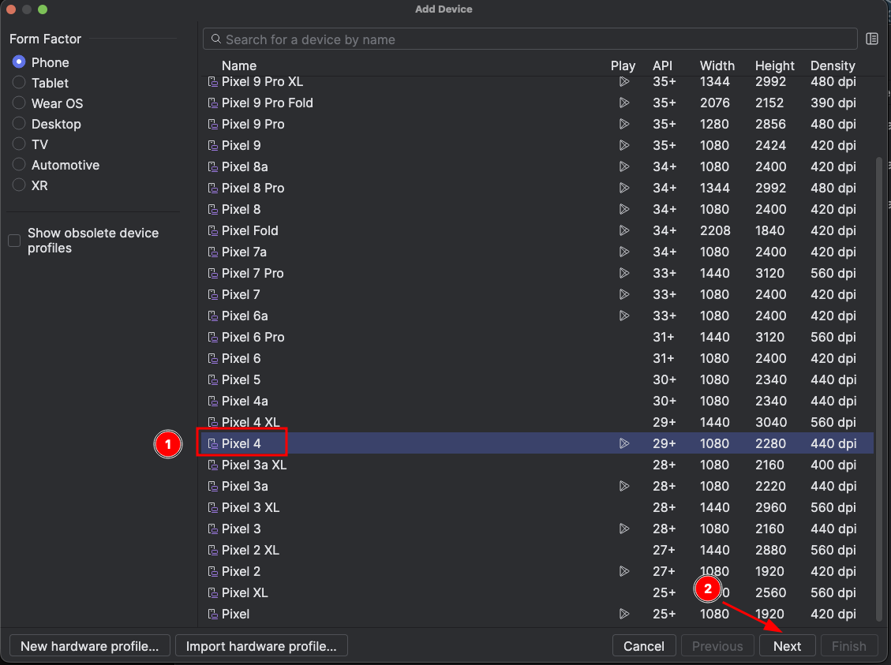
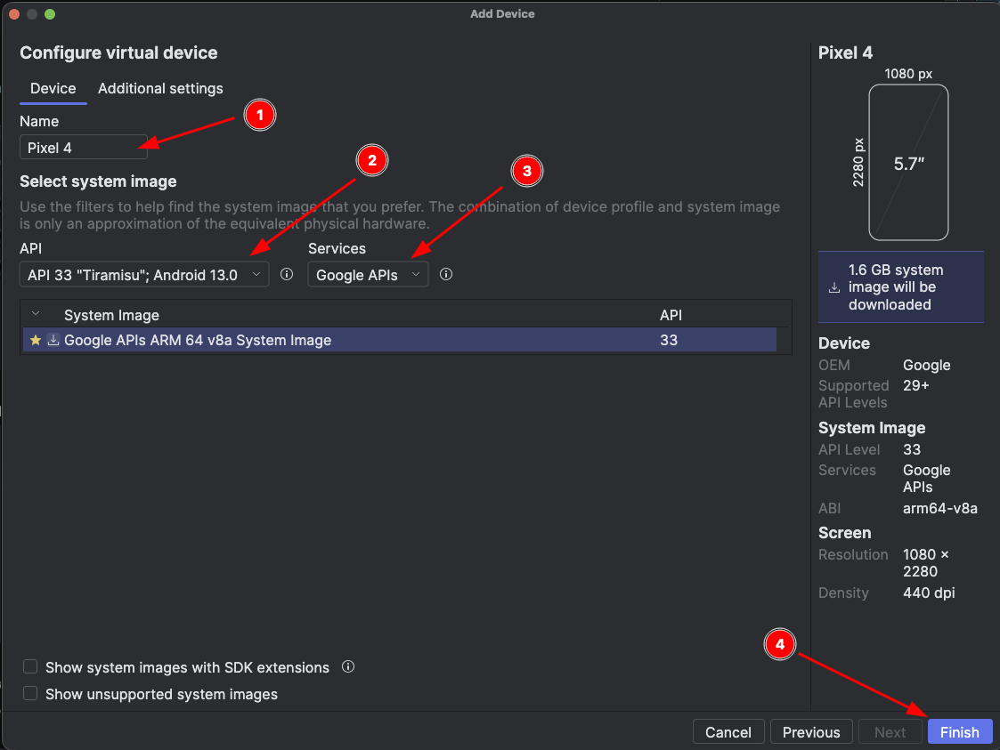

import Tabs from '@theme/Tabs';
import TabItem from '@theme/TabItem';

Nem sempre é viável (ou barato) testar em um dispositivo físico. Esta seção cobre as principais opções de emuladores Android para pentest, suas diferenças de arquitetura em relação a dispositivos reais, e como fazer boot de um AVD com a partição de sistema gravável.

Emuladores Android são ferramentas essenciais para testes de segurança e desenvolvimento de aplicativos. Eles permitem simular o sistema operacional Android em um computador, facilitando a execução e análise de apps sem a necessidade de dispositivos físicos.

## Por que usar emuladores?

- Custo reduzido: não é necessário um dispositivo físico.
- Testes em diferentes versões e arquiteturas do Android.
- Simulação de sensores, GPS, chamadas, mensagens, entre outros.
- Suporte para testes de apps com ou sem root (dependendo da imagem usada).

## Arquitetura

A arquitetura do seu Android emulado será a mesma do seu sistema operacional. Se por exemplo, você está em um computador com um Intel/AMD ao criar um dispositivo emulado, você irá criar um android com a arquitetura x86 (a mesma de processadores Intel/AMD). Mas se você estiver em um computador ARM, de forma análoga, seu emulador será também ARM.

Essa diferença pode afetar a execução de exploits ou bibliotecas nativas, por isso é importante estar ciente durante um pentest.

## Android Studio AVD

O Android Studio fornece o AVD (Android Virtual Device), um emulador rápido e repleto de recursos para testes. Faça o download do Android Studio em https://developer.android.com/studio?hl=pt-br.

### Criando um AVD

1. Abra o Android Studio.
2. Vá em **Tools > Device Manager** ou siga a imagem abaixo clicando em Virtual Device Manager:


3. Clique em **Create Device**. Na imagem abaixo demonstro que basta clicar no `+`:


4. Escolha um perfil de hardware (como Pixel 4). Não faz tanta diferença quanto parece, mas eu sempre crio como Pixel 4, ou Medium Phone. Depois basta clicar em "Next".


5. Escolha a imagem do sistema (exemplo: `Tiramisu 33 x86_64 Google APIs`).
> Destaque 1: Aqui eu escolho o nome do dispositivo (escolha um sem espaços de preferência, como `api33_teste`)
>
> Destaque 2: Aqui você escolhe a versão da API, selecionei API 33.
>
> Destaque 3: Selecione Google APIs
>
> Destaque 4: Clique em Finish




:::tip
Evite executar o AVD dentro de uma máquina virtual, pois a virtualização aninhada pode afetar o desempenho.
:::

### Sobre imagens do sistema

- **Google APIs**: permitem acesso root com ADB (ideal para testes de segurança).
- **Google Play**: vêm assinadas e **não** permitem root via ADB.

## Recursos do Emulador

- Menu lateral com opções como câmera, rotação, sensores e localização.
- Botão `...` para configurações avançadas.
- Suporte a múltiplas instâncias.

## Alternativas ao AVD
Existem outras tecnologias capazes de emular ou virtualizar um android. Abaixo descrevo algumas de forma genérica. Mas sinceramente, o AVD é suficiente.

### Corellium

- Emula dispositivos Android e iOS.
- Interface web e recursos avançados de depuração.
- Suporte a snapshots e dispositivos root/jailbroken.

### Genymotion

- Interface gráfica amigável.
- Integração com Android Studio e Xamarin.
- Emula sensores como GPS, câmera e acelerômetro.

### BlueStacks

- Foco em jogos e usabilidade.
- Suporte a múltiplas instâncias.

### NoxPlayer

- Leve e eficiente.
- Suporte a gamepads e gravação de macros.

### MEmu Play

- Alta compatibilidade.
- Suporte a múltiplas versões do Android e mapeamento de teclado.

### LDPlayer

- Otimizado para jogos e produtividade.
- Controles personalizáveis e multi-instância.

## Executando Comandos Android Tools
As ferramenta do Android Studio ficam em uma pasta específica de acordo com o seu sistema operacional. É necessário adiciona-las ao seu PATH para que possa executar os comandos corretamente.

:::important
Certifique-se que esses caminhos existem antes de adicionar.
:::

<Tabs>
  <TabItem value="Windows" label="Windows" default>
Abra o Android Studio, vá em File > Settings > Appearance & Behavior > System Settings > Android SDK para ver o diretório exato configurado.

Crie ou edite a variável de sistema ANDROID_HOME com o valor do diretório base do SDK (ex: `C:\Users\<seu-usuario>\AppData\Local\Android\Sdk`).

Adicione `%ANDROID_HOME%\platform-tools` e `%ANDROID_HOME%\tools\bin` à variável de ambiente Path do Windows.
  </TabItem>
  <TabItem value="Linux" label="Linux">
Para configurar o caminho das ferramentas do Android Studio no Linux, defina a variável de ambiente `ANDROID_HOME` e adicione os diretórios de ferramentas e platform-tools ao PATH no arquivo `~/.bashrc` ou `~/.bash_profile`. 

O caminho padrão do SDK geralmente é `$HOME/Android/Sdk` ou `/opt/android-studio/sdk`. Se o SDK estiver instalado em outro local, ajuste o caminho de `ANDROID_HOME` de acordo. Adicione as seguintes linhas ao final do arquivo de configuração do seu shell:
```
export ANDROID_HOME=$HOME/Android/Sdk
export PATH=$PATH:$ANDROID_HOME/tools/bin
export PATH=$PATH:$ANDROID_HOME/platform-tools   
```

  </TabItem>
  <TabItem value="MacOS" label="MacOS">
No MacOS adicione as seguintes linhas ao `zshrc`:
```
export ANDROID_HOME=$HOME/Library/Android/sdk
export PATH=$PATH:$ANDROID_HOME/tools
export PATH=$PATH:$ANDROID_HOME/platform-tools
```
  </TabItem>
</Tabs>


## Boot com emulador AVD via linha de comando

```bash
emulator \
  -avd android11_ggapis \
  -writable-system \
  -no-snapshot-load \
  -http-proxy 192.168.15.189:8089
```

**`-avd android11_ggapis`**
- Define qual AVD (Android Virtual Device) será iniciado.
- Nesse caso, o dispositivo chamado `android11_ggapis`.

**`-writable-system`**
- Faz o sistema inicializar com a partição `/system` montada como gravável.
- Isso permite, por exemplo, copiar certificados para `/system/etc/security/cacerts/`, instalar binários e modificar arquivos de sistema, ou editar configurações protegidas.
- Sem essa flag, o `/system` fica somente leitura.

**`-no-snapshot-load`**
- Impede que o emulador carregue um snapshot salvo anteriormente.
- Por padrão, o Android Emulator usa snapshots para subir rápido.
- Com esta flag, ele realiza um boot "limpo" e carrega o estado real do sistema, incluindo alterações no `/system`.
- Se não usar isso, o emulador pode ignorar mudanças feitas como root.
