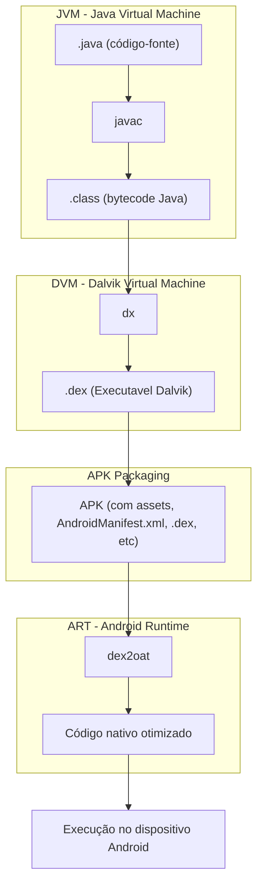

## Formato APK

Um APK é o formato de pacote utilizado pelo Android para distribuir e instalar aplicativos. Ele é, essencialmente, um arquivo compactado (formato `.zip`) que contém todos os componentes necessários para a instalação e execução de um app Android.

```shell
$ unzip myapp.apk
$ ls -l

total 27584
-rw-r--r--    1 bertolis  bertolis     4220 Jan  1  1981 AndroidManifest.xml
drwxr-xr-x   49 bertolis  bertolis     1568 May 10 13:36 META-INF
drwxr-xr-x    3 bertolis  bertolis       96 May 10 13:36 assets
-rw-r--r--    1 bertolis  bertolis  8285624 Jan  1  1981 classes.dex
drwxr-xr-x    9 bertolis  bertolis      288 May 10 13:36 kotlin
drwxr-xr-x    6 bertolis  bertolis      192 May 10 13:36 lib
drwxr-xr-x  545 bertolis  bertolis    17440 May 10 13:36 res
-rw-r--r--    1 bertolis  bertolis   922940 Jan  1  1981 resources.arsc
```

| Componente | Descrição |
| --- | --- |
| `AndroidManifest.xml` | Define informações essenciais do app: permissões, atividades, serviços etc. |
| `classes.dex` | Contém o código compilado da aplicação em formato **DEX** (Dalvik Executable) |
| `META-INF/` | Armazena os certificados e assinaturas digitais do app |
| `assets/` | Contém arquivos arbitrários acessíveis via código, como fontes, textos, imagens etc. |
| `lib/` | Código nativo (C/C++) separado por arquitetura (ex: `armeabi-v7a`, `x86`) |
| `res/` | Recursos do app (layouts XML, imagens, strings), sem código |
| `resources.arsc` | Índice compilado dos recursos (strings, dimensões, estilos etc.) |

## Compilação e estrutura de código

Um APK (Android Package) é compilado a partir de arquivos fonte em Java ou Kotlin.



### Arquivos do APK

#### `META-INF/` — Certificados e Assinaturas

Este diretório é criado durante o processo de assinatura do APK. Ele contém os arquivos que validam a integridade do pacote. Qualquer alteração no conteúdo do APK invalida essas assinaturas, exigindo que o APK seja assinado novamente.

| Arquivo | Descrição |
| --- | --- |
| `CERT.RSA` | Contém a chave pública usada para assinar e verificar `CERT.SF` |
| `CERT.SF` | Lista os hashes dos arquivos descritos em `MANIFEST.MF` |
| `MANIFEST.MF` | Lista os nomes e hashes SHA256 em Base64 de todos os arquivos do APK. Usado para verificar a integridade do pacote |

#### `assets/` — Recursos Arbitrários da Aplicação

Contém arquivos fornecidos pelos desenvolvedores que podem ser acessados via `AssetManager`. São incluídos aqui arquivos como imagens, vídeos, bancos de dados, documentos ou bibliotecas adicionais. Frameworks como Xamarin, Cordova e React Native frequentemente armazenam código e DLLs neste diretório.

#### `lib/` — Bibliotecas Nativas

Contém código nativo compilado (em C/C++) na forma de arquivos `.so` (shared object), separados por arquitetura da CPU:

```bash title="Visão dos arquivos de biblioteca"
lib/
├── arm64-v8a/
├── armeabi-v7a/
├── x86/
└── x86_64/
```

Aplicativos que utilizam o NDK (Native Development Kit) incluem aqui componentes de baixo nível que interagem diretamente com o hardware.

#### `res/` — Recursos Estáticos

Contém os recursos do aplicativo definidos estaticamente, que não podem ser modificados em tempo de execução. Exemplos:

- `color/`: definições de cores
- `drawable/`: imagens e vetores
- `layout/`: estruturas de UI (XML)
- `xml/`: configurações, segurança de rede, entre outros

#### `AndroidManifest.xml` — Metadados da Aplicação

Arquivo obrigatório e central, que define as informações estruturais do app. Ele inclui:

- Nome do pacote
- Versões do SDK e build
- Permissões solicitadas
- Configurações de segurança (ex: NetworkSecurityConfig)
- Componentes: `activities`, `services`, `providers`, `receivers`

Esse arquivo é compilado em formato binário e deve ser convertido (ex: com `apktool`) para ser legível.

#### `classes.dex` — Código Compilado

Arquivo com as classes compiladas da aplicação em formato DEX (Dalvik Executable). Executado pela Dalvik VM (Android < 5.0) ou ART (Android Runtime) em versões modernas.

- Aplicativos grandes podem ter vários DEX: `classes.dex`, `classes2.dex`, etc.
- Suporta Multidex em projetos mais complexos.

#### `resources.arsc` — Mapeamento de Recursos

Arquivo binário que mapeia os identificadores dos recursos (`R.string`, `R.layout`, etc) para os seus valores reais (strings, layouts, estilos, etc).

- É essencial para a renderização correta da interface.
- Contém representações binárias de arquivos XML.

#### (Opcional) `kotlin/`

Diretório opcional presente em apps escritos em Kotlin. Contém metadados específicos usados pelo compilador e ferramentas de runtime.
