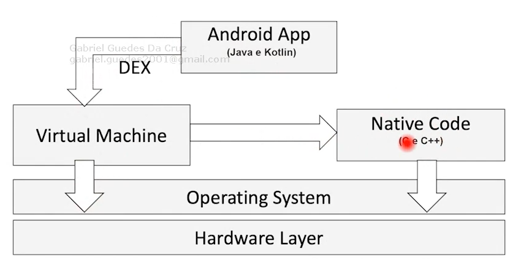

Os aplicativos são desenvolvidos na linguagem de programação Java ou Kotlin e executados na Máquina Virtual Dalvik ou no ART.

- Seja Java ou Kotlin, o código **será compilado em DEX** (Dalvik Executable, bytecode).
- A **Dalvik VM** é baseada em registrador e **interpreta o formato de código DEX**.
- O Dalvik depende da funcionalidade fornecida por várias bibliotecas de código nativo de suporte.
- Isso ocorre para que o sistema **suporte diferenças entre os SO**.
- Também é possível desenvolver em C e C++, mas aí passa a existir diferença entre SOs e arquiteturas.

## Dalvik VM

A Dalvik Virtual Machine (DVM) foi o ambiente de execução padrão do Android até a API 21 (Lollipop). O código Java/Kotlin dos apps era convertido em bytecode Dalvik no formato `.dex` ou `.odex`, diferente do bytecode tradicional da JVM. Diferenças:

- Dalvik é baseada em registradores (register-based VM), diferente da JVM que é stack-based.
- Projetada para melhor desempenho em dispositivos com recursos limitados.
- Usava JIT compilation, enquanto o ART passou a adotar AOT compilation.

A partir do Android 5.0, o ART substituiu a Dalvik como runtime padrão.
