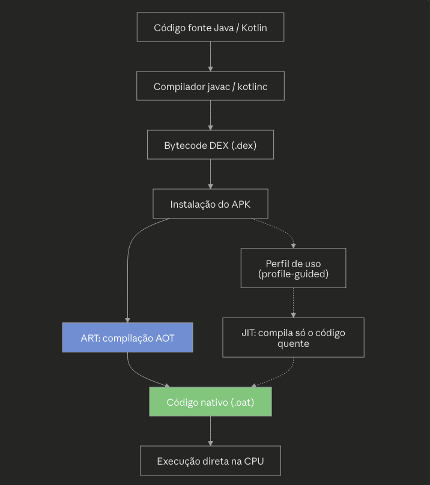

O ART (Android Runtime) substituiu a Dalvik VM como ambiente de execução padrão a partir do Android 5.0 (Lollipop, API 21). Ele mudou a forma como o bytecode DEX é processado, priorizando desempenho e eficiência energética.

## ART

O ART introduziu a compilação AOT (Ahead-Of-Time), diferente do modelo JIT (Just-In-Time) usado pela Dalvik. Principais características são:

- Na instalação do app, o bytecode DEX é compilado para código de máquina nativo, gerando um arquivo `.oat`.
- Isso elimina a necessidade de interpretar ou compilar o bytecode a cada execução, reduzindo o tempo de inicialização e o consumo de CPU.
- O ART mantém compatibilidade com o formato DEX, então apps antigos continuam funcionando sem recompilação manual.
- A partir do Android 7.0 (Nougat), o ART passou a usar um modelo híbrido, combinando AOT, JIT e um perfilador de uso, otimizando apenas o código executado com frequência (profile-guided compilation).
- Isso reduziu o tamanho ocupado em disco e o tempo de instalação, problemas que existiam na versão original do ART puramente AOT.

