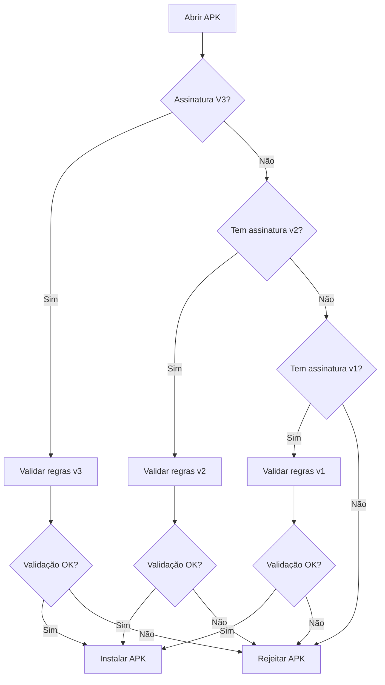

import Tabs from '@theme/Tabs';
import TabItem from '@theme/TabItem';

Para instalar ou publicar um APK, ele precisa estar assinado. Isso protege o pacote contra modificações maliciosas.

## Evolução dos Esquemas de Assinatura

| Versão | Android | Características |
| --- | --- | --- |
| **v1 (JAR Signing)** | ≤ 7.0 | Não protege todo o conteúdo do APK |
| **v2** | ≥ 7.0 | Protege todo o APK exceto o bloco de assinatura |
| **v3** | ≥ 9.0 | Permite metadados extras no bloco de assinatura |
| **v4** | ≥ 11 | Usa Merkle hash tree, armazenamento externo ao APK |

:::note
A v4 precisa obrigatoriamente de uma v2 ou v3 junto.
:::

## Validação de Assinaturas — Fluxo

Quando o Android instala um APK, o sistema verifica a assinatura seguindo a hierarquia:



## Implicações de Segurança por Versão da Assinatura de APK

<Tabs>
  <TabItem value="v1" label="v1">

| Campo | Descrição |
| --- | --- |
| **Problema** | Só protege os arquivos listados no `META-INF/MANIFEST.MF` e `META-INF/CERT.SF`. |
| **Falha** | Não cobre os metadados ZIP do APK. Isso permitia ataques de tampering onde arquivos maliciosos eram adicionados ou partes não verificadas do APK eram modificadas sem invalidar a assinatura. |
| **Pentest** | Se o app for assinado apenas com v1 e instalado em um Android < 7 ou sem suporte a v2+, é possível alterar recursos no APK (como assets ou arquivos no ZIP) sem quebrar a assinatura, ou explorar técnicas conhecidas como **Janus vulnerability (CVE-2017-13156)**, onde era possível incluir um arquivo DEX adicional sem invalidar a assinatura. |

  </TabItem>
  <TabItem value="v2" label="v2">

| Campo | Descrição |
| --- | --- |
| **Melhoria** | Protege todo o conteúdo do APK (exceto o bloco de assinatura), validando offsets e hashes. |
| **Problema** | Ainda não impede a inclusão de arquivos extras no bloco de assinatura ou no final do arquivo, desde que o conteúdo verificado permaneça intacto. |
| **Pentest** | Raramente viável tampering direto sem invalidar a assinatura. Mas se o app aceitar APKs assinados só com v1 e permitir downgrade para um Android 6 ou inferior, downgrade attacks podem ser explorados. |

  </TabItem>
  <TabItem value="v3" label="v3">

| Campo | Descrição |
| --- | --- |
| **Melhoria** | Permite incluir metadados extras no bloco de assinatura (como número de versão e informações de atualização). |
| **Pentest** | Se metadados adicionais contiverem flags ou chaves de segurança (por exemplo, `debuggable=true` ou config de teste), podem ser explorados. Mesmos riscos de downgrade de v2 para v1. |

  </TabItem>
  <TabItem value="v4" label="v4">

| Campo | Descrição |
| --- | --- |
| **Melhoria** | Assinatura baseada em **Merkle hash tree**, usada para otimizar a verificação durante instalação incremental (sem revalidar o APK todo). A mais completa, mas depende da coexistência de v2 ou v3. |
| **Pentest** | Se só a v4 estiver presente (e o dispositivo não verificar corretamente), pode ser alvo para técnicas futuras — embora hoje não haja exploração pública contra v4. |

  </TabItem>
</Tabs>

## Explorações típicas que surgem por versões fracas

- Tampering de APKs assinados apenas com v1
- Ataques Janus (CVE-2017-13156) em versões sem patch
- Downgrade attacks: substituir um APK v2/v3 por outro apenas com v1 em dispositivos antigos ou mal configurados
- Inserção de payloads não verificados em metadados ou áreas não cobertas pela assinatura v1
- Troca de arquivos após assinatura em builds vulneráveis que ainda aceitam v1

**Como validar isso em pentest:**

1. Checar versões de assinatura com `apksigner verify --verbose nome.apk`
2. Comparar permissões ou flags estranhas nos metadados
3. Verificar coexistência de múltiplos blocos de assinatura (v1 + v2, por exemplo) — o Android aceita mais de um bloco, o que pode gerar conflitos se a verificação de integridade não for bem feita

## Assinando um APK

Para que um aplicativo Android seja instalado em um dispositivo ou publicado na Play Store, ele precisa estar assinado digitalmente. A assinatura garante a integridade do APK e impede alterações não autorizadas.

Formas de assinar um APK:

- Pelo Android Studio, usando a opção `Build > Generate Signed App Bundle / APK`.
- Via ferramentas de linha de comando: `jarsigner` e `apksigner`.
- Usando o serviço Play App Signing do Google Play.

Os certificados usados para assinar APKs são self-signed — ou seja, não requerem uma autoridade certificadora externa.

Exemplo de assinatura via CLI:

```bash title="Exemplo de um processo de assinatura de .apk"
# Cria um arquivo com os parâmetros para o keytool
echo -e "password\npassword\njohn doe\ntest\ntest\ntest\ntest\ntest\nyes" > params.txt

# Gera um par de chaves RSA, armazenado em key.keystore
cat params.txt | keytool -genkey -keystore key.keystore -validity 1000 -keyalg RSA -alias john

# Alinha o APK para otimizar o acesso a arquivos via mmap
zipalign -p -f -v 4 myapp.apk myapp_signed.apk

# Assina o APK usando apksigner e a keystore criada
echo password | apksigner sign --ks key.keystore myapp_signed.apk
```

| Etapa | Descrição |
| --- | --- |
| `params.txt` | Cria um arquivo contendo as respostas automáticas para o keytool |
| `keytool` | Gera um par de chaves RSA e armazena na keystore `key.keystore` |
| `zipalign` | Alinha os arquivos do APK para permitir acesso eficiente via `mmap`. Cria `myapp_signed.apk` |
| `apksigner` | Assina digitalmente o APK usando a chave contida em `key.keystore` e o password fornecido |

Outra forma mais simples, e que eu costumo utilizar:

```bash title="Exemplo de um processo de assinatura de .apk"
# Criar um certificado / keystore para assinar o apk modificado
keytool -genkey -V -keystore key.keystore -alias APKtool -keyalg RSA -keysize 2048 -validity 10000

# Assinar o APK modificado com o certificado criado
jarsigner -verbose -sigalg SHA1withRSA -digestalg SHA1 -keystore key.keystore [name].apk APKtool
```
