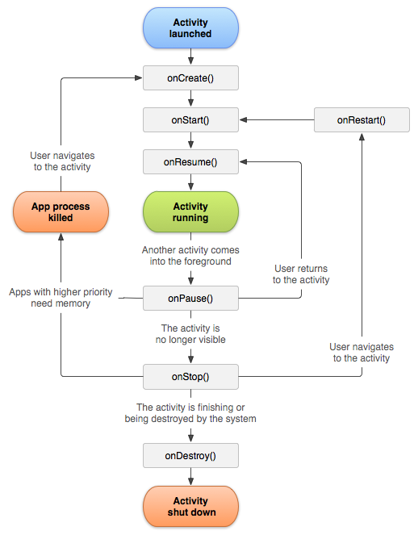
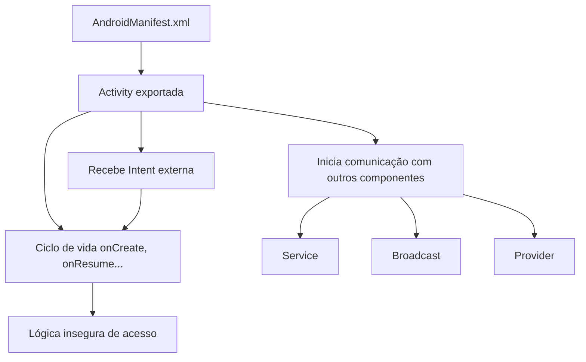

import Tabs from '@theme/Tabs';
import TabItem from '@theme/TabItem';

- Cada Activity representa uma única tela com interface gráfica.
- Gerencia a interação do usuário com essa interface.
- Podem ser iniciadas por outras Activities, por outros apps ou até por eventos do sistema.
- Uma Activity pode ser escolhida como a principal, de forma que quando a aplicação inicie essa será apresentada.
- Caso a aplicação permita, outra aplicação externa pode iniciar uma Activity.

## Ciclo de Vida de uma Activity

Cada Activity passa por diferentes estados controlados por métodos como:

- `onCreate()`: inicialização
- `onStart()`: visível ao usuário
- `onResume()`: interativa
- `onPause()`: perdeu foco
- `onStop()`: não visível
- `onDestroy()`: finalizada



Esses métodos são chamados automaticamente pelo sistema conforme o contexto do app (mudança de tela, rotação, chamada, etc).

```java
@Override
protected void onPause() {
    super.onPause();
    // Dados sensíveis ainda estão na memória?
}
```

- Dados em memória podem vazar entre `onPause()` e `onResume()`.
- Lógicas de verificação de autenticação mal posicionadas podem ser burladas.
- Eventos maliciosos podem ser injetados durante transições de estado.

A seguir estão os principais métodos do ciclo de vida:

```java
public class Activity extends ApplicationContext {
    protected void onCreate(Bundle savedInstanceState);
    protected void onStart();
    protected void onRestart();
    protected void onResume();
    protected void onPause();
    protected void onStop();
    protected void onDestroy();
}
```

### `onCreate()`

Este é o ponto de entrada principal. É onde a interface é configurada, dados são vinculados a elementos visuais e eventuais dados sensíveis (como tokens ou chaves) podem ser carregados — o que torna esse método um alvo importante em pentests.

```java
@Override
protected void onCreate(Bundle savedInstanceState) {
    super.onCreate(savedInstanceState);
    setContentView(R.layout.activity_main);
    Toast.makeText(this, "Mensagem na inicialização.", Toast.LENGTH_SHORT).show();
}
```

### `onRestart()`

Ao minimizar e voltar ao app, ele vai chamar `onRestart()`:

```java
@Override
protected void onRestart() {
	super.onRestart();
	Log.e("HackingMobileApp", "onRestart Chamado");
}
```

## Como identificar uma Activity

<Tabs>
  <TabItem value="manifest" label="No AndroidManifest">

No `AndroidManifest.xml`, dentro da tag `activity`. A principal é marcada com o intent-filter `MAIN` + `LAUNCHER`.

```xml
<activity android:name=".LoginActivity"
          android:exported="true" />
```

  </TabItem>
  <TabItem value="java" label="No Código Java">

Uma Activity representa uma tela visível da aplicação:

```java
public class LoginActivity extends Activity {
    @Override
    protected void onCreate(Bundle savedInstanceState) {
        super.onCreate(savedInstanceState);
        // Carrega o layout da tela
        setContentView(R.layout.activity_login);
    }
}
```

  </TabItem>
</Tabs>

## Como iniciar uma Activity

No contexto do código Java, pode ser iniciada por outra parte do app ou por outro app pelo uso do intent:

```java
Intent i = new Intent(this, LoginActivity.class);
startActivity(i);
```

Agora no contexto de linha de comando, ela pode ser iniciada pelo Activity Manager (`am`):

```bash
adb shell am start -n com.example.demo/com.example.demo.LoginActivity
adb shell am start -n com.example.demo/.LoginActivity
```

:::note[Importante para pentest]
- Se a activity tem `android:exported="true"` (ou implicitamente via intent-filter).
- Se não exige `android:permission`.
- Se ela permite ações não autenticadas (ex: bypass de login).
- Se há intent-filters com ações genéricas (`VIEW`, `SEND`) que permitem trigger externos.
:::

Agora que entendemos que uma Activity representa uma interface visual e pode ser acionada por intents, é essencial compreender como o sistema Android gerencia essa Activity em tempo de execução. Esse gerenciamento ocorre por meio do ciclo de vida da Activity, que determina quando ela é criada, pausada, retomada ou destruída.

Entender esse ciclo é importante tanto para desenvolvedores (para evitar vazamento de dados ou recursos) quanto para pentesters (que podem explorar execuções indevidas ou persistência de dados sensíveis entre estados).

Além da interface e do ciclo de vida, as Activities também podem se comunicar com outras partes do sistema ou de outros apps usando o mecanismo de Inter-Process Communication (IPC) do Android, que usa intenções (`Intent`), serviços (`Service`), provedores de conteúdo (`ContentProvider`) e até AIDL (Android Interface Definition Language).

Uma Intent é um objeto que descreve uma ação a ser realizada, e pode carregar dados adicionais chamados de extras. Ela pode ser usada para:

- Iniciar uma nova `Activity`
- Disparar um `Service`
- Enviar um `Broadcast`
- Realizar uma ação com base em um `ContentProvider`

Intents são o mecanismo oficial de chamada entre componentes no Android. Eles substituem chamadas diretas entre objetos e são fundamentais para a arquitetura do sistema.

Exemplo simples:

```java
// Chama outra activity
Intent i = new Intent(this, LoginActivity.class);
startActivity(i);
```

Exemplo com dados extras:

```java
Intent i = new Intent(this, SyncService.class);
i.putExtra("cmd", "backup");  // Dados que o Service pode processar
startService(i);
```

Há uma página separada só para explicarmos intents; por enquanto entenda-as como um jeito de mostrar sua intenção de realizar uma ação.

## IPC (Inter-Process Communication)

Uma Activity raramente opera sozinha, ela interage com outros componentes usando IPC.

Como vimos, uma Activity pode ser invocada externamente se estiver exportada, e da mesma forma ela pode iniciar serviços, enviar intents ou consumir conteúdo de outros apps. O IPC está no coração dessas interações, e é justamente esse canal que pode ser explorado quando mal implementado.

### Formas de IPC

- **Intents**: iniciar outras Activities ou Services.
- **Broadcasts**: enviar mensagens para Receivers.
- **Content Providers**: acessar ou expor dados.
- **AIDL (Android Interface Definition Language)**: comunicação estruturada entre processos.

```java
Intent i = new Intent(this, SyncService.class);
i.putExtra("cmd", "backup");
startService(i);
```

Onde isso aparece no código:

- `startActivity(Intent)` → chamada entre Activities
- `startService(Intent)` → execução em background
- `sendBroadcast(Intent)` → mensagem para Receivers
- `getContentResolver().query(...)` → acesso a dados via URI

Esquema de como o que está declarado no AndroidManifest se relaciona com a execução da Activity (e seu ciclo de vida) e a comunicação IPC:


