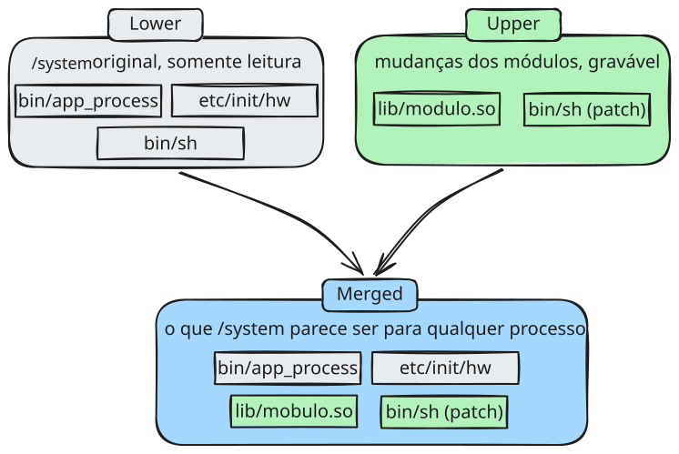

## OverlayFS
`OverlayFS` é um sistema de arquivos de união (union filesystem) nativo do kernel Linux desde a versão 3.18. A ideia descrita na documentação oficial do kernel, é apresentar um **sistema de arquivos que resulta da sobreposição de um sistema de arquivos sobre outro**. Ele pega duas (ou mais) pastas diferentes no disco e faz o kernel apresentar as duas como se fossem uma pasta só, combinada, para qualquer programa que olhe para aquele ponto de montagem. Ele não copia arquivo nenhum fisicamente para criar essa junção, é uma ilusão montada em tempo real pelo próprio kernel.

Existem três peças nessa montagem:
- **Lower (camada inferior)**: é a pasta original, intocada, e normalmente tratada como somente leitura. No caso do Android, é o conteúdo real da partição `/system`.
- **Upper (camada superior)**: é uma pasta vazia (ou quase vazia) onde ficam só as mudanças. É aqui que o KernelSU grava o que os módulos instalados adicionam ou alteram.
- **Merged (view mesclada)**: é o ponto de montagem final, o que todo processo do sistema efetivamente enxerga quando acessa `/system.` Ele mostra o conteúdo da camada inferior, mas com tudo que está na camada superior sobrescrevendo ou complementando por cima.

Observe que existe o `bin/sh` original na camada *lower*, sem nenhuma alteração. Um módulo do KernelSU, escreve uma versão modificada de `bin/sh` na camada *upper*. Na camada *merged*, que é o que qualquer processo enxerga como sendo `/system` irá aparecer os seguintes arquivos: 
- os arquivos que só existem na *lower* (como o `bin/app_process` original);
- os arquivos que só existem na *upper* (como a biblioteca `lib/modulo.so` que o módulo adicionou);
- e nos casos em que o mesmo arquivo existe nas duas camada, como `bin/sh`, a versão da *upper* é a que prevalece no final

É se aproveitando desse comportamento do OverlayFS, que o KernelSU **consegue modificar `/system` sem necessariamente alterar a partição original**. A camada *lower* não é modificada em momento algum

### Fonte
> https://docs.kernel.org/filesystems/overlayfs.html
> https://en.wikipedia.org/wiki/OverlayFS