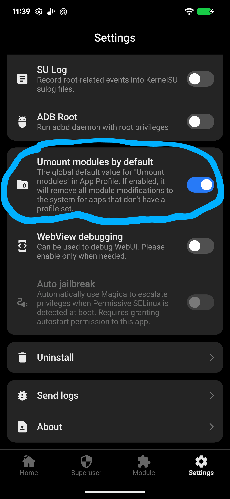

## App Profile

Depois que um app está na allowlist, o KernelSU ainda permite controlar com que privilégio exato ele roda root, através do que o projeto chama de App Profile, com uma sub-configuração chamada Root Profile. A documentação oficial descreve isso como a possibilidade de customizar a UID, GID, grupos suplementares, capabilities e regras de SELinux do comando `su`, restringindo assim os privilégios do usuário root concedido. Isso permite, por exemplo, dar a um app de firewall apenas capacidade de rede sem acesso root pleno ao sistema de arquivos, seguindo o princípio do menor privilégio em vez de tratar todo app rooteado como equivalente.

Outra configuração do App Profile para apps que não têm root concedido é o controle de "umount modules", que decide se as modificações feitas por módulos instalados (via OverlayFS) devem ser desmontadas especificamente para aquele app antes dele rodar. Isso serve como um mecanismo de ocultação, pois por padrão, o KernelSU já vem configurado para desmontar módulos para apps sem permissão de root, e é em cima dessa opção que módulos de hiding mais sofisticados constroem sua lógica.

### Fonte:
> - https://kernelsu.org/guide/app-profile.html