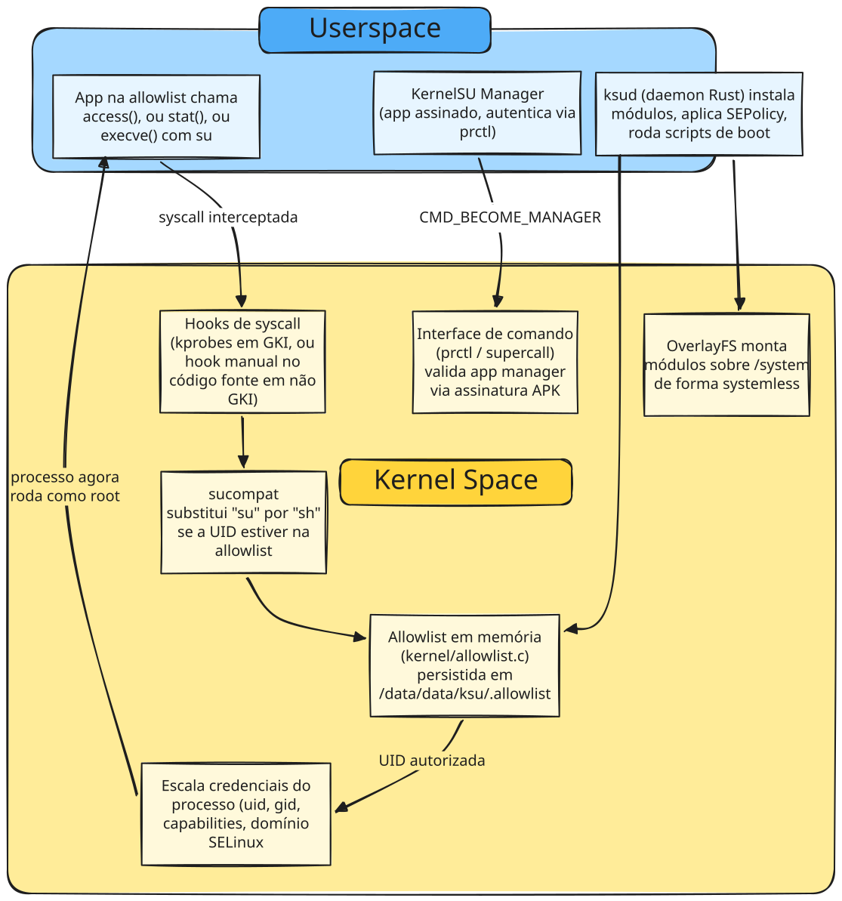

Agora que já entendemos os componentes de forma individual, vou apresentar um esquema de como eles interagem entre si, é claro abstraindo alguns detalhes internos e simplificando eles. 

O diagrama abaixo resume o fluxo onde um app na allowlist chama uma função que normalmente checaria a existência de `su`, essa chamada é interceptada no kernel via `kprobe`, o kernel decide com base na allowlist se concede a elevação, e caso conceda, reescreve as credenciais do processo diretamente na estrutura de kernel, sem nunca passar por um binário `su` em disco. Em paralelo, um daemon userspace (`ksud`) cuida da parte de gerenciamento que não precisa rodar em kernel space como instalar módulos, aplicar políticas SELinux adicionais e servir a interface do app gerenciador.

