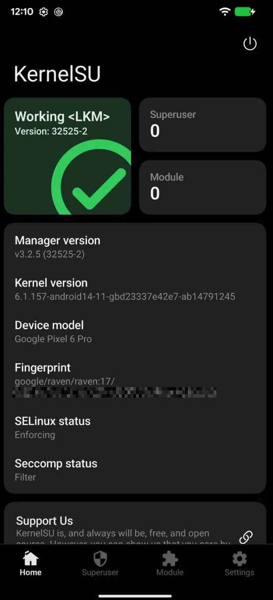
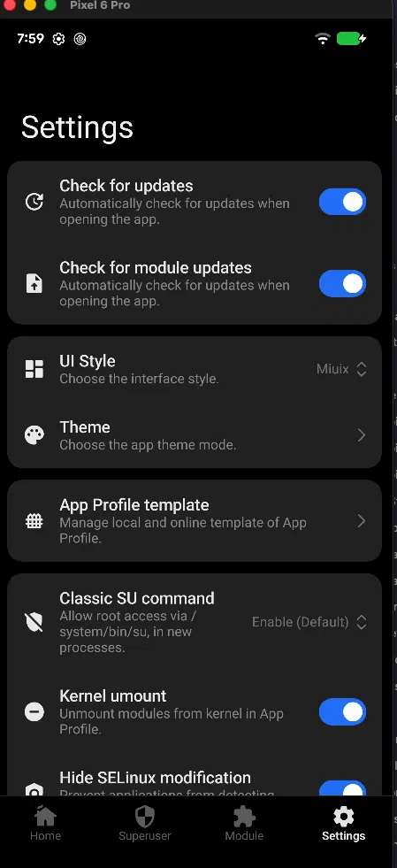
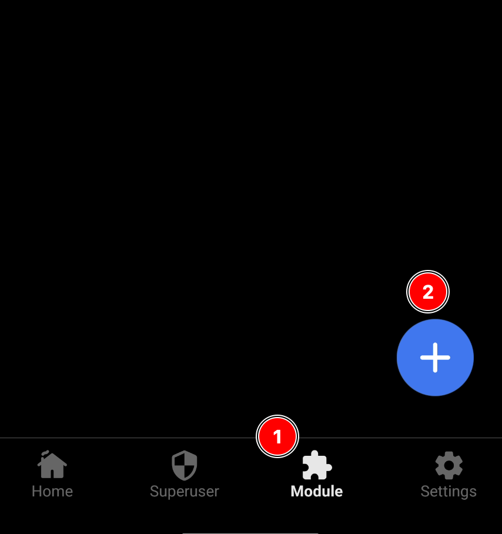
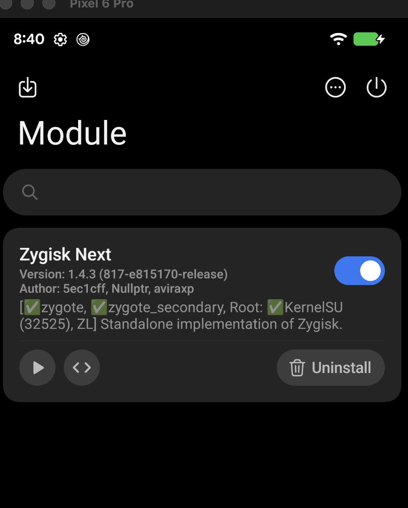
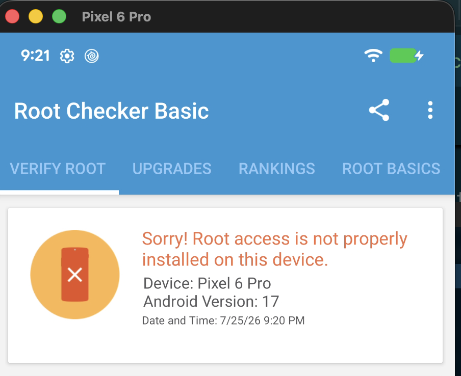
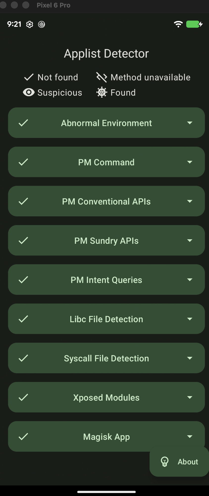
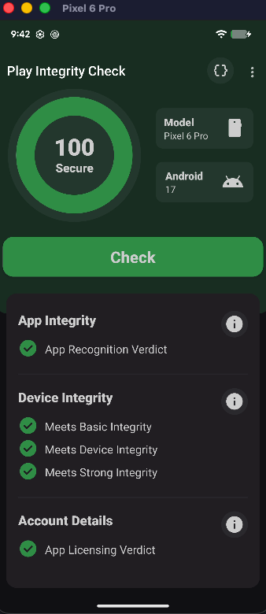
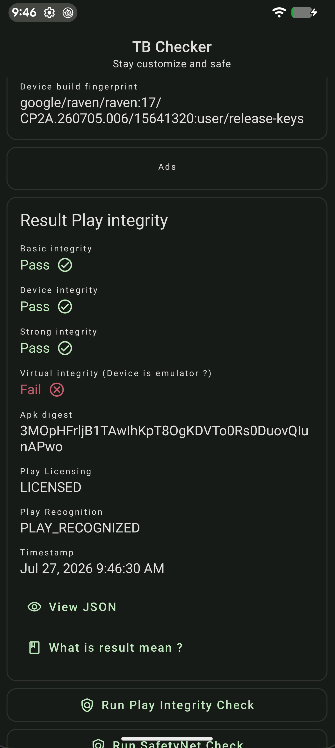

A primeira coisa é ativar o modo desenvolvedor no seu dispositivo e o debug via USB. O caminho para fazer isso pode variar, então pesquise de acordo com seu modelo.

O meu dispositivo é um Google Pixel 6 PRO, e o caminho para ele é o seguinte:
1. Settings 
2. About phone 
3. Clique várias vezes em Build Number até aparecer que você ativou o modo desenvolvedor
4. Depois volte para o menu anterior
5. Clique em System
6. Advanced > Developer options
7. Habilite o Debug USB

Agora confirme a conexão com o ADB:
```
❯ adb devices
List of devices attached
21071FDEE008MQ  device
```
O número `21071FDEE008MQ` é o serial do dispositivo, usado apenas para identificação local via USB. O seu provavelmente será diferente, o importante é aparecer algo na lista.

Se aparecer *unauthorized*, desbloqueia o prompt no celular que pergunta se confia no computador. Se aparecer *offline*, troca o cabo ou a porta USB.

Com o dispositivo reconhecido, agora verifique o status do bootloader:
```
❯ adb shell getprop ro.boot.verifiedbootstate
green
```
O comando retorna `green` se está stock e com bootloader travado.
Para desabilitar é simples também. Basta ir em Configurações > Opções do Desenvolvedor > OEM Unlocking e ative essa opção.

Agora o próximo passo é reiniciar no modo **fastboot** e desbloquear o **bootloader**.
```
❯ adb reboot bootloader
❯ fastboot flashing unlock
OKAY [  0.008s]
Finished. Total time: 0.008s
```

:::warning
Atenção!! Pois isso vai resetar o android para o padrão de fábrica.
:::

Vai aparece na tela do aparelho uma tela pedindo a confirmação. Use o botão de volume (ou qualquer que seja o seu botão) para navegar e selecionar a opção de unlock bootloader.

No meu caso precisei confirmar mais uma vez para ele bootar. 

Depois de bootar, configure apenas o wifi e um Pin, o resto pode pular.

## Instalação do KernelSU
A partir daqui é bem importante que tenha lido sobre [[Android - Generic Kernel Imagem (GKI)|GKI]] e [[Android - KernelSU|KernelSU]] para pelo menos entender o que está fazendo, mas não é impossível de apenas seguir os passos e boa.

Depois de iniciado, habilite novamente o modo desenvolvedor e o Debug USB, para conseguir checar a versão do seu Android:
```
❯ adb shell getprop ro.build.version.release
17
```
Veja que meu Google Pixel possui uma versão bem recente do Android, esta eu sei que usa o `init_boot.img` para fazer o patching.

Agora precisamos do ID da nossa build para baixarmos a imagem correspondente do site do android.
```
❯ adb shell getprop ro.build.id
CP2A.260705.006
```

Para garantir que vou baixar a versão certa, também peguei algumas informações a mais:
```
❯ adb shell getprop ro.product.model
Pixel 6 Pro
❯ adb shell getprop ro.product.device
raven
```
Agora com essa informações, basta baixar a imagem do seu dispositivo. No meu caso fica em https://developers.google.com/android/images?hl=pt-br#raven.
Baixe e extraia o zip (se necessário). 
No meu caso dentro dele tinha o arquivo "`image-raven-cp2a.260705.006.zip`" extrai este também, para então chegar ao arquivo `boot.img` .
Agora transfira o `boot.img` via adb:
```
❯ adb push boot.img /sdcard/Download/
boot.img: 1 file pushed, 0 skipped. 153.6 MB/s (67108864 bytes in 0.417s)
```
:::warning
Lembre-se que o arquivo para patch muda de acordo com o dispositivo, leia novamente sobre como funciona o [[Android - KernelSU|KernelSU]] caso não se recorde.
:::
Agora você pode baixar o app do KernelSU em https://github.com/tiann/KernelSU/releases (faça o download do `.apk`).

Então instale o `.apk` com o adb:
```
❯ adb install KernelSU_v3.2.5_32525-release.apk
```

Nessa etapa:
- Se o app mostrar "Sem suporte", significa que você precisará compilar o kernel por conta própria. O KernelSU não fornecerá e nunca fornecerá um arquivo boot.img para você instalar.
- Se o app mostrar "Não instalado", então seu dispositivo é oficialmente suportado pelo KernelSU.

Caso tenha suporte para seu dispositivo clique em "Não instalado". Selecione a imagem que você acabou de enviar via `adb`. 
Na sequência o KernelSU irá perguntar qual KMI (Kernel Module Interface) você deseja usar. Basta selecionar a que bate com a do seu dispositivo (o app já vai identificar isso para você).

Pronto, depois disso você deve ver a tela de "Flash Success", isso significa que ele gerou uma nova imagem de boot após fazer o patch nela. Anote o caminho de onde essa imagem ficou (no meu caso foi: `/storage/emulated/0/Download/kernelsu_patched_20260724_144754.img`) armazenada para conseguirmos pegar ela via `adb`:
```
adb pull /storage/emulated/0/Download/kernelsu_patched_20260724_144754.img
```
Depois vamos reiniciar o device com o bootloader:
```
❯ adb reboot bootloader
```
E por fim fazer o flash com o arquivo gerado pelo KernelSU:
```
❯ fastboot flash boot kernelsu_patched_20260724_144754.img
```

Agora é só iniciar o dispositivo:
```
❯ fastboot reboot
```

Se o comando acima não funcionar pode ligar pelo celular mesmo.

Se estiver tudo certo, você verá a seguinte tela após o reboot:



## Configurações do KernelSU

Quando você estiver com o KernelSU instalado e com o dispositivo rootado, algumas opções vão vir a tona. Aqui eu descrevo os efeitos de cada uma delas:

### App Profile Template
Essa é uma funcionalidade importante para o um cenário de RASP. Você define perfis de permissão por app, controlando exatamente o que cada aplicativo consegue enxergar do root. Os templates remotos que aparecem são perfis pré-configurados da comunidade. Os mais relevantes para pentest são:
- Adb: permissões mínimas para ADB, útil para o fluxo de pentest
- Incompetent root: UID 0 mas sem capabilities reais, útil para enganar apps que checam presença de root sem precisar de acesso real

### Classic SU command
Controla se o root é acessível via `/system/bin/su`. As três opções que apareceram para mim:
- Enable (Default): su disponível normalmente para todos os processos
- Disable until Reboot: desativa o su até reiniciar, útil quando vai entregar o device ou pausar testes
- Always disable: desativa permanentemente via esse caminho

Para pentest mantenha *Enable (Default)*. Algumas ferramentas como Frida e scripts de teste dependem do su disponível.

### Kernel umount (ativo)
Desmonta os módulos do kernel no perfil do app. Útil para esconder root de apps específicos.

### Hide SELinux modification (ativo)
Impede que apps detectem que o SELinux foi modificado. Para RASP isso é importante, RASP avançado checa SELinux status. Mantém ativo.

### SU Log (inativo)
Grava eventos de root nos logs do KernelSU. Útil para debug mas gera rastro. Para pentest deixe inativo, pois gera menos evidência de root rodando.
> Digo isso mas não me deparei ainda com uma aplicação que cheque os logs


### ADB Root (inativo)
Roda o daemon ADB com privilégios root. Deixe inativo por padrão, ative só quando precisar de acesso root via adb shell durante uma sessão de teste. Manter sempre ativo aumenta superfície de detecção.

### Unmount modules by default (ativo)
Remove modificações de módulos para apps sem perfil definido. Boa proteção genérica, mantém ativo. Significa que apps sem configuração explícita não enxergam os módulos.

### WebView debugging (inativo)
Habilita debug de WebView via Chrome DevTools. Ativa só quando for testar especificamente apps híbridos ou WebViews. Deixe inativo por padrão.

### Auto Jailbreak (inativo/acinzentado)
Usa *Magica* para escalar privilégios quando detecta SELinux permissivo. Está acinzentado porque seu SELinux está em Enforcing, o que é correto para o meu cenário.



## Módulos - ZygiskNext
O primeiro módulo que instalei foi o ZygiskNext, baixe o zip em https://github.com/Dr-TSNG/ZygiskNext/releases e transfira via `adb` para o dispositivo.

```
adb push Zygisk-Next-1.4.3-817-e815170-release.zip /sdcard/Download
Zygisk-Next-1.4.3-817-e815170-release.zip: 1 file pushed, 0 skipped. 41.5 MB/s (7306746 bytes in 0.168s)
```
Abra o App do KernelSU, clique em Module, depois no +, e selecione o zip do módulo que você acabou de transferir.


Reinicie o celular e você deverá ver uma tela como essa:


Clique no símbolo `<>` e ative a opção "Use anonymous memory", pois isso faz o ZygiskNext usar memória anônima em vez de arquivos mapeados, o que dificulta detecção por RASP que inspeciona `/proc/maps` em busca de arquivos suspeitos.

## Módulos - .Integrity Box
Baixe o módulo em https://github.com/MeowDump/Integrity-Box/releases, importe da mesma forma que fez para o Zygisk, reinicie e boa!

## Módulos - TrickStore
Baixe o módulo em https://github.com/5ec1cff/TrickyStore/releases, importe da mesma forma que fez para o Zygisk.

## Frida
Primeiro baixe o frida para sua máquina via `pip` e baixe também o `frida-server` para android em https://github.com/frida/frida/releases/.
No meu caso escolhi o frida 17.15.3 então seria em https://github.com/frida/frida/releases/tag/17.15.3 e o comando de download no PC é:
```
$ python3 -m pip uninstall frida-tools frida
$ python3 -m pip install -U frida==17.15.3 frida-tools
```

E para mover o `frida-server` baixado via `adb`:
```
$ adb push frida-server-17.15.3-android-arm64 /data/local/tmp/frida-server
frida-server-17.15.3-android-arm64: 1 file pushed, 0 skipped. 71.0 MB/s (53489240 bytes in 0.718s)
```

Agora lembre-se de habilitar o ADB Root nas configurações do KernelSU e então executar os seguintes comando:
```
$ adb shell
$ chmod 0755 /data/local/tmp/frida-server
$ su -c "/data/local/tmp/frida-server &"
```

E finalmente podemos testar se funcionou com o `frida-ps`
```
frida-ps -Uai
 PID  Name                Identifier
----  ------------------  -----------------------------------------
6630  Calendar            com.google.android.calendar
5181  Camera              com.google.android.GoogleCamera
7706  Chrome              com.android.chrome
3344  Clock               com.google.android.deskclock
6888  Contacts            com.google.android.contacts
7368  Docs                com.google.android.apps.docs.editors.docs
5975  Drive               com.google.android.apps.docs
6270  Files by Google     com.google.android.apps.nbu.files
7015  Gmail               com.google.android.gm
3479  Google              com.google.android.googlequicksearchbox
3697  Google Play Store   com.android.vending
7297  Google TV           com.google.android.videos
7583  Google Wallet       com.google.android.apps.walletnfcrel
3776  Home                com.google.android.apps.chromecast.app
3935  Keep Notes          com.google.android.keep
5290  KernelSU            me.weishu.kernelsu
6148  Maps                com.google.android.apps.maps
7431  Meet                com.google.android.apps.tachyon
3525  Messages            com.google.android.apps.messaging
6514  My Pixel            com.google.android.apps.tips
6462  Personal Safety     com.google.android.apps.safetyhub
5264  Phone               com.google.android.dialer
4333  Photos              com.google.android.apps.photos
4586  Pixel Weather       com.google.android.apps.weather
2595  Settings            com.android.settings
7509  Translate           com.google.android.apps.translate
   -  Applist Detector    icu.nullptr.applistdetector
   -  Calculator          com.google.android.calculator
   -  Google News         com.google.android.apps.magazines
   -  Google One          com.google.android.apps.subscriptions.red
   -  LocalSend           org.localsend.localsend_app
   -  Now Playing         com.google.android.apps.pixel.nowplaying
   -  Recorder            com.google.android.apps.recorder
   -  Root Checker Basic  com.joeykrim.rootcheck
   -  YouTube             com.google.android.youtube
   -  YouTube Music       com.google.android.apps.youtube.music
```

E mesmo com todas essas ferramentas, se usarmos os Apps "Applist Detector" e "Root Checker" veja os resultado:




E ainda testei também em apps que verificam a integridade do dispositivo e também passou liso!



