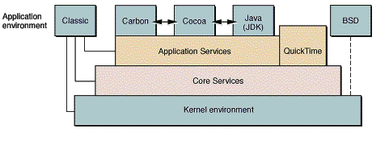
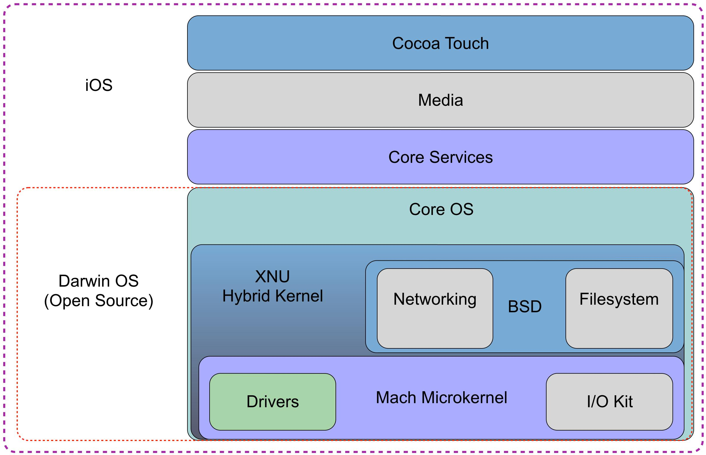

Nesta camada está a base open-source dos sistemas da Apple (macOS, iOS, tvOS, watchOS, visionOS). Ela fornece o núcleo do sistema operacional, incluindo kernel, drivers, sistema de arquivos, networking e modelo de permissões. É a fundação sobre a qual as camadas superiores (Core Services, Media e Cocoa Touch) são construídas.

## Kernel XNU

O kernel usado pelo Core OS se chama XNU, sigla para "X is Not Unix". Ele é o núcleo do Darwin, a base open source que sustenta os sistemas da Apple. O Darwin reúne o kernel e as partes centrais do sistema, sem as camadas proprietárias como Quartz, Cocoa e Carbon.

O XNU tem uma arquitetura híbrida. Isso significa que ele combina duas abordagens normalmente tratadas como opostas onde há um microkernel, que separa serviços em módulos isolados, e um kernel monolítico, que concentra a maior parte dos serviços em um único espaço, com mais performance. O XNU é formado por três componentes principais:

- Mach: o microkernel. Cuida do gerenciamento de tarefas, threads, memória virtual e IPC (comunicação entre processos). É a camada de mais baixo nível, responsável por controlar a execução.
- BSD: a camada baseada em Unix, herdada principalmente do FreeBSD. Fornece o modelo de processos, permissões, chamadas de sistema (syscalls), sistema de arquivos e rede.
- IOKit: framework orientado a objetos, escrito em um subconjunto restrito de C++, usado para comunicação com hardware através de drivers.

Juntando os três, o XNU une a flexibilidade de um microkernel com a performance de um kernel monolítico.

- o Mach cuida do escalonamento de CPU, do gerenciamento de memória virtual e do isolamento de processos
- o BSD entrega o modelo de processos, sockets e chamadas de sistema
- o IOKit faz a mediação entre software e hardware

## Drivers de hardware

Os drivers implementam a comunicação com dispositivos físicos, como armazenamento, sensores e rádio. Eles rodam com alto privilégio dentro do IOKit e expõem interfaces controladas para o restante do sistema. Por rodarem em *kernel space* com privilégio elevado, drivers são uma superfície relevante em avaliações de segurança.

## Security Framework

O Security Framework reúne os mecanismos que protegem a integridade do sistema e os dados do usuário. Os principais componentes são:

- Code Signing e AMFI: validam a integridade e a origem de um binário antes de permitir sua execução
- Sandbox (Seatbelt): restringe o que cada processo pode fazer, limitando acesso a arquivos, rede e IPC
- Secure Enclave: coprocessador dedicado a operações criptográficas e à proteção de chaves, isolado do processador principal

Esses três mecanismos, combinados, garantem isolamento entre processos e protegem segredos armazenados no dispositivo. O framework também gerencia certificados e o armazenamento seguro de credenciais, através do Keychain, além de suporte a SSL e TLS para comunicação segura pela rede.

## Sistema de arquivos: APFS

O APFS (Apple File System) é o sistema de arquivos usado nas plataformas atuais da Apple. Ele gerencia armazenamento com criptografia nativa, snapshots, copy on write e proteção por classes de dados (Data Protection).

O APFS controla organização, persistência e permissões dos arquivos no dispositivo, e substituiu o antigo HFS+ como padrão.

## Outros componentes do Core OS

Vale registrar mais três peças que também fazem parte dessa camada, mesmo não sendo tão citadas quanto o kernel:

- libSystem: conjunto de bibliotecas de sistema que sustenta o restante do SO, incluindo a libc (funções como malloc, free, open) e a libdispatch, responsável pelo Grand Central Dispatch (GCD), usado para concorrência
- gerenciamento de energia: controla como CPU, tela e interfaces de rede consomem energia, incluindo sleep e controle de tarefas em background
- rede: a pilha TCP/IP e o Bonjour, a implementação da Apple para descoberta de dispositivos em rede local sem configuração manual

## Referências

- Apple Developer Documentation. Kernel Architecture Overview. Disponível em: https://developer.apple.com/library/archive/documentation/Darwin/Conceptual/KernelProgramming/Architecture/Architecture.html
- VIJAYAN, Binoy. iOS SDK Architecture. DEV Community, 2025. Disponível em: https://dev.to/binoy123/ios-sdk-architecture-3h11