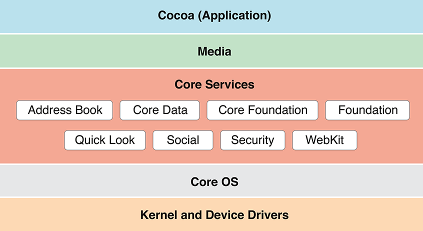

# Core Services

O Core Services fica entre o Core OS e as camadas de Media e Cocoa Touch. Ele pega os serviços de baixo nível do Core OS, como acesso a disco e rede, e entrega isso para as apps em uma forma mais pronta para uso como persistência de dados, comunicação com a nuvem, tipos de dados e armazenamento seguro de credenciais.

> Essa é uma imagem tirada da documentação do MacOS, mas imagino que não deve ser muito diferentes para iOS.

## Principais componentes

<Stepper>
  <Step title="Core Foundation">
    Framework base em Objective-C que fornece tipos de dados, coleções e classes utilitárias usadas por praticamente todo o resto do SDK. É a camada Objective-C sobre o Core Foundation, que é a versão em C dos mesmos conceitos.
  </Step>
  <Step title="Core Data">
    Gerencia a camada de model da arquitetura MVC. Trabalha com object graphs, ou seja, representa os dados da app como objetos relacionados entre si, e cuida da persistência desses objetos em disco.
  </Step>
  <Step title="CFNetwork">
    API de comunicação de rede baseada em C, com acesso de baixo nível à pilha TCP/IP e a sockets BSD. É a base para trabalhar com HTTP, FTP, DNS e conexões seguras via SSL e TLS.  
  </Step>
  <Step title="CloudKit">
    fornece armazenamento e sincronização de dados na nuvem da Apple. Cada app tem um container próprio, com uma base pública e uma privada, e pode usar o Core Data em conjunto com o CloudKit para sincronizar dados entre dispositivos do mesmo usuário.
  </Step>
  <Step title="Keychain Services">
    Armazenamento seguro de senhas, chaves e outras informações sensíveis. É o mecanismo recomendado sempre que a app precisa guardar uma credencial.
  </Step>
  <Step title="SQLite">
    Biblioteca que embarca um motor de banco de dados SQL na app. O próprio Core Data pode usar SQLite como backend de armazenamento.
  </Step>
</Stepper>

## Referências

- Apple Developer Documentation. Core Services Layer. Disponível em: https://developer.apple.com/library/archive/documentation/MacOSX/Conceptual/OSX_Technology_Overview/CoreServicesLayer/CoreServicesLayer.html
- VIJAYAN, Binoy. iOS SDK Architecture. DEV Community, 2025. Disponível em: https://dev.to/binoy123/ios-sdk-architecture-3h11
- Techotopia. The iPhone iOS 4 Core Services Layer. Disponível em: https://www.techotopia.com/index.php?title=The_iPhone_iOS_4_Core_Services_Layer
