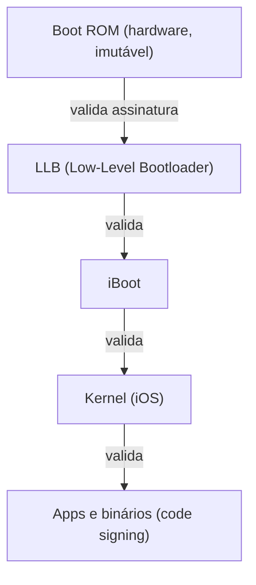

# Boot ROM e Chain of Trust

## Boot ROM

A Boot ROM é o primeiro código executado quando um dispositivo iOS é ligado. Ela fica gravada em hardware, o que a torna imutável, e carrega as chaves necessárias para validar o próximo estágio do boot. Como está implementada (em textos em inglês, *burn*) no chip, não existe forma de alterá-la remotamente, o que a torna a raiz de confiança de todo o processo de inicialização.

Não é possível acessar a Boot ROM diretamente, mas dá para observar sua atuação através dos modos de boot do próprio dispositivo. Ao colocar um iPhone em DFU Mode e conectá-lo a um Mac, o Finder detecta o aparelho em modo de recuperação sem chegar a carregar o iOS, já que apenas a Boot ROM está ativa nesse estágio. Da mesma forma, durante um restore feito pelo Finder ou iTunes, a Boot ROM valida a assinatura da imagem de firmware (o IPSW) antes de prosseguir, e o processo falha caso essa assinatura não seja válida.

## Chain of Trust

A Chain of Trust é o mecanismo que garante que cada estágio do boot valide criptograficamente o próximo, começando na Boot ROM e terminando no kernel.

Cada etapa dessa cadeia verifica uma assinatura digital usando a chave pública da Apple, garantindo que o binário seguinte não foi alterado e que realmente foi assinado pela Apple. Se algum componente for modificado, a assinatura correspondente quebra e o boot falha nesse ponto.

Essa cadeia pode ser observada na prática de algumas formas. Tentar restaurar um IPSW não assinado pela Apple falha, já que o iBoot rejeita a imagem antes mesmo de tentar carregá-la. Jailbreaks semi tethered ou tethered também evidenciam esse comportamento, pois o jailbreak desaparece após um reboot e o sistema volta ao estado íntegro validado pela cadeia, o que mostra que a alteração feita pelo jailbreak acontece apenas em runtime e não sobrevive a uma nova verificação de boot. Logs de restore no Finder ou iTunes também expõem falhas de verificação quando alguma etapa da cadeia não confere.

Isso significa que apenas código assinado e confiável tem permissão para rodar durante a inicialização do dispositivo, o que empurra qualquer tentativa de persistência maliciosa para depois do boot, em vez de conseguir sobreviver dentro dele.

## Referências

- Apple Platform Security Guide. Boot process. Disponível em: https://support.apple.com/guide/security/welcome/web
