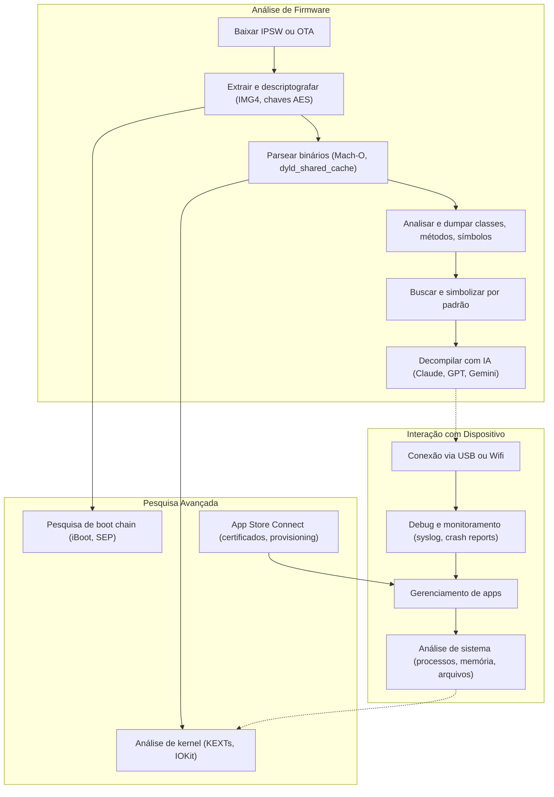

# iOS RE com ipsw

O `ipsw` é uma ferramenta de linha de comando abrangente para pesquisa em iOS e macOS, funcionando quase como um canivete suíço para análise das plataformas da Apple. Seja você um pesquisador de segurança, um reverse engineer, um desenvolvedor de jailbreak ou só um entusiasta de iOS, o `ipsw` reúne o que é necessário para baixar, processar, analisar e interagir com firmware e dispositivos Apple.

## Principais funcionalidades

- Análise de IPSW e OTA: baixa, extrai e analisa arquivos de firmware do iOS vindos de várias fontes.
- Análise binária: desmontagem ARM avançada de binários Mach-O, com decompilação assistida por IA.
- dyld_shared_cache: análise completa do cache compartilhado, incluindo dump de classes Objective-C e Swift.
- Análise de kernel: parsing do kernelcache, extração de KEXTs e simbolização.
- Interação com dispositivos: gerenciamento e depuração de dispositivos iOS através do `idev`.
- Pesquisa de firmware: análise de IMG4, iBoot, SEP e outros coprocessadores.
- App Store Connect: integração com a API para gerenciamento de apps e certificados.
- Ferramentas de desenvolvedor: SSH, integração com Frida, depuração e utilitários variados de engenharia reversa.
- Análise assistida por IA: decompilador integrado com suporte a Claude, OpenAI, Gemini e Ollama.

O fluxo abaixo resume como essas funcionalidades se encaixam, entre a análise de firmware baixado e a interação com um dispositivo real conectado:

Nos próximos tópicos vamos instalar o `ipsw` e usar algumas de suas funcionalidades práticas para pentest, como a leitura de plists e o dump de classes Objective-C e Swift.

## Referências

- Documentação do ipsw. Disponível em: https://blacktop.github.io/ipsw/docs/introduction
