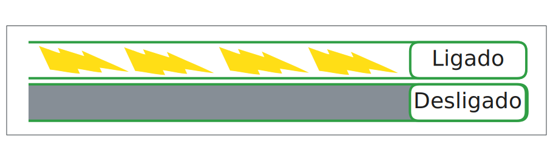
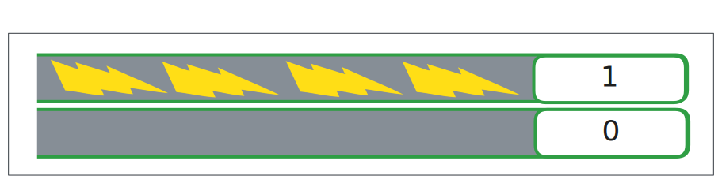

import transistorImg from './img/transistor_pic.jpg';
import Tabs from '@theme/Tabs';
import TabItem from '@theme/TabItem';

#  Computadores

Muitas pessoas limitam o conceito de “computador” àquela caixa que fica embaixo da mesa, ligada a um monitor. Essa imagem não está errada, mas é incompleta. Um computador vai muito além disso. Celulares, smartwatches, notebooks, câmeras digitais, roteadores, videogames e servidores também são computadores. A diferença entre eles não está no fato de serem ou não computadores, mas na forma como são usados e no tipo de tarefa que executam.

De forma simples, **um computador é qualquer dispositivo eletrônico que pode ser programado para executar um conjunto de instruções lógicas**. 

Por enquanto, basta guardar essa definição. Com o tempo, ela vai fazer cada vez mais sentido.

#  Analógico vs Digital
É muito comum as pessoas associarem computadores a dispositivos digitais, em contraste com objetos como relógios de pulso clássicos, que costumam ser chamados de analógicos. Mas o que isso realmente significa? O que diferencia algo analógico de algo digital?

##  Abordagem analógica
Olhe ao seu redor e escolha qualquer objeto. Agora tente descrever características como tamanho e peso. Fazer isso com precisão não é simples sem ferramentas como uma régua ou uma balança.
Na ausência dessas ferramentas, normalmente usamos comparações:
- “Essa boneca tem mais ou menos um palmo de altura”
- “Ela pesa mais ou menos o mesmo que um copo cheio de água”

Ao fazer isso, você cria uma escala de referência. Você não sabe a medida exata, mas consegue representar o tamanho e o peso usando comparações contínuas com outros objetos.

Nesse contexto, podemos dizer algo como:
- altura da boneca = 1 palmo
- peso da boneca = 1 copo

Se houver duas bonecas iguais, elas teriam:
- 2 palmos de altura
- peso equivalente a 2 copos

Então você consegue comparar, a mão com um objeto e dizer o quão grande ou pequeno ele é por meio de uma analogia, e em outras palavras, é um tipo de representação é analógica. Ela funciona por aproximação, comparação e variação contínua. Pequenas mudanças geram pequenas diferenças no resultado, sem saltos bruscos.

O mesmo acontece em uma balança analógica. À medida que o peso aumenta, a agulha se move de forma contínua. Não há “pulos” entre valores. O ponteiro pode estar exatamente entre dois números, representando algo como “um pouco mais” ou “um pouco menos”.

Em uma balança analógica tradicional, o que move a agulha não é eletricidade, é força física, mais especificamente a força da gravidade atuando sobre o objeto. Quando você coloca um objeto sobre a balança, ele exerce uma força para baixo devido ao seu peso. Essa força é transmitida para uma mola, e dependendo do quanto essa mola for pressionada, ela vai mexer a agulha indicando mais ou menos peso. Ou seja, o peso aplicado a balança é comparado ao quão bem a mola resiste a ele, e a agulha para onde aponta o quilograma, reage de acordo e torna a leitura fácil para o usuário final.

Esse é o coração da abordagem analógica: representar informações como variações contínuas, sem valores fixos e discretos.

Outro exemplo de medida analógica, seria o termômetro de mercúrio. O volume do mercúrio aumenta conforme a temperatura aumenta, isso é uma propriedade natural dele. Os fabricantes colocam uma quantidade de mercúrio em um tubo de vidro com várias marcações (por exemplo, 24°C, 30°C) que correspondem a um determinado volume que o mercúrio pode assumir dependendo da temperatura. Essas posições do mercúrio em tubos de vidro representam então a temperatura.

Perceba que em ambos os exemplos, tanto a mola, quanto o mercúrio, não medem nada sozinhos, mas o dispositivo criado consegue se aproveitar deles para converter posições que eles assumem em unidades de medidas, números, muito mais palpáveis para nós humanos.

Porém aqui vai um problema, esses números não são precisos, se a agulha da balança para entre 59Kg e 60Kg, ou se o mercúrio parar entre 29°C e 30°C. Até poderíamos chutar que é 59,5Kg no caso da balança, mas não teria como ter certeza absoluta, apenas seria uma aproximação. Logo, é necessário algo mais literal, mais preciso, que dispositivos analógicos não conseguem entregar.

## Abordagem digital

Mas o que tudo isso tem a ver com computadores? O ponto central é que representações analógicas são um problema para máquinas digitais. Sistemas analógicos variam demais em forma e comportamento, o que torna extremamente difícil criar uma única máquina capaz de interpretar todos eles diretamente. Medir o deslocamento de uma mola, o volume de mercúrio ou a pressão do ar exige mecanismos físicos completamente diferentes.

Além disso, computadores dependem de representações confiáveis e repetíveis. Sistemas analógicos sofrem com ruído, desgaste e perda de fidelidade ao serem copiados. Pequenas variações físicas podem alterar o resultado, e isso é inaceitável para uma máquina que precisa produzir sempre a mesma saída para a mesma entrada.

Por isso, computadores adotam uma abordagem diferente: a **representação digital**. Em vez de lidar com variações contínuas, um sistema digital trabalha com um conjunto pequeno e bem definido de estados possíveis. Cada estado é claramente distinguível dos demais, sem zonas intermediárias. Um exemplo simples é o interruptor de luz. Ele só pode estar ligado ou desligado. Não existe “meio ligado”. Sempre que alguém observa o interruptor, o estado é fácil diz se está ligado ou não.

Dentro do computador, algo parecido acontece. **Sinais elétricos chegam aos circuitos e são interpretados de forma discreta: uma tensão mais baixa representa um estado, enquanto uma tensão mais alta representa outro**. Componentes como o transistor [^1] permitem armazenar e manter esses estados de forma estável, assim guardando a presença ou ausência de energia dentro dele.

<Figure src={transistorImg} alt="Imagem de um transistor" caption="Imagem de um transistor"/>

:::tip
Para entender em profundidade como esses estados elétricos são produzidos e mantidos, seria necessário estudar eletricidade, física e química. Aqui, o foco não é o *como físico*, mas o *significado lógico* desses estados.
:::

### Do elétrico ao abstrato

É importante deixar algo claro neste ponto: **sinais elétricos não são números**.

Uma tensão em um fio não “vale” 0 ou 1 por natureza. Esses valores não existem na eletricidade. O que existe são apenas fenômenos físicos: corrente, tensão, carga e resistência. O que transforma esses fenômenos em algo útil é uma decisão humana.

Dentro do computador, circuitos são projetados para trabalhar apenas com dois estados elétricos bem definidos. Um deles corresponde a uma tensão mais baixa, e o outro a uma tensão mais alta. Não importa o valor exato da tensão, desde que ela esteja claramente dentro de um desses dois estados.

Por convenção, escolhe-se interpretar um desses estados como 0 e o outro como 1. Esses valores não surgem da eletricidade em si, mas da necessidade de representar informação de forma simples, confiável e repetível.

  
Um pouco mais sobre transistores e sinais elétricos

  Transistores podem funcionar como interruptores, permitindo ou bloqueando a passagem de corrente elétrica em um circuito.

  Quando um transistor permite a passagem de corrente, dizemos que ele está em um estado; quando bloqueia a corrente, está em outro. Esses dois estados físicos são usados como base para representar os valores lógicos 1 e 0.

  O papel do transistor não é “criar” números, mas garantir que o circuito permaneça firmemente em um estado ou no outro, evitando valores intermediários que poderiam causar erros.

Os transistores, portanto, não trabalham com números. Eles apenas mantêm estados elétricos estáveis. O significado desses estados, 0 ou 1, é uma abstração criada para que computadores possam armazenar e processar informações.
Criei alguns desenhos para garantir que estamos alinhados quanto ao entendimento de eletricidade e sinais digitais. Então vamos revisar aos poucos.

As abas abaixo começam no nível 2 de abstração e vão até o nível 0 que seria o mais próximo do que acontece na realidade. Conforme diminuir o nível de abstração você estará mais perto de entender como a transformação de sinais elétricos se tornam 0 e 1!

<Tabs>
  <TabItem value="abstract2" label="Nível 2" default>
    O jeito mais simples de representar informações usando fios e eletricidade é trabalhar com dois estados distintos: ligado e desligado, definidos pela presença ou ausência de corrente elétrica:
    
  </TabItem>
  <TabItem value="abstract1" label="Nível 1">
    Fazemos uma escolha abstrata ao criar um transistor: decidimos que o estado ligado será interpretado como 1, e o estado desligado como 0. Observe que a presença de corrente significa 1 e ausência significa 0.
    
  </TabItem>
  <TabItem value="abstract0" label="Nível 0">
    Se você entendeu os níveis anteriores isso é ótimo, está no caminho certo! Entretanto as duas explicações foram apenas uma forma de tornar o conteúdo mais acessível. Espero não te decepcionar com isso, mas a realidade é que não existe exatamente "ligado" ou "desligado" essa é apenas uma forma de abstrair e simplificar.

    Podem haver diferentes voltagens fluindo até chegar ao transistor, essa variação não agrada muito aos computadores, precisamos de mais precisão aqui, é necessário portanto saber exatamente qual quantidade vai representar "1" e "0".

    Em 1947, foi inventado o transistor por engenheiros que definiram que um transistor deve estar ligado quando receber uma determinada quantidade de eletricidade, do contrário, se manterá desligado. 
    
    Legal, mas qual a quantidade de eletricidade é suficiente então? Bem, os transistores são configurados pelos engenheiros de forma que, se por exemplo, o limiar que for definido é de 4.5 volts, então qualquer voltagem igual ou maior que 4.5V ligará o transistor. E qualquer voltagem inferior, o transistor permanece desligado.

    

  </TabItem>
</Tabs>

:::tip
Lembrando que se aprofundar nos níveis de abstração é uma opção sua, decida com cuidado o quão comprometido e interessado está em entender esse conteúdo. Não existe problema nenhum em parar nos níveis mais altos, muito menos em tentar os mais baixos.
:::

### Símbolos antes de números

Esses sinais ainda não são números. Eles são apenas símbolos confiáveis, capazes de serem distinguidos sem ambiguidade. O passo seguinte é organizá-los em sequências e manipulá-los seguindo regras bem definidas.

É nesse momento que os números entram em cena.

O computador não “entende” números no sentido humano. Ele apenas manipula símbolos. Os números surgem quando nós interpretamos determinadas sequências desses símbolos como valores numéricos.

Assim como marcas em um papel não são números, mas representam números, estados elétricos também não são números. Eles apenas os representam.

Antes de falar sobre sistemas de numeração, é fundamental entender essa diferença. Números não surgem da eletricidade. Eles surgem da necessidade de dar significado abstrato a estados físicos confiáveis.

Para que isso funcione de forma consistente, é preciso um sistema que defina como esses símbolos representam valores. É exatamente esse o papel de um sistema de numeração.

[^1]: Helerbrock, Rafael. Transistor: o que é, função, onde é usado, origem - Brasil Escola. Brasil Escola. Disponível em: https://brasilescola.uol.com.br/fisica/transistor.htm. Acesso em: 07 fev. 2026.
[^2]: The Engineering Mindset. Transistors Explained - How transistors work. Disponível em https://www.youtube.com/watch?v=J4oO7PT_nzQ. Acesso em: 07 fev. 2026.
