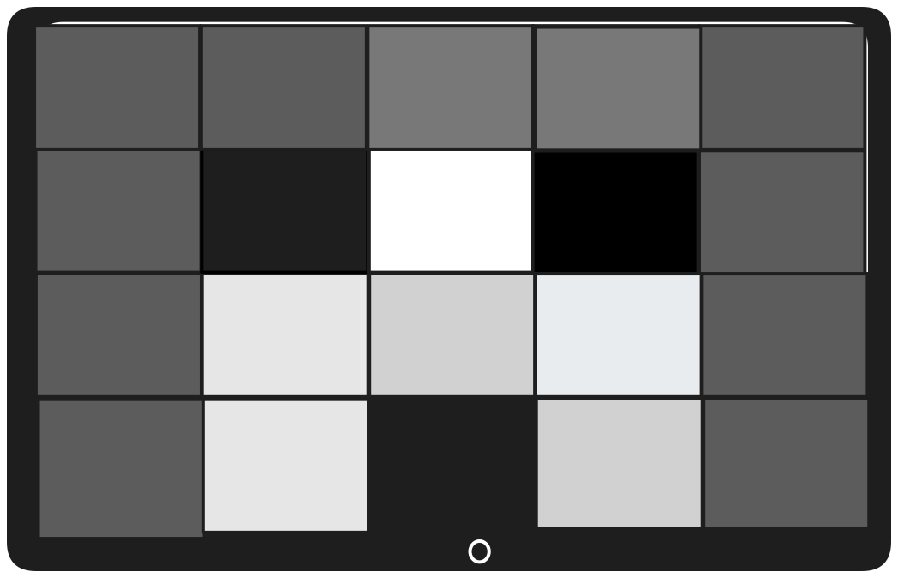

import Tabs from '@theme/Tabs';
import TabItem from '@theme/TabItem';

# Imagem digital 

Agora que vimos como representar números e texto em binário, vamos explorar as cores, apenas outro tipo de dado que o computador precisa armazenar. Qualquer máquina com tela gráfica precisa de um sistema para armazenar cores, e **uma imagem nada mais é do que um arranjo de cores em um plano bidimensional**.
Complicado? Depois dessa imagem vai ver que é mais simples do que parece:

Neste exemplo temos uma imagem formada por 20 quadrados pintados em escalas de cinza, e apesar das críticas que insisto em ignorar, afirmo com convicção que trata-se de um rosto. Um rosto muito simpático, inclusive.

O ponto é que imagens não passam de uma porção enorme de pequenos quadrados organizados em uma grade, onde cada quadradinho é preenchido com uma única cor. Esses quadrados se chamam **pixels**. A imagem acima, por exemplo, tem 5 pixels de largura e 4 pixels de altura, totalizando majestosos 20 pixels de resolução.

> Os pixels estão exagerados aqui de propósito pois é material didático, não um NFT. Qualquer dispositivo moderno também funciona como uma grade de pixels, só que cada pixel é pequeno o suficiente para você nunca perceber.

Separei alguns exemplos do mundo real onde o conhecimento sobre imagens digitais se aplicam, espero que seja tão divertido para ti, quanto foi para mim escrever.

<Tabs>
  <TabItem value="image_definition" label="Resolução de imagens" default>
    Você certamente já ouviu termos como "câmera de 1080p", "monitor Full HD" ou "4K". Tudo isso se refere exatamente ao que estamos discutindo, que é a quantidade de pixels que compõem a imagem.

    Uma tela Full HD, por exemplo, tem 1920 × 1080 pixels, ou seja, mais de 2 milhões de quadradinhos sendo atualizados dezenas de vezes por segundo. E você achando que era só "imagem bonita".
  </TabItem>

  <TabItem value="pixelado" label="Câmeras e imagens pixeladas">
    Câmeras de baixa resolução registram a cena com poucos pixels. Com pouca informação para preencher a tela, cada pixel fica grande e visível e o resultado é aquela imagem borrada e cheia de quadrados que nem de longe representa o que seus olhos viram. É o computador fazendo o melhor que pode com o que tem.

    Câmeras de segurança dos anos 90 agradecem pela compreensão.
  </TabItem>

  <TabItem value="zoom" label="Zoom digital vs. óptico">
    Sabe quando você dá zoom numa foto e a imagem começa a ficar "feia"? Isso acontece porque o zoom digital não está revelando mais detalhes, ele está apenas **ampliando os pixels existentes**. É como pegar uma imagem pequena e esticá-la. Em algum momento os quadradinhos aparecem.

    O zoom óptico, presente em câmeras melhores, funciona diferente. É uma lente física se movendo, capturando de fato mais detalhes da cena. Daí a diferença de preço.
  </TabItem>

  <TabItem value="retina" label="Displays Retina e PPI">
    A Apple popularizou o termo *Retina Display* para telas com densidade tão alta de pixels que o olho humano não consegue distinguir os quadradinhos individualmente. A unidade usada é **PPI** (*pixels per inch* ou pixels por polegada).

    Uma tela comum tem em média 100 PPI. Um smartphone moderno chega a 460 PPI. A partir de certo ponto, adicionar mais pixels não melhora a experiência visual, mas vende muito bem no marketing.
  </TabItem>
</Tabs>
