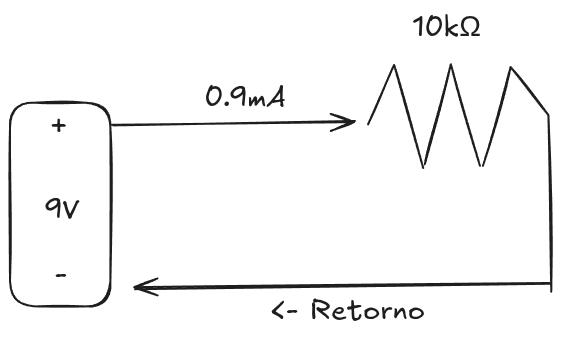
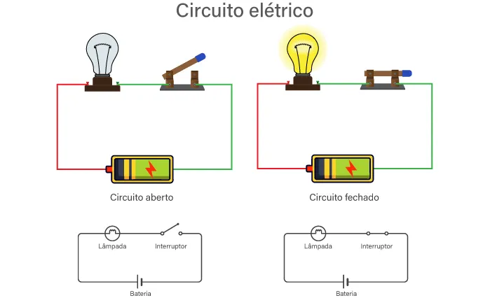

Faremos agora uma breve passagem pelo mundo dos circuitos elétricos. O objetivo é apresentar o significado de alguns termos que usaremos com frequência daqui em diante, sem transformar isso em uma aula de física. Você não precisa sair deste capítulo como especialista em eletricidade, então leia com calma.

# Eletricidade

Toda a computação que estudamos até agora, os bits, os estados 0 e 1, os transistores, tudo isso acontece sobre a base física da **eletricidade**. Para entender como circuitos funcionam, precisamos conhecer pelo menos quatro conceitos. Vou apresentar cada um com uma analogia de água, que costuma ajudar bastante.

<Stepper>
  <Step title="Carga elétrica - Propriedade da matéria.">
    - Toda matéria é feita de átomos
	- Os átomos contêm partículas carregadas 
	- Prótons Protons têm carga positiva
	- Elétrons têm carga negativa
	- Nêutrons não têm carga nenhuma
	- Cargas opostas se atraem e cargas iguais se repelem
	- A carga é medida em coulombs ($C$)
    
	Pense na carga como a própria água, ela existe e pode se mover.

  </Step>
  <Step title="Corrente elétrica - O movimento de carga por um condutor.">
    - Quando elétrons se movem por um material condutor, como um fio de cobre, dizemos que há corrente elétrica.
	- A corrente mede a intensidade desse fluxo, ou seja, quanta carga passa por um ponto em um dado tempo. 
	- É medida em amperes ($A$) e representada pelo símbolo $I$ nas equações.

:::info
1 ampere equivale a 1 coulomb de carga passando por um ponto por segundo. Se um fio tem 5A e outro tem 1A, o primeiro move carga cinco vezes mais rápido.
:::

    Na analogia com água, a corrente é o fluxo de água pelo cano, quanto mais rápido a água passa, maior a corrente.
  </Step>
  <Step title="Tensão (voltagem) - A diferença de potencial entre dois pontos.">
    A tensão é o que "empurra" a carga pelo circuito.
	- Quanto maior a tensão, maior a corrente gerada
	- Uma bateria de 9V tem 9V entre seus terminais mesmo quando desconectada, esperando ser usada. 
	- É medida em volts ($V$) e representada pelo símbolo $V$ nas equações.

:::info
Tensão é sempre medida entre dois pontos, nunca em um ponto isolado. É a diferença de potencial elétrico, o trabalho necessário para mover 1 coulomb de carga de um ponto ao outro.
:::

    Na analogia com água, a tensão é a pressão que empurra a água pelo cano. Sem pressão, a água não vai a lugar nenhum, e sem tensão, a carga também não.
  </Step>
  <Step title="Resistência - A dificuldade que a corrente encontra ao atravessar um material.">
    Nem todo material conduz eletricidade da mesma forma. Um fio de cobre tem resistência tão baixa que a tratamos como zero nos cálculos.
	- Um **resistor** é um componente que introduz uma resistência específica no circuito onde precisamos controlar a corrente. 
	- A resistência é medida em ohms ($\Omega$) e representada pelo símbolo $R$.

:::info
Um **condutor** é qualquer material que permite o fluxo de corrente. Fio de cobre, por exemplo, é um bom condutor. Um **isolante**, como o plástico que reveste os fios, bloqueia a passagem de corrente.
:::

    Na analogia com água, a resistência é a largura do cano. Um cano estreito dificulta o fluxo, assim como uma resistência alta dificulta a corrente.
  </Step>
</Stepper>

|                   Sistema hidráulico                |                            Circuito elétrico                            |
| :-----------------------------------------------------: | :---------------------------------------------------------------------: |
|       
**Bomba d'água**
Move água pelo cano       |      
**Bateria (fonte de tensão)**
Move carga pelo circuito      |
|    
**Pressão da água**
Determina a taxa de fluxo     |               
**Tensão (volts)**
Determina a corrente                |
| 
**Fluxo de água**
Litros/segundo passando pelo ponto | 
**Corrente elétrica (amperes)**
Coulombs/segundo passando pelo ponto |
|     
**Cano estreito**
Restringe o fluxo de água      |          
**Resistor (ohms)**
Restringe o fluxo de corrente           |
|   
**Cano largo**
Fluxo livre, sem restrição     |         
**Fio de cobre**
Resistência quase zero, corrente livre          |

## Diagramas de circuito e conceito de laço

Circuitos são representados com símbolos padronizados. Os dois mais comuns são o resistor e a fonte de tensão (bateria). As linhas que conectam os símbolos representam os fios.

**Um circuito elétrico é um conjunto de componentes conectados de forma que a corrente flua em laço, partindo da fonte, passando pelos componentes e voltando à fonte.**

A corrente percorre o laço completo, não apenas o resistor.

Dois estados definem se a corrente consegue circular. Quando o caminho está completo e a corrente pode passar, chamamos de **circuito fechado**. Quando há uma interrupção no caminho, impedindo o fluxo, chamamos de **circuito aberto**. Um interruptor de luz funciona exatamente assim, abrir o circuito interrompe o fluxo e a lâmpada apaga.

## Tensões no circuito

Nos próximos capítulos você vai encontrar alguns rótulos de tensão com bastante frequência. Já que estamos aqui, vale apresentá-los antes.

**$V_{cc}$** é a tensão de alimentação do circuito. Pense nela como a bateria do sistema, a fonte que fornece energia para que tudo funcione. Circuitos digitais costumam usar $5\,\text{V}$ ou $3{,}3\,\text{V}$ como alimentação.

**$V_{in}$** e **$V_{out}$** são as tensões de entrada e saída de um componente. Se um circuito recebe uma tensão pela entrada ($V_{in}$), processa e entrega uma tensão na saída ($V_{out}$), esses rótulos indicam exatamente onde cada medição está sendo feita. Isso vai ficar mais claro quando chegarmos nos transistores.

## Ground (GND)

O ground é o ponto de referência do circuito, definido como $0\,\text{V}$. Toda tensão no circuito é medida em relação a ele. Nos circuitos simples, o GND equivale ao terminal negativo da bateria. Quando você vê o símbolo de GND em um diagrama, é ali que o laço do circuito se fecha.

## Capacitor

Existe um componente que aparece mais adiante e vale mencionar brevemente agora chamado **capacitor**. Ele armazena energia temporariamente e tem um comportamento particular de que quando está descarregado, age como um curto-circuito e deixa a corrente passar livremente. Quando está carregado, bloqueia a corrente. O tempo que leva para carregar ou descarregar depende da sua **capacitância**, medida em farads ($\text{F}$). Na prática, capacitores pequenos são medidos em microfarads ($\mu\text{F}$). Você vai entender o porquê disso ser útil quando falarmos sobre memória.

## E agora?

Esse trecho foi feito apenas para introduzir termos como tensão, corrente e resistência, que são o suficiente para seguirmos adiante. Vamos então carregar esse vocabulário e levá-lo para o próximo capítulo!