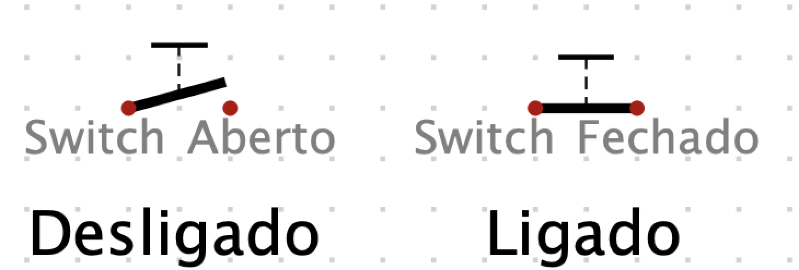
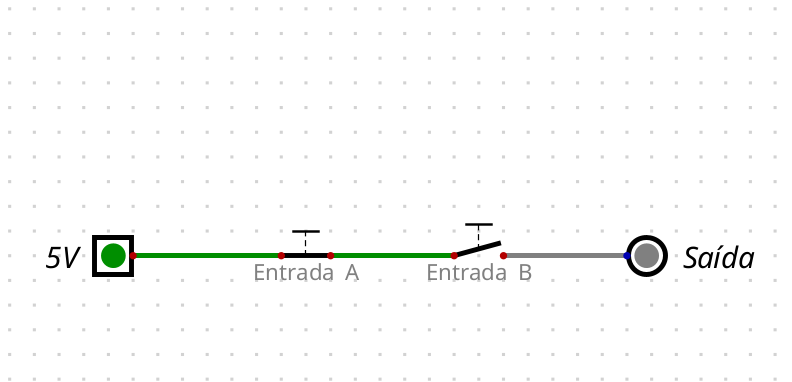
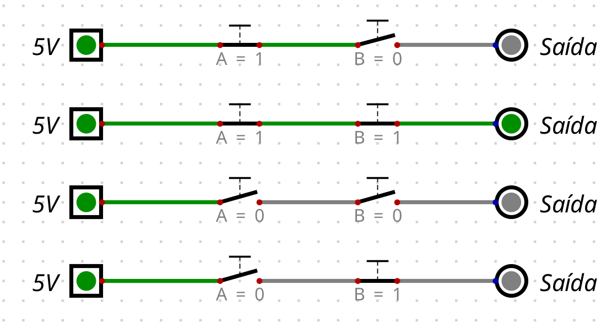
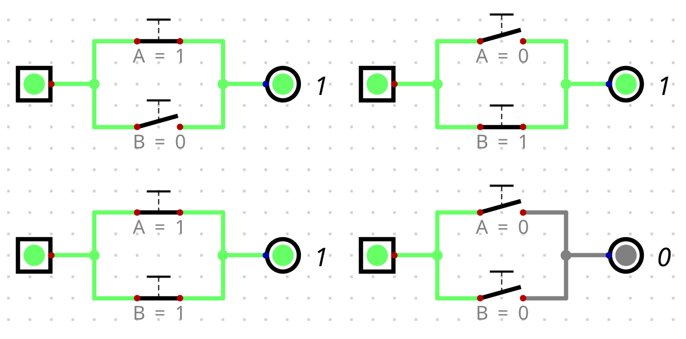

# Circuitos Digitais

Até aqui falamos de lógica binária de forma bem generalista, verdadeiro, falso, AND, OR, tabelas verdade. Mas em algum momento essas operações precisam sair do papel e acontecer em algum componente físico dentro do computador.

Os circuitos digitais são o elo entre a lógica que estudamos e a eletricidade que corre pelos chips. Entender como um AND ou um OR se traduz em circuito vai fechar uma lacuna importante na forma como você imagina a computação, e felizmente não é tão complicado quanto parece.

## Sinais digitais e tensão

Circuitos digitais lidam com sinais que representam um número limitado de estados, e como estamos lidando com circuitos digitais binários, consideramos apenas dois estados: 0 e 1. Usamos tensão para representar 0 ou 1 em um circuito digital, onde 0 é uma tensão baixa e 1 é uma tensão alta. Sendo que a tensão baixa é de $0\,\text{V}$, e a alta tende a ser $5\,\text{V}$, $3{,}3\,\text{V}$ ou $1{,}8\,\text{V}$, a depender do circuito.

Na verdade, circuitos digitais não demandam muita precisão para registrarem alta ou baixa tensão. Por exemplo, em um circuito digital de $5\,\text{V}$, uma entrada de $2\,\text{V}$ a $5\,\text{V}$ pode ser registrada como alta, e de $0\,\text{V}$ a $0{,}8\,\text{V}$ como baixa. Qualquer outra tensão resulta em algo indefinido e deve ser evitado.

## Lógica com switches mecânicos
Agora que já entendemos que alta e baixa tensão representam 1 e 0 no circuito digital, podemos direcionar o aprendizado a como construir um circuito digital. Queremos um circuito onde as tensões de entrada e saída sejam sempre um valor alto ou baixo predeterminado, ou pelo menos dentro de uma faixa aceitável. 

Para nos ajudar com isso, vamos trazer um elemento ao circuito que é bem simples um chaveador mecânico (*mechanical switch*). Um interruptor é útil porque sua natureza é digital, afinal, ou está ligado, ou desligado.
- **Ligado:** age como um fio de cobre normal, permitindo que a corrente elétrica flua livremente.
- **Desligado:** age como um circuito aberto e a corrente não consegue fluir.

:::info
Por mais que eu queira utilizar a palavra "chaveador", sinto que meus textos serão mais úteis para você leitor, se eu te ajudar a se habituar com o termo em inglês. Pois quando for comprar seus próprios componentes, fazer trabalhos para faculdade, ou outras leituras, o fato de você saber o que um "switch" faz, pode te ajudar a entender outros temas onde ele também será usado. Portanto de agora em diante chamaremos de *switch* o dispositivo e "chavear" será a palavra usada para descrever o que ele faz.
:::

Para representar um *switch*, usamos os seguintes símbolos:

:::tip
Esse print, esse desenho simpático foi tirado de dentro do programa chamado "Digital", que você pode baixar do [github](https://github.com/hneemann/Digital) se quiser também se divertir montando circuitos.

Em outros momento o print virá de um outro programa, este é online disponível no site [falstad - simulador de circuitos](https://www.falstad.com/circuit/).
:::

### Porta AND com switches
Podemos usar esses *switches* como fornecedores de entrada para a nossa tabela verdade AND. Lembre-se que a tabela AND é composta por todas as possibilidades de combinação de 0 e 1, e irá produzir a saída 1 apenas quando as duas entradas forem 1. Vamos traduzir isso para circuitos digitais usando os *switches*:

Observe o circuito abaixo, onde está sendo constantemente fornecida uma entrada de $5\,\text{V}$ (alta tensão = 1).

- Ao encontrar o primeiro *switch* ("Entrada A"), não houve interrupção pois ele está fechado, permitindo a passagem da corrente, portanto permanecemos com o valor 1.
- Ao chegar na "Entrada B", nosso segundo *switch*, ele está aberto, fazendo com que nenhuma tensão fosse adiante. Por consequência, a tensão chegou como baixa na saída, resultando no valor 0.

Se observarmos o que fizemos aqui, percebe-se que a operação AND usou A = 1 e B = 0, portanto `1 AND 0 = 0`. Caso esteja com a memória em dia, vai se lembrar de que essa mesma linha existe na tabela verdade AND.

Para provar isso, podemos simular as 4 situações possíveis. Observe que a corrente só passa quando ambos os *switches* estão ligados:

### Porta OR com switches

Podemos usar os *switches* também para criar um circuito que produza os resultados da tabela verdade OR:

Até o momento utilizamos *switches* que dependem de interações humanas para ativar e desativar a passagem de corrente. Mas não tem algo estranho nisso? Você se lembra de ter apertado um desses alguma vez antes de precisar fazer algo no computador? Vamos adiante, está começando a ficar interessante!