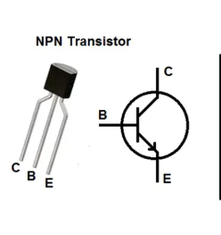
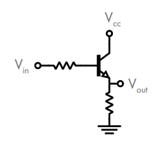

# O transistor

Na nossa missão de criar circuitos digitais, usamos circuitos baseados em *switches* e eles foram uma boa forma de introduzir o conceito. De qualquer forma, usar *switches* mecânicos não é uma boa ideia para computadores. 

Computadores precisam lidar com uma quantidade muito grande de entradas a todo momento, e acionar *switches* manualmente não é um bom *design*. Além disso, sistemas computacionais precisam conectar múltiplos circuitos lógicos juntos, onde a saída de um circuito será a entrada de outro.

Para alcançar esse objetivo, o *switch* precisa ser controlado eletricamente, e não mecanicamente. Não queremos um *switch* mecânico, e sim um elétrico. E ainda bem que existe um componente que pode ser integrado ao circuito chamado **transistor**, que chaveia a corrente eletricamente!

### Tipos de transistor
Um transistor é um dispositivo usado para **chavear** ou **amplificar** a corrente. Por enquanto vamos focar em sua capacidade de chaveamento. Existem dois tipos principais:
- **BJT** - transistor de junção bipolar (*bipolar junction transistor*)
- **FET** - transistor de efeito de campo (*field-effect transistor*)

A diferença entre eles não é relevante por enquanto, então vamos focar nos BJTs.

### BJT - Transistor de Junção Bipolar

BJTs possuem três terminais, um **base**, um **coletor** e um **emissor**. Existem dois tipos de BJTs, NPN e PNP, que se diferenciam no modo de responder à aplicação de corrente no terminal base. Vamos focar no tipo NPN.

Em um transistor NPN, aplicar uma pequena corrente na base permite que uma corrente maior flua do coletor ao emissor. Em outras palavras, se pensarmos no transistor como uma chave, aplicar corrente na base é como *ligar* o transistor, e remover essa corrente é como *desligá-lo*.

### O transistor como chave eletrônica

Veja como um transistor pode ser conectado como um chave eletrônica:

Temos um transistor NPN conectado com três tensões rotuladas:
- $V_{cc}$ - tensão positiva de alimentação, aplicada ao coletor. É o fornecedor de energia do circuito, equivalente a uma bateria. O "cc" significa *common collector*.
- $V_{out}$ - a tensão que queremos controlar. É o que o circuito produz como saída.
- $V_{in}$ - a tensão que controla o transistor. É a entrada, o que "diz" ao transistor o que fazer.

Então em vez de apertar um *switch* físico, você aplica uma tensão em $V_{in}$. Essa tensão na base do transistor decide se ele conduz ou não:

| $V_{in}$ | Base         | Transistor    | $V_{out}$ |
| -------- | ------------ | ------------- | --------- |
| Baixo    | sem corrente | chave aberta  | Baixo     |
| Alto     | com corrente | chave fechada | Alto      |

### Por que o transistor é melhor que o switch mecânico

Mas se $V_{in}$ ainda precisa vir de algum lugar, então qual é a vantagem?

Com um switch mecânico, $V_{in}$ é um humano apertando um botão. Isso tem dois problemas:
- **Velocidade.** Um transistor chaveia bilhões de vezes por segundo. Nenhum switch mecânico chega perto.
- **Integração**. $V_{in}$ **pode vir de outro circuito**. O $V_{out}$ de um circuito pode ser o $V_{in}$ do próximo. Você encadeia circuitos, a saída de um vira entrada do outro, sem nenhuma intervenção humana. Um computador não tem um humano apertando switches internamente, e sim trilhões de transistores onde a saída de um grupo controla o próximo, em cascata, na velocidade da eletricidade.

### Por que a corrente de $V_{cc}$ não chega sozinha em $V_{out}$

O transistor NPN funciona como uma **comporta física** entre o coletor e o emissor. Enquanto nenhuma corrente chega à base, essa comporta está bloqueada, e a corrente de $V_{cc}$ fica parada, sem caminho para seguir.
Quando $V_{in}$ envia corrente para a base, a comporta abre. A corrente de $V_{cc}$ finalmente tem caminho livre para fluir do coletor ao emissor, e $V_{out}$ sobe.

A corrente de $V_{cc}$ não estava "faltando força" quando a comporta estava fechada, ela estava lá, disponível, esperando. O transistor é que bloqueava o caminho.

:::tip Detalhe importante
A corrente que vem de $V_{in}$ para abrir a comporta é **pequena**, só o suficiente para acionar o transistor. A corrente que flui de $V_{cc}$ quando a comporta abre pode ser muito maior. Por isso o transistor também tem a capacidade de **amplificar** uma corrente pequena na base controla uma corrente grande entre coletor e emissor.
 :::