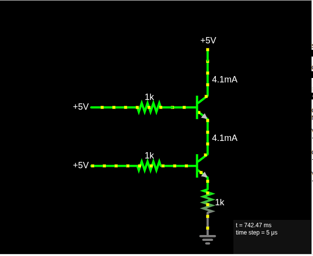
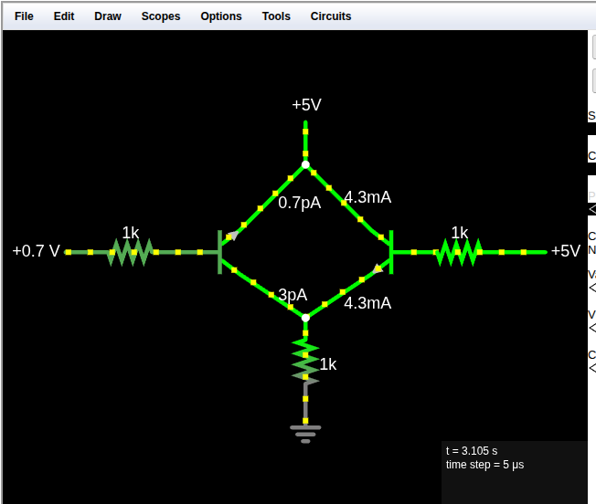
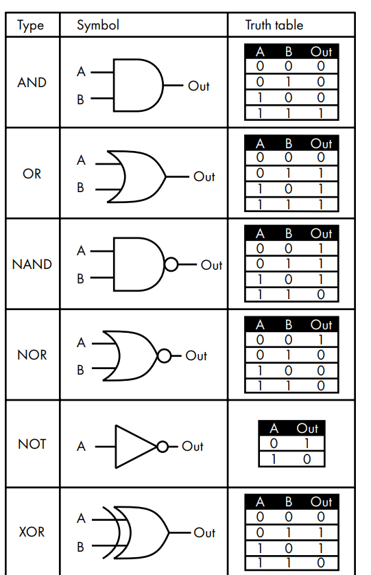
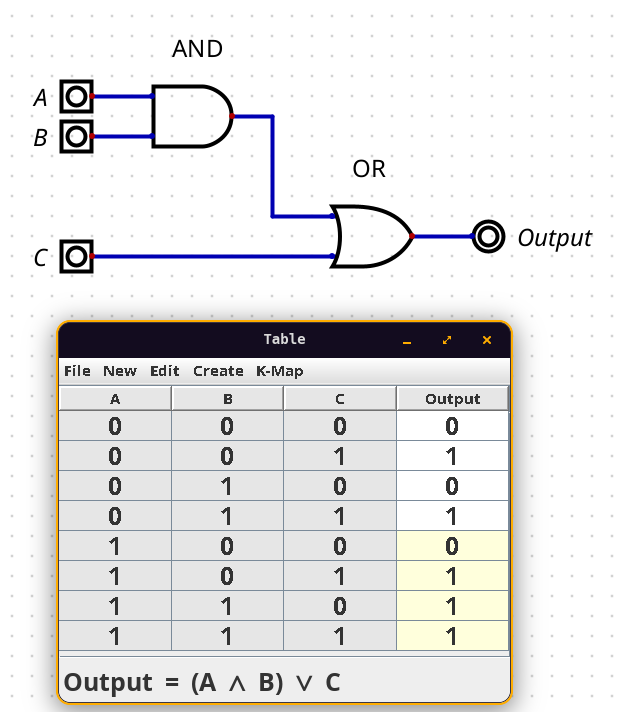

# Portas lógicas

Agora que já entendemos que um transistor pode agir como um switch controlado eletricamente, podemos construir elementos de um circuito que implementam funções lógicas onde as entradas e saídas são tensões baixas ou altas. Esses componentes são chamados de **portas lógicas** (*logic gates*).

No circuito AND com transistores, substituímos os switches mecânicos por transistores para que as entradas fossem controladas eletricamente e não dependessem de intervenção humana. Essa qualidade fará cada vez mais sentido conforme avançamos.
### Porta AND com transistores

O circuito abaixo implementa uma porta AND usando dois transistores NPN em série. Veja o que cada parte faz logo após a imagem:

- **$+5\,\text{V}$ (topo)** é o $V_{cc}$ , a alimentação do circuito. A corrente de $4{,}1\,\text{mA}$ desce pelo fio vertical quando o circuito está conduzindo.
- **Transistor superior** recebe $V_{in} = 5\,\text{V}$ pela esquerda, através do resistor de $1\,\text{k}\Omega$. Esse resistor protege a base de corrente excessiva. Com $5\,\text{V}$ na base, o transistor abre sua comporta interna e permite que a corrente passe do coletor ao emissor.
- **Transistor inferior** faz o mesmo. Também recebe $5\,\text{V}$ pela base através de um resistor de $1\,\text{k}\Omega$, e também abre sua comporta.
- **Resistor de $1\,\text{k}\Omega$ no emissor** (antes do GND) limita a corrente total que flui para o que seria a nossa saída.
- **GND** (símbolo de três linhas no fundo) é o retorno do circuito (o ponto de $0\,\text{V}$).

O ponto de $V_{out}$ seria medido entre os dois transistores. Como **ambos** estão com $5\,\text{V}$ na base, ambas as comportas estão abertas, a corrente flui do topo ao GND, e $V_{out}$ fica alto, ou seja, **saída 1**.

Se qualquer uma das entradas fosse $0\,\text{V}$, aquele transistor bloquearia a corrente e $V_{out}$ ficaria baixo - saída **0**. Isso é exatamente o comportamento AND:

| $V_{in}$ A | $V_{in}$ B | $V_{out}$    |
| ---------- | ---------- | ------------ |
| Baixo (0)  | Baixo (0)  | Baixo (0)    |
| Baixo (0)  | Alto (1)   | Baixo (0)    |
| Alto (1)   | Baixo (0)  | Baixo (0)    |
| Alto (1)   | Alto (1)   | **Alto (1)** |

Essa é uma implementação da lógica `AND`, algo similar poderia ser feito com o `OR`.
### Porta OR com transistores

A lógica é a mesma que vimos com os switches mecânicos, mas a estrutura muda: em vez de colocar os transistores em série como no AND, colocamos em **paralelo**.

### Circuito OR com transistores

Os dois transistores estão lado a lado, cada um com sua própria entrada. Veja o que acontece:

- **$+5\,\text{V}$ (topo)** é o $V_{cc}$ - alimentação do circuito, como sempre.
- **Transistor esquerdo** recebe $V_{in} = +0{,}7\,\text{V}$ pela base através do resistor de $1\,\text{k}\Omega$. Essa tensão está no limiar - o transistor conduz muito pouco, praticamente nada ($0{,}7\,\text{pA}$).
- **Transistor direito** recebe $V_{in} = +5\,\text{V}$ pela base através do resistor de $1\,\text{k}\Omega$. Esse transistor está plenamente ativado e conduz $4{,}3\,\text{mA}$.

Como os dois transistores estão em paralelo, **basta um deles estar ativado** para que a corrente flua de $V_{cc}$ ao GND e $V_{out}$ fique alto. Isso é exatamente o comportamento OR.

No exemplo da imagem, A = 0 e B = 1, portanto `0 OR 1 = 1` a saída é alta, confirmada pela corrente de $4{,}3\,\text{mA}$ fluindo pelo lado direito.

| $V_{in}$ A | $V_{in}$ B | $V_{out}$ |
|---|---|---|
| Baixo (0) | Baixo (0) | Baixo (0) |
| Baixo (0) | Alto (1) | **Alto (1)** |
| Alto (1) | Baixo (0) | **Alto (1)** |
| Alto (1) | Alto (1) | **Alto (1)** |

### Diferença estrutural entre AND e OR

|                          | AND                                                         | OR                                           |
| ------------------------ | ----------------------------------------------------------- | -------------------------------------------- |
| Transistores             | Em série                                                    | Em paralelo                                  |
| Condição para saída alta | Os dois ativados                                            | Qualquer um ativado                          |
| Analogia                 | Duas torneiras no mesmo cano - ambas precisam estar abertas | Dois canos distintos - basta um estar aberto |

Acabamos então de entender como uma porta lógica, um circuito que implementa funções lógicas, pode ser construída com transistores e resistores. Deste ponto em diante, vamos esconder um pouco os detalhes de como portas lógicas são implementadas e tratá-las como componentes únicos. Afinal, portas lógicas estão disponíveis para compra já montadas e empacotadas fisicamente como um componente único, então não existe a necessidade de construir uma por meio de transistores, exceto para fins de aprendizado, como fizemos aqui.

Existem símbolos padrões para cada porta lógica. Veja alguns exemplos:

Você pode ter percebido alguns círculos adicionados aos símbolos. Eles servem para representar NOT, ou seja, inversão. A porta NOT é o exemplo mais simples disso, pois a saída é sempre o inverso da entrada. Se a entrada for 1, a saída é 0, e vice-versa. A porta NAND é simplesmente um NOT AND, onde os resultados que seriam 1 passam a ser 0, e os que seriam 0 passam a ser 1.

Vale introduzir aqui o conceito de **encapsulamento**, **uma escolha de *design* que esconde os detalhes internos** de um componente e documenta apenas como interagir com ele. Dessa forma quando os criadores de um componente querem que outras pessoas possam usá-lo sem precisar entender cada detalhe da implementação, eles encapsulam. É exatamente o que estamos fazendo ao tratar uma porta lógica como uma caixinha preta com entradas e saída, sem precisar pensar nos transistores por baixo.

### Projetando com portas lógicas

Nos capítulos anteriores vimos como combinar diferentes operações lógicas com o exemplo da praia. Uma vez que a tabela verdade está  escrita, a lógica pode ser implementada fisicamente no hardware usando portas lógicas.

> **Se** eu estiver de férias (entrada A) **e se** o clima estiver quente (entrada B)
>
> **Ou se** for meu aniversário (entrada C)
>
> **Então** eu vou para praia (Saída)
> 
> em outras palavras `(A AND B) OR C`

Usando portas lógicas, essa operação pode ser descrita da seguinte forma:

Se ambos, A e B, forem 1, então a saída da porta lógica AND será 1. A saída dessa mesma porta AND se conecta a primeira entrada da porta OR, juntamente com a entrada C. Se ou a saída de AND ou C for 1, então o resultado será 1.

Quando combinamos portas lógicas de forma que a saída depende apenas das entradas presentes, o circuito é chamado de **circuito combinacional** (*combinational logic circuit*). Um conjunto de entradas sempre produz a mesma saída, sem precisar de memória. Um AND ou um OR são combinacionais: não importa o histórico, se você colocar A=1 e B=1, a saída é sempre 1.

Isso contrasta com a **lógica sequencial** (*sequential logic*), onde a saída depende tanto das entradas presentes quanto das passadas. É o que permite que um circuito "lembre" de algo, sendo a base de registradores, contadores e flip-flops, que são os blocos construtivos da memória RAM e do processador. O circuito responde diferente dependendo do que aconteceu antes, não só do que está acontecendo agora. Mas isso é assunto para depois.

Resumindo:
- **Combinacional:** a saída depende apenas das entradas *presentes*. Mesmas entradas resultaria sempre na mesma saída.
- **Sequencial:** a saída depende das entradas presentes *e das passadas*. O circuito tem memória.

## Circuitos integrados (ICs)

Fabricantes vendem portas lógicas prontas, já montadas em um único componente chamado **circuito integrado** (*integrated circuit* - IC), também chamado de **chip**.

Um IC contém múltiplos componentes em uma única peça de silício, com **pinos** externos para conexão. O formato mais comum é o **DIP** (*dual in-line package*), um formato retangular com duas fileiras de pinos, compatível com breadboard.

Os transistores dentro de um IC são muito menores que transistores discretos, o que resulta em circuitos mais rápidos e mais baratos.

:::info
Um componente discreto é um dispositivo eletrônico contendo um único elemento, como um resistor ou um transistor.
:::