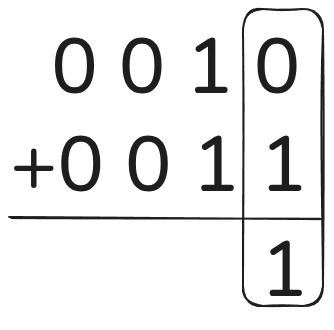
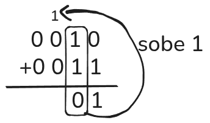
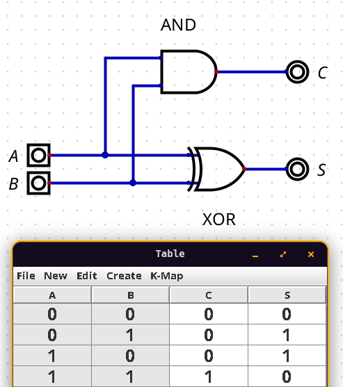

# Matemática com circuitos

Até aqui aprendemos a construir portas lógicas que implementam AND, OR e NOT. Mas portas lógicas sozinhas ainda não parecem com o que imaginamos quando pensamos em "computação". Afinal, um computador soma números, multiplica, compara. Onde fica toda essa matemática?

A resposta é que toda operação matemática que um computador realiza é implementada em circuitos, e esses circuitos são feitos de portas lógicas que acabamos de estudar. Neste capítulo vamos ver como isso acontece na prática, começando pela adição.

## Adição binária

Antes de construir qualquer circuito, precisamos entender como a adição funciona em binário.

A boa notícia é que o princípio é o mesmo de qualquer sistema posicional, incluindo o decimal que você já conhece. Pegue como exemplo a soma de `0010` e `0011`. Alinha os números e começa pelo bit menos significativo, o que está mais à direita.



A primeira coluna é simples: `0 + 1 = 1`, tranquilo, né?

A segunda coluna já é mais destemida. Lembra da regra do "vai um" quando a soma ultrapassava 9 no sistema decimal? Aqui acontece o mesmo, mas em binário o limite é muito mais baixo, `1 + 1 = 10`. O resultado tem dois símbolos, mas a posição atual só comporta um. O que fazemos é registrar o `0` na posição atual e **carregar** o `1` para a próxima coluna.



:::info
Esse bit carregado para a próxima posição é chamado de *carry bit*. Vamos usar esse termo daqui em diante no lugar da expressão mais informal "bit que subiu".
:::

A próxima coluna então ficaria `0 + 0 + 1 = 1`, onde esse `1` extra é o *carry bit* que veio da posição anterior.

## Half adder - somador parcial

Agora que entendemos como a adição binária funciona no papel, podemos construir um circuito que realiza essa operação.


Para somar dois bits, precisamos de duas entradas, vamos chamá-las de **A** e **B**, e o circuito terá duas saídas:
- **S** (*sum*): o resultado da soma
- **$C_{out}$** (*carry-out*): o *carry bit* de saída, o "vai um" para a próxima posição

E ele é representado da seguinte forma:


A tabela verdade desse circuito:

| A | B | S | $C_{out}$ |
|---|---|---|-----------|
| 0 | 0 | 0 | 0         |
| 0 | 1 | 1 | 0         |
| 1 | 0 | 1 | 0         |
| 1 | 1 | 0 | 1         |


Se você olhar com atenção, vai reconhecer dois padrões familiares:
- A coluna **S** é idêntica à tabela verdade do **XOR**
- A coluna **$C_{out}$** é idêntica à tabela verdade do **AND**

Isso não é por que os astros se alinharam e demos sorte. Significa que podemos construir esse somador usando essas duas portas em paralelo, com as mesmas entradas A e B alimentando as duas ao mesmo tempo!



Esse circuito tem o nome de **half adder** (somador parcial). O "parcial" no nome já entrega o spoiler de que ele resolve a adição dos primeiros dois bits, mas não consegue lidar com um *carry bit* vindo de uma posição anterior. E quando somamos números com mais de um bit, todas as posições além da primeira precisam lidar com esse caso.

## Full adder - somador completo

Cada bit além do menos significativo pode receber um *carry bit* da posição anterior. Chamamos esse bit de **$C_{in}$** (*carry-in*). Para incorporar essa terceira entrada, precisamos de um novo circuito chamado **full adder**.

O full adder tem três entradas, **A**, **B** e **$C_{in}$**, e duas saídas, **S** e **$C_{out}$**:

| A | B | $C_{in}$ | S | $C_{out}$ |
|---|---|-----------|---|-----------|
| 0 | 0 | 0         | 0 | 0         |
| 0 | 0 | 1         | 1 | 0         |
| 0 | 1 | 0         | 1 | 0         |
| 0 | 1 | 1         | 0 | 1         |
| 1 | 0 | 0         | 1 | 0         |
| 1 | 0 | 1         | 0 | 1         |
| 1 | 1 | 0         | 0 | 1         |
| 1 | 1 | 1         | 1 | 1         |

### Construindo o full adder com dois half adders

Como o próprio nome sugere, um full adder pode ser construído a partir de dois half adders encadeados.

O primeiro half adder (**HA1**) soma **A** e **B**, gerando uma soma parcial e um primeiro $C_{out}$. O segundo half adder (**HA2**) soma esse resultado com $C_{in}$, gerando a saída final **S** e um segundo $C_{out}$. O $C_{out}$ final do full adder é 1 se qualquer um dos dois half adders gerou carry, o que é exatamente o que uma porta **OR** faz.

Mais um exemplo de encapsulamento em ação. Uma vez construído, o full adder pode ser usado como um bloco único, sem que quem o utilize precise saber o que há por dentro. Três entradas, duas saídas, e isso é tudo que importa para quem vai usá-lo.

## Somador de 4 bits

Com um full adder em mãos, temos estrutura suficiente para ir além de dois bits.

Para somar números de 4 bits, enfileiramos os circuitos de adição de forma que o $C_{out}$ de cada posição vire o $C_{in}$ da próxima. A estratégia é usar um **half adder** para o bit menos significativo, pois não há *carry-in* nessa posição, e um **full adder** para cada um dos três bits restantes.

Para ilustrar, considere a soma de `0010` (2) e `0011` (3). O processamento ocorre da direita para a esquerda, com cada somador passando seu *carry-out* para o próximo:

| Posição | A | B | $C_{in}$ | S | $C_{out}$ |
|---------|---|---|-----------|---|-----------|
| Bit 0   | 0 | 1 | -         | 1 | 0         |
| Bit 1   | 1 | 1 | 0         | 0 | 1         |
| Bit 2   | 0 | 0 | 1         | 1 | 0         |
| Bit 3   | 0 | 0 | 0         | 0 | 0         |

Resultado: `0101` = 5. Correto.

Esse tipo de somador é chamado de **ripple carry adder** (somador com propagação de carry), porque o *carry bit* se propaga de posição em posição até o fim. Cada carry que se propaga introduz um pequeno atraso, então aumentar o número de bits torna o somador progressivamente mais lento. Para números maiores, existem arquiteturas mais eficientes, mas a ideia base é exatamente essa.

:::tip
Chips prontos com somadores de 4 bits estão disponíveis na série 7400 de ICs. Na prática, você não precisa montar um somador a partir de portas individuais se já existe um componente encapsulado para isso.
:::

## Números com sinal

Até aqui representamos apenas números positivos. Mas computadores precisam lidar com números negativos também, e o problema é que um bit só pode ser 0 ou 1, e um sinal negativo não é nenhum dos dois.

### A abordagem ingênua: sinal de magnitude

A primeira ideia que vem à cabeça é reservar o bit mais significativo para o sinal: 0 para positivo, 1 para negativo. O restante dos bits representa o valor absoluto. Funciona conceitualmente, mas exige que o somador seja modificado para entender esse bit de sinal, o que complica o hardware sem necessidade.

### A abordagem elegante: complemento de dois

Existe uma solução melhor chamada **complemento de dois** (*two's complement*). A ideia é representar negativos de forma que o somador que já construímos continue funcionando sem nenhuma modificação.

O processo para converter um número positivo em negativo é direto:

1. Escreva o número em binário: `5 = 0101`
2. Inverta todos os bits: `0101` → `1010`
3. Some 1 ao resultado: `1010 + 1 = 1011`

Logo, `-5` em complemento de dois é `1011`. O processo é reversível: aplicar os mesmos três passos de volta retorna ao valor original.

A parte divertida é que subtração vira adição. Para calcular `7 + (-3)`:

```
  0111   (7)
+ 1101   (-3 em complemento de dois)
------
 10100
```

O bit que extrapola os 4 bits é descartado, e o resultado é `0100 = 4`. Exatamente `7 - 3 = 4`, e o somador não precisou saber de nada disso.

Para interpretar um número em complemento de dois, basta lembrar que o bit mais significativo tem peso negativo. Para 4 bits, os pesos das posições são:

```
-8  4  2  1
```

Então `-3` seria representado como:

```
-8  4  2  1
 1  1  0  1
```

As posições ativas são -8, 4 e 1, portanto: $-8 + 4 + 1 = -3$.

A regra prática: sempre que o bit mais significativo for 1, o número é negativo. Quando for 0, é positivo.

### O custo do sinal

Ao usar o bit mais significativo para indicar o sinal, perdemos uma posição que antes contribuía para a magnitude. O total de valores representáveis não muda, mas o range se redistribui:

|                    | Sem sinal (unsigned) | Com sinal (signed) |
|--------------------|---------------------|--------------------|
| Mínimo             | 0                   | -8                 |
| Máximo             | 15                  | 7                  |
| Total de valores   | 16                  | 16                 |

A distribuição é assimétrica porque o zero ocupa uma posição do lado positivo (`0000`), então o lado negativo alcança -8 enquanto o positivo só chega até 7. A fórmula geral para $n$ bits com sinal:

$$\text{máximo} = 2^{n-1} - 1 \qquad \text{mínimo} = -2^{n-1} \qquad \text{total} = 2^n$$

Para 8 bits: máximo = 127, mínimo = -128, total = 256 valores.

Quando se sabe que negativos nunca serão necessários, faz sentido usar *unsigned* e recuperar toda a faixa para valores positivos:

| Bits    | Signed           | Unsigned      |
|---------|------------------|---------------|
| 4 bits  | -8 a 7           | 0 a 15        |
| 8 bits  | -128 a 127       | 0 a 255       |
| 16 bits | -32.768 a 32.767 | 0 a 65.535    |

---

Vale parar um segundo aqui. Construímos, passo a passo, um circuito capaz de somar números, partindo de nada além de portas lógicas simples. Lembra da definição lá do começo? Um computador é um dispositivo que executa instruções lógicas. A adição é uma dessas instruções, e você acabou de ver como ela se traduz em transistores, portas e circuitos encadeados. Outras operações fundamentais, como subtração e multiplicação, seguem a mesma lógica. É assim que tudo funciona lá embaixo.
