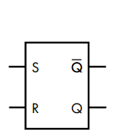
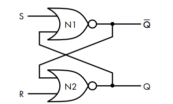
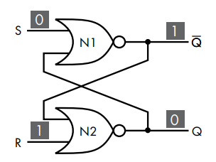
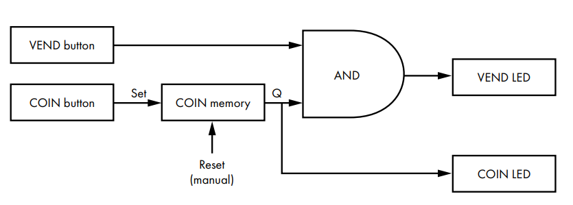
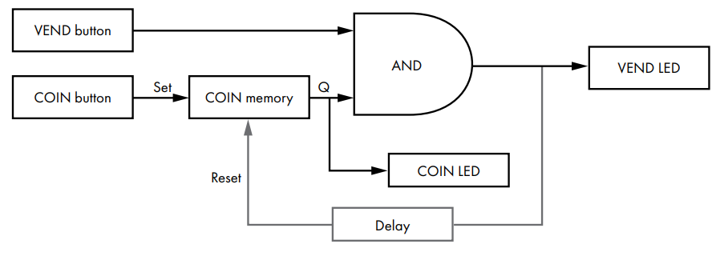
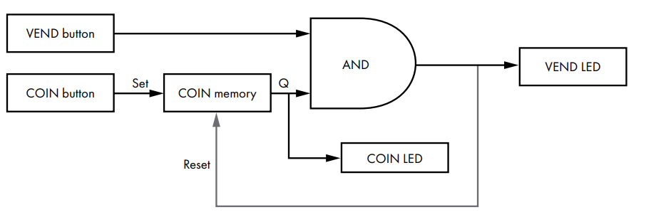

# Memória e sinais de clock

Nos capítulos anteriores vimos como portas lógicas podem ser combinadas para formar circuitos combinacionais, onde a saída depende apenas das entradas presentes. Dê as mesmas entradas, obtenha sempre a mesma saída.

Mas computadores fazem muito mais do que reagir a entradas. E uma caracterísca essencial é a capacidade de guardar informações.
Para que isso funcione, o circuito precisa de memória, a capacidade de armazenar o estado passado e consultá-lo no presente. E é isso que os circuitos lógicos sequenciais oferecem, onde a saída depende tanto das entradas presentes quanto das anteriores.

## SR Latch

O componente de memória mais simples possível é o **latch**, simples pois ele armazena apenas 1 bit.

O **SR latch** tem duas entradas e duas saídas:

- **S** (*set*): define o bit armazenado como 1
- **R** (*reset*): redefine o bit armazenado como 0
- **Q**: a saída principal, o bit armazenado
- **$\overline{Q}$**: o complemento de Q, sempre o oposto do que está em Q

Quando S é 1, a saída Q vai para 1. Se S voltar a ser 0, Q continua sendo 1, pois o circuito "lembra" da entrada anterior. Quando R é 1, o estado anterior é apagado e Q volta para 0, onde permanece mesmo quando R voltar a ser 0.

| S | R | Q                       | Operação  |
|---|---|-------------------------|-----------|
| 0 | 0 | Mantém o valor anterior | Manter    |
| 0 | 1 | 0                       | Redefinir |
| 1 | 0 | 1                       | Definir   |
| 1 | 1 | X                       | Inválido  |

A linha `S=1`, `R=1` é inválida porque as duas entradas se contradizem: uma quer definir e a outra quer redefinir ao mesmo tempo. O resultado seria indeterminado.

### Como o SR latch funciona por dentro

O SR latch pode ser implementado com duas portas NOR e alguns fios de realimentação, onde a saída de cada porta alimenta a entrada da outra.

Quando vi isso pela primeira vez, pensei: espera, isso é um paradoxo. Para calcular a saída de N1, preciso da saída de N2, que por sua vez depende da saída de N1. Como isso funciona sem entrar em loop infinito?

O problema era que eu estava pensando de forma muito humana. O circuito não calcula em passos como nós. O tempo todo existe corrente fluindo pelos fios, seja ela alta ou baixa. Quando uma nova entrada é aplicada, as tensões se propagam simultaneamente pelos dois fios de realimentação e o circuito converge para um novo estado estável em frações de nanossegundo. Não é uma sequência de passos, são tensões se ajustando ao mesmo tempo.

Para tornar isso mais palpável, tome o caso `R=1`:

1. N2 recebe R=1. Independente do que $\overline{Q}$ vale, `1 NOR qualquer_coisa = 0`. Q vai para 0.
2. N1 agora recebe `S=0` e `Q=0`. `0 NOR 0 = 1`. $\overline{Q}$ = 1.
3. O circuito estabilizou em Q=0 e $\overline{Q}$=1.

Quando R volta para 0, as saídas permanecem Q=0 e $\overline{Q}$=1 por realimentação. Esse é o momento em que o circuito está fazendo o que imaginamos que uma memória deveria fazer, ou seja, armazenando coisas.

Dito isso, podemos voltar a tratar o SR latch como um bloco único encapsulado. Os detalhes internos estão lá, mas não precisamos pensar neles a cada uso.

### A máquina de venda automática

Para entender o SR latch em ação, imagine o seguinte circuito de uma máquina de venda automática com duas entradas e dois LEDs:
- **COIN**: botão que representa inserir uma moeda
- **VEND**: botão que solicita a venda de um item
- **COIN LED**: acende quando uma moeda foi inserida
- **VEND LED**: acende quando um item está sendo vendido

A regra proposta é que a máquina só vende se uma moeda foi inserida antes.

Sem memória, o circuito não tem como saber se uma moeda foi inserida no passado. Ele enxerga apenas o estado presente das entradas. Mas com um SR latch, quando COIN é pressionado, o latch armazena Q=1. Quando VEND é pressionado, uma porta AND verifica se Q=1. Se sim, o VEND LED acende.

Mas há mais de uma forma de implementar o reset desse latch:

**Versão 1 - reset manual.** A saída da porta AND acende o VEND LED. O latch só é resetado via input R, por intervenção humana. Funciona, mas alguém precisaria apertar R para voltar ao estado inicial.

**Versão 2 - reset automático.** A saída da porta AND é conectada de volta ao input R do latch. Quando o VEND LED acende, o latch se reseta sozinho. Porém o problema é que o circuito opera tão rápido que o reset ocorre antes do LED ter tempo de acender. O usuário não vê nada. Um exemplo clássico de um design que tecnicamente funciona, mas é rápido demais para ser percebido.

**Versão 3 - reset automático com delay.** Um **capacitor** é inserido na linha de reset. O capacitor precisa de tempo para carregar, e esse tempo introduz o atraso necessário para o VEND LED aparecer antes do reset ocorrer.

Um capacitor é um componente elétrico que armazena energia. Seu comportamento muda conforme seu estado de carga:
- **Descarregado:** age como curto-circuito, deixando a corrente passar livremente
- **Carregado:** age como circuito aberto, bloqueando a corrente

O tempo para carregar ou descarregar depende da **capacitância** do componente e da **resistência** do circuito. Quanto maiores esses valores, mais lento o carregamento, e portanto, maior o delay. A capacitância é medida em **farads** (F). Um farad é um valor enorme, então capacitores são tipicamente medidos em **microfarads** ($\mu\text{F}$).

