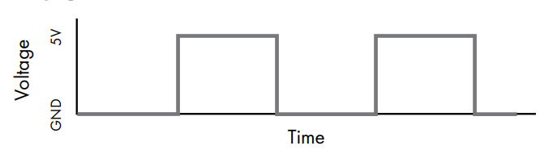
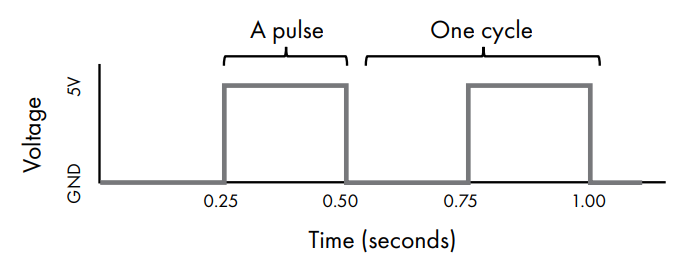
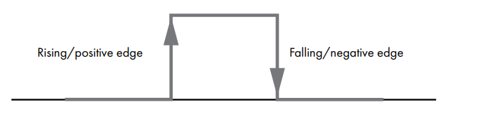
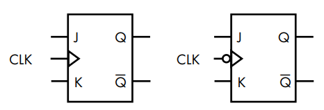
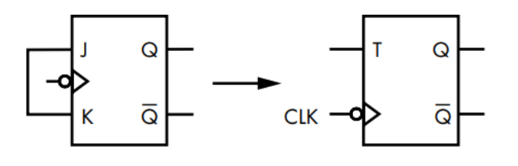
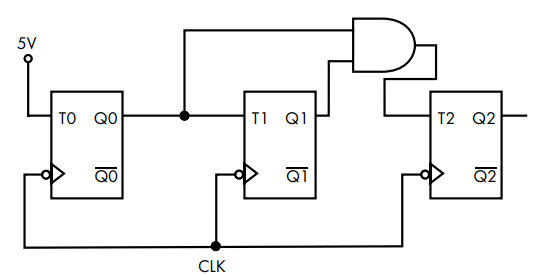

## Sinais de clock

Conforme os circuitos se tornam mais complexos, surge a necessidade de manter vários elementos sincronizados para que todos os estados mudem ao mesmo tempo. Se um circuito tem múltiplos dispositivos de memória, como garantir que todos os bits são definidos exatamente no mesmo instante?

Um sinal de clock alterna sua tensão entre alto e baixo em uma cadência regular, alto metade do tempo e baixo a outra metade. Esse tipo de sinal é chamado de **onda quadrada** (*square wave*). Com essa figura ficará claro o por que do nome:

Uma variação completa da tensão, subindo e descendo, é um **pulso**. Uma oscilação completa, de baixo para alto e de volta para baixo, é um **ciclo**. A frequência do clock é medida em ciclos por segundo, ou **hertz** (Hz).

:::info
Para fins didáticos, vamos assumir que a mudança de alta para baixa tensão ocorre instantaneamente. Na realidade, essa transição leva um tempo finito, mas isso não é relevante aqui.
:::

Quando um circuito usa clock, todos os componentes que precisam estar sincronizados são conectados a ele. Cada componente é projetado para permitir mudanças de estado apenas quando um pulso de clock ocorrer.

Há dois tipos de acionamento por clock:
- **Positive edge-triggered:** o componente muda de estado na borda ascendente do pulso, quando a tensão sobe
- **Negative edge-triggered:** o componente muda de estado na borda descendente, quando a tensão cai

## JK Flip-Flop

Um dispositivo de memória de 1 bit que usa clock é chamado de **flip-flop**.

:::tip
Você pode encontrar pessoas usando *latch* e *flip-flop* como sinônimos, mas não você! A diferença é que latches não usam clock, flip-flops usam clock.
:::

O **JK flip-flop** é uma extensão do SR latch. Assim como o SR latch usa S para definir e R para redefinir, o JK flip-flop usa **J** para definir e **K** para redefinir. A diferença principal é que o JK flip-flop só muda de estado durante o pulso de clock, e não imediatamente ao receber uma entrada.

Além disso, o JK flip-flop resolve o estado inválido do SR latch. Quando tanto J quanto K são 1, em vez de um resultado indeterminado, a saída simplesmente **alterna**, invertendo o valor atualmente armazenado.

| J | K | Q (próximo estado) | Operação  |
|---|---|--------------------|-----------|
| 0 | 0 | Q (sem mudança)    | Manter    |
| 0 | 1 | 0                  | Redefinir |
| 1 | 0 | 1                  | Definir   |
| 1 | 1 | $\overline{Q}$     | Alternar  |

O símbolo do JK flip-flop tem uma entrada CLK indicada por um triângulo. A versão com triângulo simples é *positive edge-triggered*; com um círculo antes do triângulo, é *negative edge-triggered*. O comportamento geral dos dois é idêntico.

E como você pode notar, falar *flip-flop* é muito legal.

## T Flip-Flop

Ao conectar J e K juntos e tratá-los como uma entrada única, cria-se um flip-flop que só faz duas coisas a cada pulso de clock: ou alterna o valor armazenado, ou mantém.

Esse é o **T flip-flop** (*toggle flip-flop*). Quando T=1, ele inverte o bit armazenado a cada pulso de clock. Quando T=0, mantém o estado.

| T | Q (próximo estado) | Operação |
|---|--------------------|----------|
| 0 | Q (sem mudança)    | Manter   |
| 1 | $\overline{Q}$     | Alternar |

### Contador de 3 bits

Para ilustrar como o clock e o T flip-flop trabalham juntos, vamos construir um **contador de 3 bits** que conta de 0 a 7 em binário.

O circuito tem três T flip-flops, cada um armazenando um bit do número, sendo Q0 é o bit menos significativo, Q2 é o mais significativo. A cada pulso de clock, o número é incrementado em 1.

| Contagem | Q2 | Q1 | Q0 |
|----------|----|----|-----|
| 0        | 0  | 0  | 0   |
| 1        | 0  | 0  | 1   |
| 2        | 0  | 1  | 0   |
| 3        | 0  | 1  | 1   |
| 4        | 1  | 0  | 0   |
| 5        | 1  | 0  | 1   |
| 6        | 1  | 1  | 0   |
| 7        | 1  | 1  | 1   |

É possível notar o seguinte padrão:
- Q0 alterna a cada contagem, sem exceção
- Q1 alterna apenas quando Q0 era 1 na contagem anterior
- Q2 alterna apenas quando tanto Q0 quanto Q1 eram 1 na contagem anterior

T flip-flops são perfeitos para isso.
- **T0** conectado permanentemente a 5V, então Q0 alterna a cada pulso de clock
- **T1** conectado a Q0, então Q1 alterna apenas quando Q0 está alto
- **T2** conectado à saída de uma porta AND entre Q0 e Q1, então Q2 alterna apenas quando os dois estão altos ao mesmo tempo

Os três flip-flops compartilham o mesmo sinal de clock, então a mudança acontece de forma sincronizada a cada pulso.
