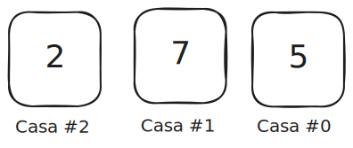
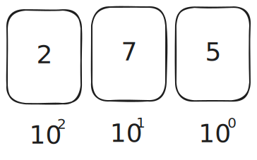

import sistema_decimal01 from './img/sistemadecimal01.svg';

#  Sistemas de numeração

A grande maioria de nós conhece bem os símbolos 0, 1, 2, 3, 4, 5, 6, 7, 8, 9 que são utilizados no nosso sistema decimal (ou de base 10). Aqui, usamos o 0 (zero) para descrever a ausência, o vazio, o nulo, já o 1 (um) descreve uma quantidade, o 2 (dois) descreve duas quantidades, e por ai vai. A maior quantidade que conseguimos representar com apenas um símbolo, é 9 (nove). Para representar quantidades maiores que essa, precisamos juntar dois símbolos, por exemplo, usando o 1 que representa uma quantidade e colocamos a sua direita outro símbolo que presenta outra quantidade, como o zero, formando o 10 (dez).

## Sistema decimal

Normalmente, escrevemos números usando algo chamado notação posicional. Isso significa que ao escrever um número cada posição representa uma ordem de grandeza diferente. No sistema decimal, ou de base 10, as ordens de grandeza são fatores de 10, e cada lugar pode ter um de dez símbolos diferentes (de 0 a 9).

Por hora vamos chamar esse lugar de casa, pois é bem comum chamarem assim no Brasil durante o ensino.
Quando dizemos que cada “casa” representa uma ordem de grandeza, o que estamos realmente dizendo é que cada posição está associada a uma potência de 10. Isso significa que, no sistema decimal, cada casa vale 10 elevado a algum número.

Começando da direita para a esquerda:
- A primeira casa é a casa #0, logo ela vale $10^0$
- A segunda casa é a casa #1, logo ela vale $10^1$
- A terceira casa é a casa #2, vale $10^2$ 

E assim por diante, agora que nos aprofundamos vamos mudar um pouco a imagem:

Agora que já separamos o número em "casas", podemos finalmente chegar ao número original novamente, para isso basta multiplicar o número presenta na casa pelo valor que ela possui. Se número estiver na casa #0 será multiplicado por $10^0$.

Agora vem o ponto chave, qualquer número decimal pode ser decomposto como a soma de cada dígito multiplicado pela potência de 10 correspondente à sua posição:
- O número $5$ seria multiplicado por $10$ elevado ao número da posição de $5$ que neste caso é a posição zero. Isso é o mesmo que escrever: $5 \cdot 10^0 = 5$ 
- O número $7$ seria multiplicado por $10$ elevado ao número da posição de $5$ que neste caso é a posição um. Isso é o mesmo que escrever: $7 \cdot 10^1 = 70$ 
- O número $2$ seria multiplicado por $10$ elevado ao número da posição de $2$ que neste caso é a posição dois. isso é o mesmo que escrever: $2 \cdot 10^2 = 200$ 
- Por fim basta somar: $200 + 70 + 5 = 275$

Escrevendo em uma única expressão seria:
$$
275 = 2 \cdot 10^2 + 7 \cdot 10^1 + 5 \cdot 10^0
$$

:::info
Observe que o valor mais a direita, é multiplicado por $10^0$, isso faz com que o número que ocupar essa casa, será o número de menor valor, pois qualquer outra casa depois dessa sempre será maior. Portanto, mantenha isso em mente, a posição mais à direita será sempre a de menor valor, e que estiver mais a esquerda será a posição de maior valor.
:::

Como o maior número possível de se representar com três casas é 999, se quisermos representar o que vai além disso precisaríamos de uma quarta casa, a do milhar, ou $10^3$, e assim por diante.

Isso remove qualquer achismo de que um número é apenas uma sequência de símbolos. Agora entendemos que ele vem de um sistema de somas de potências de 10, e que qualquer sistema posicional pode ser descrito da mesma forma, trocando apenas a base.

É exatamente esse princípio que fundamenta o sistema que os computadores usam: o binário.

##  Sistema binário
O sistema binário tem esse nome pois é constituído de apenas dois símbolos 0 e 1 (e assim como o decimal é chamado de base 10, o binário também pode ser chamado de base 2). Contar em binário segue a mesma ideia do sistema decimal, primeiro vem o 0 (que representa nenhuma quantidade), depois o 1 que representa uma unidade, se quisermos representar duas quantidades devemos colocar o 1 a esquerda e depois a unidade de valor nulo 0 a direita, formando 10 (le-se um, zero, e não dez), que representaria duas quantidades.

Observe a tabela abaixo que compara os dois sistemas:

| Decimal | Binário |
| ------- | ------- |
| 0       | 0       |
| 1       | 1       |
| 2       | 10      |
| 3       | 11      |
| 4       | 100     |
| 5       | 101     |
| 6       | 110     |
| 7       | 111     |
| 8       | 1000    |
| 9       | 1001    |
| 10      | 1010    |
| 15      | 1111    |
| 16      | 10000   |

Perceba o padrão de que toda vez que os símbolos disponíveis se esgotam, acrescenta-se uma nova posição à esquerda e recomeça-se do zero. No decimal isso acontece ao passar do 9 para o 10. No binário, ao passar do 1 para o 10, do 11 para o 100, e assim por diante.

##  Binário e potências de 2

O mesmo raciocínio posicional que vimos no decimal se aplica aqui. A diferença é que a base agora é 2, então cada posição representa uma potência de 2: $2^0$, $2^1$, $2^2$, e assim por diante, sempre da direita para a esquerda.

Tomando o binário $101$ como exemplo e decompondo da direita para a esquerda:

$$
1 \cdot 2^2 + 0 \cdot 2^1 + 1 \cdot 2^0 = 4 + 0 + 1 = 5
$$

Logo, $101$ em binário representa o número cinco em decimal. A mesma sequência de símbolos representa valores completamente diferentes dependendo da base usada, por isso é importante sempre deixar claro em qual sistema um número está escrito.

##  Convenções de notação

Existem duas formas comuns de indicar em qual base um número está escrito. A primeira usa um subscrito com o valor da base: $101_2$ para binário e $275_{10}$ para decimal. A segunda, muito usada no mundo da programação, usa prefixos textuais: `0b` para binário, como em `0b101`, e `0x` para hexadecimal, um sistema que veremos em seguida.

:::tip
Ao encontrar o número $101$ em um código ou documento sem nenhuma indicação de base, o contexto geralmente esclarece. Mesmo assim, é boa prática usar os prefixos ou subscritos para eliminar qualquer dúvida, especialmente ao comunicar para outras pessoas.
:::

##  Convertendo binário para decimal

O processo de converter um número binário para decimal segue a lógica da notação posicional: multiplica-se cada bit pela potência de 2 correspondente à sua posição, da direita para a esquerda, e somam-se os resultados.

Para o binário $1010_2$:

$$
1 \cdot 2^3 + 0 \cdot 2^2 + 1 \cdot 2^1 + 0 \cdot 2^0 = 8 + 0 + 2 + 0 = 10
$$

Portanto, $1010_2 = 10_{10}$.

:::tip[Exercite]
Tente converter esses números binários para decimal antes de ver a resposta:

- $10_2$
- $111_2$
- $1100_2$

  
Ver respostas

  Para $10_2$: $1 \cdot 2^1 + 0 \cdot 2^0 = 2 + 0 = 2$

  Para $111_2$: $1 \cdot 2^2 + 1 \cdot 2^1 + 1 \cdot 2^0 = 4 + 2 + 1 = 7$

  Para $1100_2$: $1 \cdot 2^3 + 1 \cdot 2^2 + 0 \cdot 2^1 + 0 \cdot 2^0 = 8 + 4 + 0 + 0 = 12$

:::

##  Convertendo decimal para binário

O caminho inverso usa um método chamado divisões sucessivas. Divide-se o número por 2 repetidamente e anotam-se os restos. O número binário resultante é formado por esses restos lidos de baixo para cima.

Usando o número 13 como exemplo:

| Divisão | Quociente | Resto |
| ------- | --------- | ----- |
| 13 / 2  | 6         | 1     |
| 6 / 2   | 3         | 0     |
| 3 / 2   | 1         | 1     |
| 1 / 2   | 0         | 1     |

Lendo os restos de baixo para cima: $1101_2$. Para verificar: $1 \cdot 2^3 + 1 \cdot 2^2 + 0 \cdot 2^1 + 1 \cdot 2^0 = 8 + 4 + 0 + 1 = 13$. Correto.

:::info
O processo termina quando o quociente chega a zero. A partir daí, basta ler os restos na ordem inversa em que foram calculados.
:::

##  Por que apenas dois símbolos?

A resposta mais direta é: porque dois é o mínimo necessário para representar qualquer informação de forma não ambígua. Um sistema com um único símbolo não permite distinção entre valores diferentes. Com dois símbolos, já é possível construir qualquer número, qualquer texto, qualquer imagem.

O binário não é apenas uma escolha conveniente para a eletrônica. Ele é suficiente para representar tudo. A questão é que trabalhar diretamente com longas sequências de 0s e 1s pode ser bastante inconveniente para humanos. Por isso, outros sistemas continuam sendo úteis no dia a dia da computação, especialmente o hexadecimal, que representa dados binários de forma mais compacta e legível, como veremos no próximo capítulo.

:::tip[Colocando em prática]
Se você quiser ver essas conversões acontecendo de verdade, escrevi um post sobre como [brincar com binários no Python](/blog/binario-em-python). O Python entende binário e hexadecimal nativamente e é uma ótima ferramenta para confirmar os exercícios deste capítulo.
:::
