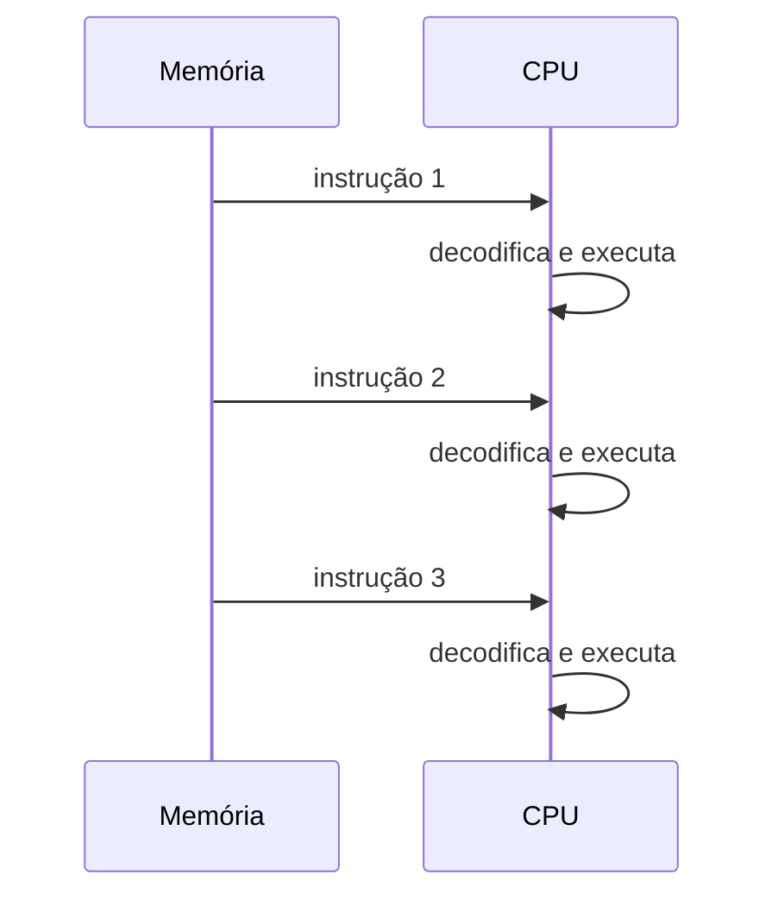

# CPU, Unidade Central de Processamento

A CPU é o componente que executa as instruções do software. É ela que dá ao computador a flexibilidade de rodar programas que nem existiam quando o processador foi projetado.

Uma CPU implementa um conjunto de instruções que os programadores usam para construir software, onde cada instrução individualmente é simples, mas essas instruções básicas são os blocos de construção de todo software que existe.

Exemplos de tipos de instrução que CPUs suportam incluem acesso à memória para leitura e escrita, operações aritméticas como adição, subtração, multiplicação e divisão, operações lógicas como AND, OR e NOT, e controle de fluxo de programa como saltos e chamadas de sub-rotinas. Instruções são operações simples que o processador consegue executar, simples do ponto de vista operacional mesmo, me refiro a adições de dois números, leitura de endereços de memória, tarefas de lógica e assim por diante.

> a CPU é o cozinheiro, o programa é a receita, e cada instrução é um passo da receita que o cozinheiro sabe executar.

As instruções de um programa ficam na memória e a CPU lê essas instruções a fim de executar o programa. Ou seja, o que vemos na tela do computador é o programa sendo executado, mas por baixo dos panos temos apenas uma sequência de instruções sendo armazenadas na memória e executadas pela CPU.

Existe um espaço na memória onde está o programa, não importa que tipo de programa é, sabe-se que ele é constituído de instruções, operações simples, como somar e comparar coisas. Quando essas instruções são carregadas e executadas, a CPU de fato começa a execução, e é provavelmente nesse momento que você começa a interagir com ele pela tela do computador.

As instruções da CPU podem ser divididas em categorias de acordo com seu propósito, sendo algumas delas de acesso a memória, ler e escrever dados, de aritmética, somar, subtrair, multiplicar, dividir, incrementar, de lógica, AND, OR, NOT, e de fluxo, saltos para partes específicas do programa e chamadas de sub-rotina. Vamos nos aprofundar mais adiante, por enquanto é apenas necessário saber que essas categorias existem.

Qualquer programa é feito com base nessas simples combinações de operações. Desde o jogo da cobrinha até os softwares mais modernos da atualidade são construídos sobre esses conceitos. Esse é o poder de dominar um fundamento que é tão escasso no mercado atual. Sinta-se poderoso!

## ISA, arquitetura do conjunto de instruções

Embora todas as CPUs implementem esses tipos de instrução, as instruções específicas variam entre processadores. Uma família de CPUs que compartilha as mesmas instruções compartilha de uma **arquitetura do conjunto de instruções**, ou ISA. Software construído para uma ISA funciona em qualquer CPU que a implemente, mesmo que sejam de fabricantes diferentes, e hoje existem duas ISAs predominantes.

A **x86** é usada na maioria dos desktops, laptops e servidores. O nome vem da convenção de nomenclatura da Intel, que começou com o processador 8086 em 1978 e continuou com o 80186, 80286, 80386 e 80486. A arquitetura evoluiu em três gerações principais, 16 bits, 32 bits e 64 bits. A versão 32 bits é chamada IA-32. A versão 64 bits foi introduzida pela AMD em 2003 com o processador Opteron, sendo originalmente chamada de AMD64. A Intel adotou a mesma arquitetura e chamou de Intel 64. Hoje é referida como x64 ou x86-64. Uma característica importante do x86 é a **retrocompatibilidade**, onde um software feito para processadores mais antigos continua rodando nos mais novos.

A **ARM** domina dispositivos móveis como smartphones e tablets. É desenvolvida pela ARM Holdings, que licencia seus designs para outras empresas fabricarem. É comum em designs **SoC** (system-on-chip), onde um único circuito integrado contém CPU, memória e outros componentes. A arquitetura ARM consome menos energia e custa menos que x86, por isso é preferida em dispositivos móveis. Em 2020, a Apple anunciou a migração do macOS de x86 para ARM.

## O que significa "CPU de 32 bits" ou "64 bits"

Se você, assim como eu, é do mundo gamer e viveu a época da virada do Windows XP para o Windows 7, já deve ter ficado triste por conta do seu computador ser 32 bits e o jogo só estar disponível para computadores 64 bits. Algo que me deixava curioso era por que o requisito era ser 32 ou 64 bits, e não a versão do sistema operacional. Bem, a explicação é que **sistema operacional é construído para rodar em uma ISA específica**.

Um Windows 64 bits é feito para rodar em CPUs x86-64, e portanto depende de instruções de 64 bits que não existem em uma CPU de 32 bits. O jogo em si pode nem exigir 64 bits diretamente, mas se ele foi distribuído apenas para Windows 64 bits, ele já assume que está rodando em cima de um sistema operacional que exige o hardware correspondente. O requisito em cascata era que o jogo exige Windows 64 bits, que por sua vez exige uma CPU de 64 bits.

:::info Um desabafo e um fato curioso

Eu ficava revoltado com esse tal de 64 bits pois não conseguia jogar os jogos que minha mãe comprava em CDs na feira ou em revistas com título "DETONADO" em letras garrafais. Direcionei então toda essa revolta para pesquisas em fóruns de hardware, para aprender a formatar um computador e instalar um Windows 7 64 bits! E de boas intenções o inferno está cheio, não é mesmo? No mesmo dia, o computador sequer abria o Word direito e o áudio não saía, sem falar na situação da impressora.

O que ocorre é que eu não encontrava os drivers corretos, ou simplesmente não existia compatibilidade com o novo Windows 7 64 bits. Hoje eu sei que muitos fabricantes de hardware simplesmente não lançaram drivers 64 bits para seus produtos, e os periféricos que eu possuía estavam longe de poderem ser chamados de lançamentos da época.

Então os drivers inexistentes ou mal otimizados, somados aos incríveis 2GB de memória RAM ao meu dispor, deixaram o sistema mais pesado sem nenhum benefício pelo meu grande upgrade.

:::
