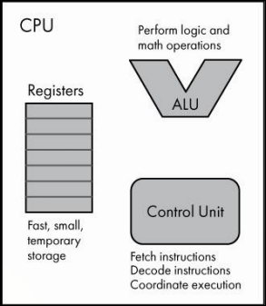

# Detalhes Internos da CPU

Internamente, uma CPU é composta por três componentes fundamentais que trabalham juntos para executar instruções.

**Registradores** são pequenas áreas de armazenamento dentro da própria CPU. Quando um programa precisa operar sobre um dado, a CPU precisa de um lugar temporário para armazená-lo dentro do processador. Os registradores cumprem esse papel. O acesso a registradores é muito mais rápido que o acesso à memória principal, mas eles só armazenam quantidades muito pequenas de dados. O tamanho de um registrador é medido em bits. Uma CPU de 32 bits geralmente tem registradores de 32 bits. O conjunto de registradores de uma CPU é implementado em um componente chamado **register file**, cujas células de memória são tipicamente do tipo SRAM.

O número de bits de um processador, também chamado de **tamanho da palavra** (em texto em inglês, você poderá encontrar *word size*, ou simplesmente *word*), refere-se à quantidade de bits que ele consegue processar de uma vez. Uma CPU de 32 bits opera em valores de 32 bits. Isso significa que a arquitetura tem registradores de 32 bits, barramento de endereço de 32 bits, ou barramento de dados de 32 bits, podendo ser os três ao mesmo tempo.

**ALU** (Unidade Lógica e Aritmética) é o componente que executa operações lógicas e matemáticas. Conceitualmente, é uma extensão dos circuitos lógicos combinacionais que vimos anteriormente. As entradas da ALU são chamadas de operandos, mais um código indicando qual operação realizar. A saída é o resultado da operação junto com um status de execução.

**Unidade de controle** é a coordenadora da CPU. Ela opera em um ciclo contínuo de três etapas, buscar (*fetch*) uma instrução na memória, decodificá-la (*decode*) e executá-la (*execute*). Para saber qual instrução buscar, a unidade de controle consulta um registrador especial chamado **program counter** (PC), também chamado de *instruction pointer* em x86. O program counter armazena o endereço de memória da próxima instrução a executar. Após buscar a instrução e armazená-la no *instruction register*, a unidade de controle atualiza o program counter para apontar para a próxima instrução, decodifica a instrução atual e a executa, coordenando outros componentes da CPU conforme necessário. O ciclo então recomeça.
