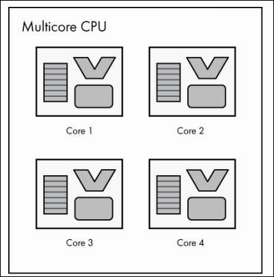
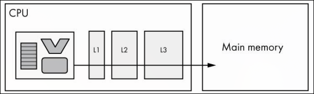
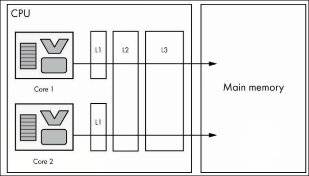

# Clock, Cores e Cache

Uma vez que CPUs executam um conjunto de instruções, é necessário algum componente que a faça progredir de uma instrução para a próxima. Já vimos como sinais de clock podem ser usados para mover um circuito de um estado para outro, ao falar de [sinais de clock](/docs/fundamentos/computerscience/circuitos/clock). O mesmo princípio pode ser usado aqui.

## Clock

A CPU usa um sinal de clock para progredir de uma instrução para a próxima, onde cada pulso do clock sinaliza à CPU para avançar na execução. CPUs modernas têm velocidades de clock medidas em gigahertz (GHz). Uma CPU de 2GHz oscila 2 bilhões de vezes por segundo.

Vale ressaltar que é uma simplificação didática dizer que a CPU executa uma instrução por clock, pois algumas instruções podem precisar de múltiplos ciclos de clock.

Aumentar a frequência do clock permite executar mais instruções por segundo, mas há um limite prático, clock muito alto gera calor excessivo e pode causar erros nas portas lógicas. Entre 1978 e o início dos anos 2000, a indústria viu aumentos constantes nas velocidades de clock. O Intel 8086 rodava a 5MHz em 1978, o Pentium III chegou a 500MHz em 1999. Após cruzar a barreira dos 3GHz no início dos anos 2000, limitações físicas dos transistores cada vez menores tornaram aumentos significativos impraticáveis.

Uma técnica usada dentro de cada núcleo para aumentar a eficiência sem aumentar o clock é o **pipelining**, que consiste em dividir instruções em etapas menores para que partes de múltiplas instruções sejam executadas em paralelo por um único núcleo. Por exemplo, enquanto uma instrução é executada, a próxima já está sendo decodificada e a seguinte já está sendo buscada.

## Múltiplos núcleos (cores)

Com o clock estagnado, a indústria adotou a abordagem de executar múltiplas instruções em paralelo com **CPUs multicore**. Um core é efetivamente um processador independente dentro da mesma CPU, com seus próprios registradores, ALU e unidade de controle.

Múltiplos cores permitem que o computador execute conjuntos distintos de instruções em paralelo, diferente do pipelining, que paraleliza etapas dentro de um mesmo conjunto de instruções. Porém, para que um programa individual se beneficie de múltiplos cores, ele precisa ser escrito para aproveitar processamento paralelo. Mesmo que um programa não seja paralelo, o sistema operacional como um todo se beneficia, pois roda múltiplos programas simultaneamente.

## Cache

Programas tendem a acessar as mesmas posições de memória repetidamente, e ir à memória principal toda vez que isso ocorre é ineficiente. A solução é o **cache**, uma pequena quantidade de memória dentro da CPU que armazena cópias dos dados acessados com frequência.

Quando a CPU precisa de um dado, ela verifica primeiro o cache. Se o dado estiver lá, o acesso é muito mais rápido. Se não estiver, a CPU busca na memória principal e traz o dado para o cache.

É comum que CPUs tenham três níveis de cache, L1, L2 e L3. A CPU verifica L1 primeiro, depois L2, depois L3, e só então vai à memória principal.

- L1: mais rápido, menor capacidade
- L2: mais lento, maior capacidade
- L3: mais lento ainda, maior ainda

Em CPUs multicore, alguns caches são exclusivos de cada núcleo e outros são compartilhados. Por exemplo, cada núcleo pode ter seu próprio L1, enquanto L2 e L3 são compartilhados.

