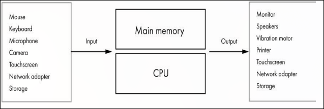
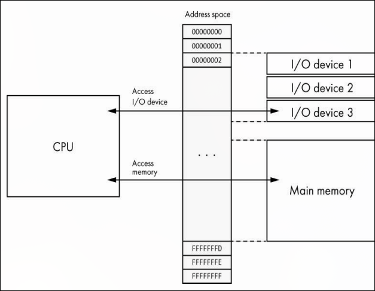

# Dispositivos de Entrada e Saída (I/O)

Um computador com apenas CPU, memória e armazenamento ainda não consegue interagir com o mundo externo. Para isso existem os dispositivos de entrada e saída (*input/output*), comumente chamados apenas de **I/O**.

Um dispositivo de I/O permite que o computador receba entradas do mundo externo, ou envie dados de saída para o mundo externo. Para um humano interagir com o computador, dispositivos de I/O são necessários.

- Entrada: teclado, mouse, microfone, câmera, touchscreen, adaptador de rede, armazenamento
- Saída: monitor, alto-falantes, motor de vibração, impressora, touchscreen, adaptador de rede, armazenamento

Da perspectiva da CPU, ler ou escrever no armazenamento é apenas mais uma operação de I/O. O armazenamento secundário é tecnicamente uma categoria de dispositivo de I/O.

## Como a CPU se comunica com dispositivos I/O

A CPU usa o **espaço de endereços físicos** para comunicação. Em um sistema com 32 bits de endereço, o range vai de `0x00000000` a `0xFFFFFFFF`, representando aproximadamente 4 bilhões de endereços, ou 4GB. Porém esses endereços nem sempre se referem exclusivamente a um byte da memória principal, eles também podem se referir a um dispositivo de I/O.

Existem duas abordagens para mapear dispositivos I/O.

**MMIO** (memory-mapped I/O): endereços do espaço de memória física são mapeados para dispositivos I/O. A CPU se comunica com o dispositivo simplesmente lendo ou escrevendo no endereço correspondente, sem instruções especiais.

**PMIO** (port-mapped I/O): dispositivos recebem um número de porta, um espaço de endereçamento separado da memória. A CPU usa instruções especiais para acessar portas. CPUs x86 suportam ambas as abordagens.

Em ambos os casos, os endereços ou portas geralmente se referem a um **controlador** do dispositivo, não diretamente aos dados. Por exemplo, uma CPU não lê bytes diretamente de um HD, ela envia um comando para o controlador do HD, que executa a operação e retorna o resultado.

