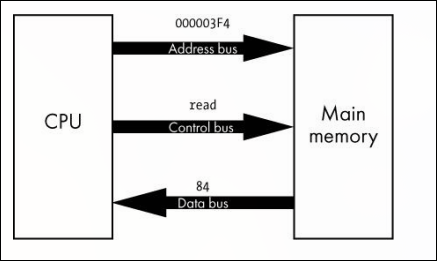

# Comunicação por Barramento (Bus)

Um **barramento** (*bus*) é o sistema de comunicação de hardware entre os componentes do computador. Nos primeiros computadores, era literalmente um conjunto de fios paralelos, cada um carregando um bit. Hoje os designs são mais sofisticados, mas o princípio é similar.

Existem três tipos de barramento principais.

- **Barramento de endereço** (*address bus*): indica o endereço de memória que a CPU deseja acessar. Se um programa deseja, por exemplo, escrever algo no endereço `0x2FE`, a CPU escreve `0x2FE` no barramento de endereço.
- **Barramento de dados** (*data bus*): transmite o valor a ser lido ou escrito. Se a CPU quer escrever o valor 25 na memória, ela escreve 25 no barramento de dados.
- **Barramento de controle** (*control bus*): gerencia as operações, indicando se é leitura ou escrita e transportando sinais de status. Por exemplo, a CPU pode usar o barramento de controle para indicar que uma operação de escrita está prestes a acontecer.

No exemplo da figura acima, a CPU precisa ler o valor armazenado no endereço `0x000003F4`. Ela escreve esse endereço no barramento de endereço, sinaliza uma leitura no barramento de controle, e o controlador de memória responde escrevendo o valor `84` no barramento de dados para a CPU ler.
