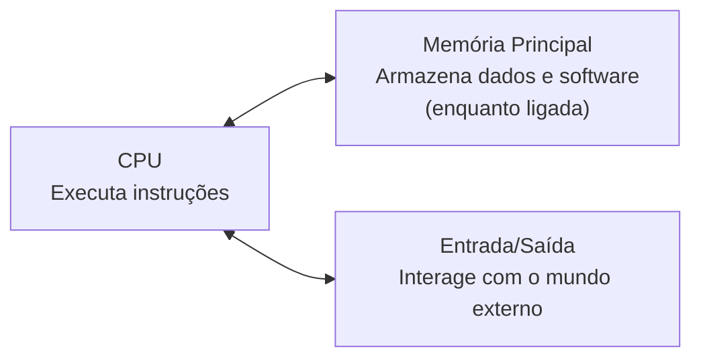

# Hardware

Nos capítulos anteriores vimos como usar circuitos lógicos e dispositivos de memória para projetar circuitos que executam tarefas úteis. O problema é que esses circuitos têm seus recursos fixados no próprio design físico. Se quisermos modificar ou adicionar algo, precisamos mudar o hardware.

Definir tudo no hardware limita demais. Um computador precisa ser capaz de executar tarefas diferentes sem precisar ser redesenhado a cada vez. Para isso, ele precisa aceitar um conjunto de instruções, um programa, e executar as ações especificadas por ele. Precisamos, portanto, de um hardware capaz de executar uma variedade de operações na ordem que o programa definir.

Essa capacidade de aceitar, processar e executar um conjunto de instruções é chamada de **programabilidade**, e é ela que diferencia um computador de um dispositivo de propósito fixo. Se hardware são os elementos físicos do computador, software são as instruções que dizem a ele o que fazer. A capacidade de executar software é exatamente o que separa um computador de qualquer outro circuito.

Então, que tipos de hardware precisamos para implementar um computador de propósito geral? São três componentes principais.

O primeiro é a **memória**. Já falamos de memórias de 1 bit, e a memória usada em computadores de verdade é uma extensão conceitual dessas memórias mais simples. A memória primária de um computador é conhecida como memória principal, mas com frequência é referida apenas como memória, ou RAM, memória de acesso aleatório. Ela é volátil, o que significa que só retém os dados enquanto estiver energizada. A parte "acesso aleatório" do nome indica que qualquer posição da memória pode ser acessada em aproximadamente o mesmo tempo que qualquer outra.

O segundo é a **CPU**, unidade central de processamento, com frequência chamada apenas de processador. É ela que carrega e executa as instruções do software, acessando a memória principal diretamente. A maioria dos processadores atuais são microprocessadores, CPUs em um único circuito integrado. Conceitualmente, a CPU é uma extensão dos circuitos lógicos que construímos anteriormente.

O terceiro componente é a capacidade de interagir com o mundo externo, feita por meio de **dispositivos de entrada e saída**, ou I/O. Por mais que memória e CPU sejam o mínimo necessário, na prática todo computador precisa se comunicar com algo além de si mesmo.

Os próximos tópicos aprofundam cada um desses três componentes, além de como eles se comunicam entre si.
