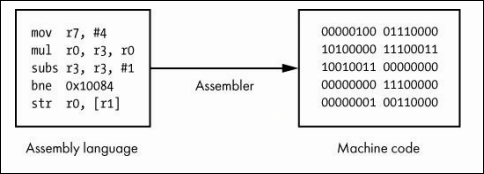

# Exemplo de Código de Máquina

Acredito que a maneira mais lúdica de entendermos código de máquina seria nos debruçarmos sobre um. Vamos analisar uma instrução que pode ser interpretada pela família de processadores ARM, usada em smartphones, então é algo que provavelmente seu celular poderia entender. No exemplo abaixo, a instrução diz ao processador para mover o número 4 para o registrador `r7`, apenas um dos registradores em uma CPU ARM. Lembre-se do que abordamos antes sobre registradores serem pequenos componentes de armazenamento dentro da CPU. A seguir, temos a representação binária da nossa instrução.

```
11100011101000000111000000000100
```

Vamos ver agora como a CPU faz para que essa sequência de bits faça algum sentido prático para ela. A tabela abaixo organiza os mesmos bits citados acima de forma mais visual, pulando alguns bits que não são relevantes neste momento.

| Campo | Bits | Significado |
| ----- | ---- | ----------- |
| Condição | `1110` | a instrução não é condicional, sempre executa |
| (ignorados por ora) | `00` | sem relevância neste exemplo |
| Imediato | `1` | o valor vem escrito na própria instrução, não em um registrador |
| Opcode | `1101` | operação `mov`, mover um dado |
| Registrador de destino | `0111` | `r7`, já que `0111` é o número sete em binário |
| Valor do imediato | `0000 00000100` | `4` em decimal |

A seção de **condição** especifica sob qual condição a instrução deve ser executada. O binário `1110` significa que a instrução não é condicional, ou seja, a CPU deve sempre executá-la. Apesar de não ser o caso desse exemplo, algumas instruções precisam ser executadas apenas em circunstâncias específicas, então entende-se que elas têm condições. Os próximos 2 bits `00` não são importantes no momento, vamos ignorá-los.

A seção de **imediato** é um único bit, que especifica se estamos acessando um valor em um registrador ou se estamos acessando um valor especificado na instrução em si. No nosso exemplo, o imediato está como `1`, o que significa que estamos usando um número especificado dentro da própria instrução. Se fosse um caso onde é `0`, o registrador deveria ser especificado.

A seção de **opcode** representa o código da operação que a CPU tem que executar. No nosso exemplo, é uma operação `mov`, o que significa que a CPU tem que mover algum dado.

A seção de **registrador de destino** diz que a intenção é mover um valor para o registrador `r7`, sabemos disso pois `0111` é o número sete em binário.

A seção de **valor do imediato** descreve o valor que será movido para o registrador de destino. No nosso caso, é o binário `00000100`, número decimal quatro, que será movido para o registrador destino `r7`.

Apenas para recapitularmos, essa operação move o número 4 para o registrador `r7`.

:::tip
Aqui eu optei pela expressão em inglês, opcode, mas ela pode ser traduzida como código de operação.
:::

A CPU está sempre lidando com binário, mas pessoas tendem a encontrar dificuldades lendo todos esses 0s e 1s. Mesmo depois da explicação, dificilmente você conseguiria ler `11100011101000000111000000000100` e dizer o que essa instrução faz logo de cara. Felizmente, não precisamos saber a sequência exata de 0s e 1s de todas as instruções, pois existe algo chamado Linguagem Assembly, que é um outro modo de representar instruções.

A linguagem assembly é uma linguagem de programação em que **cada instrução representa diretamente uma instrução em linguagem de máquina**. Uma instrução em linguagem assembly consiste em um **mnemônico que representa um opcode** da CPU, mais os operandos necessários, como um registrador ou valor numérico. **Um mnemônico é um nome legível que damos a uma instrução**, como MOV, ADD ou SUB. No nosso caso, poderíamos usar o `MOV` ao invés de `1101` no nosso código, mais fácil de ler e de escrever também.

:::info Mnemônico

Mnemônico é uma palavra que pode causar certa estranheza nessa frase. O termo vem de mnemonic em inglês e significa "ajuda à memória", ou seja, uma palavra que humanos usam para lembrar o que aquela sequência de bits faz.

Um fato curioso é que em grego, *Mnemosyne* é o deus da memória na mitologia grega.

Fontes:
- [Cambridge Dictionary, mnemonic](https://dictionary.cambridge.org/pt/dicionario/ingles-portugues/mnemonic)
- [Britannica, Mnemosyne](https://www.britannica.com/topic/Mnemosyne)

:::

A mesma instrução que destrinchamos anteriormente (`1110 00 1 1101 0 0000 0111 0000 00000100`) pode ser representada usando a seguinte linha em linguagem assembly:

```armasm
mov r7, #4
```

Comparado com nosso amigo em binário, essa representação é bem mais fácil de ser compreendida, e no final das contas é a mesma coisa que vai ser executada pela CPU, "mova 4 para o registrador `r7`". Legal, não achou?

Dito isso, vale reforçar que a CPU nunca executa texto, é tudo sempre em binário. Mesmo que se programe tudo em assembly, isso deve ser convertido para linguagem de máquina em algum momento. Isso é feito por um programa chamado *assembler*, que traduz as instruções assembly para código de máquina, o binário em si.



## Assembly é uma linguagem mesmo?

Para fins didáticos eu vou me referir ao assembly como uma linguagem de programação, mas saiba que do ponto de vista teórico isso não é muito correto. O que a CPU executa é linguagem de máquina, ou seja, sequências de bits. A instrução `1110 00 1 1101 0 0000 0111 0000 00000100` é o que a CPU lê e executa diretamente, ela não sabe o que é `mov`, essa foi uma palavra que nós humanos atribuímos para nos referirmos a uma determinada sequência de bits.

Assembly é, portanto, uma representação simbólica dessas sequências de bits. Quando você escreve `MOV R7, #4`, um programa chamado assembler traduz isso para o padrão de bits correspondente, em que cada instrução assembly vira uma instrução de máquina.

A discussão sobre se assembly é ou não uma linguagem existe porque linguagens de programação são mais elaboradas, vão além de serem simplesmente tradutores de instruções. Um desses requisitos é que deve existir um componente chamado compilador, que toma decisões sobre como transformar esse código em linguagem de máquina, organiza registradores, otimiza loops e monta diversas estruturas em binário. Assembly, por sua vez, possui uma representação tão direta que muitos diriam que não cabe chamá-lo de linguagem de programação, e sim notação para linguagem de máquina.

Essa distinção, no entanto, é mais teórica, no campo das ideias, e menos prática, por isso em meus textos vou me referir sim ao assembly como linguagem de programação. Portanto, anote isso em algum cantinho e siga a vida, você não está cometendo nenhum crime ao se referir ao assembly como linguagem.
