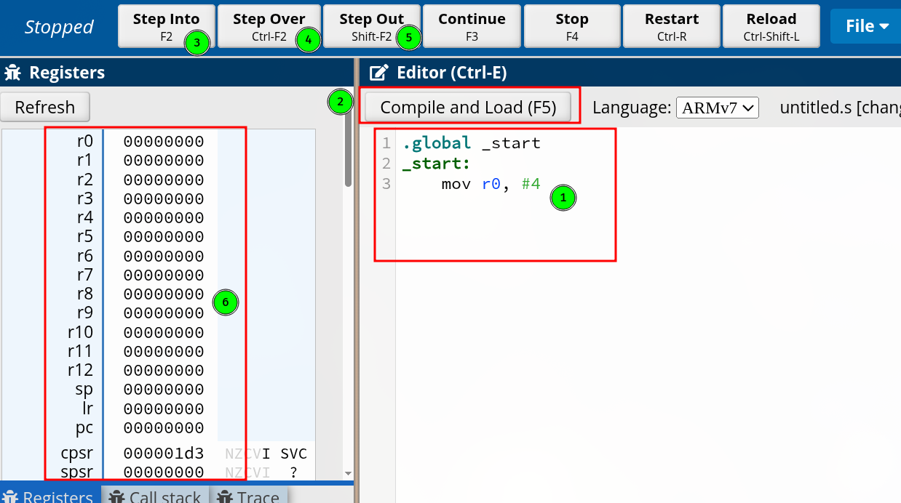
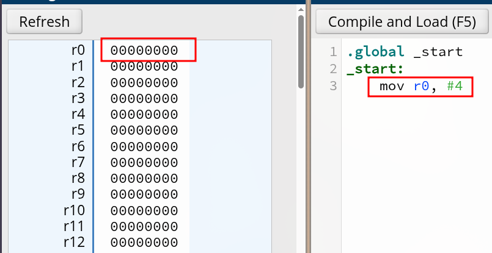
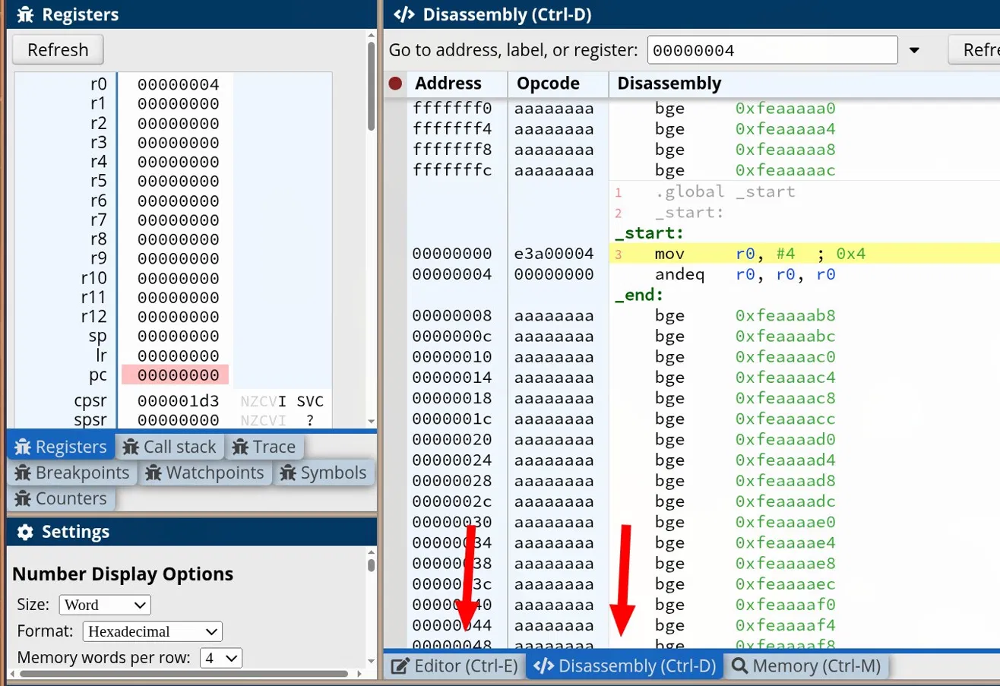

# Calculando um Fatorial com Código de Máquina

Agora vamos tentar combinar múltiplas instruções de código de máquina para conseguir escrever um programa útil, que calcula fatorial. Como você deve se lembrar das aulas de matemática, o fatorial de $n$, escrito como $n!$, é um produto de todos os inteiros menores ou iguais a $n$. Então o fatorial de 4 é

$$
4! = 4 \times 3 \times 2 \times 1 = 24
$$

Agora que definimos o fatorial, só nos resta ir à luta e tentar implementá-lo usando a linguagem assembly para CPUs ARM. Para manter as coisas simples, vamos nos ater às partes do programa que fazem o código do fatorial acontecer.

Para conseguir criar nosso programa, eu preparei tudo no site CPULator, use exatamente [este link](https://cpulator.01xz.net/?sys=arm). Ele emula uma CPU ARM para você. E antes de avançarmos no código, quero garantir que você consiga de fato fazer o exercício, portanto vamos entender primeiro como a interface desse site funciona. A interface do CPULator é dividida em duas áreas principais e uma barra de controles no topo.



1. Editor de código: é aqui que você escreve suas instruções assembly. O código que aparece ali já está pronto para uso. As linhas `.global _start` e `_start:` são obrigatórias para o CPULator saber onde o programa começa, por hora não se preocupe com elas, apenas saiba que nosso código, nossas instruções, devem vir logo após a linha `_start:`. No exemplo, a linha `mov r0, #4` é a nossa primeira instrução de fato.
2. Compile and Load: após escrever ou colar o código no editor, clique neste botão para compilar e carregar o programa na memória simulada. Nada acontece nos registradores até que você faça isso.
3. Step Into: executa uma instrução por vez. É o botão que você vai usar para acompanhar o programa passo a passo e observar os registradores mudando a cada instrução executada.
4. Step Over: similar ao Step Into, mas pula chamadas de sub-rotina sem entrar nelas. Por enquanto não vamos usar isso.
5. Step Out: sai de uma sub-rotina. Também não será necessário por enquanto.
6. Painel de registradores: aqui você acompanha o estado de todos os registradores da CPU em tempo real. Quando uma instrução é executada, o registrador afetado muda de valor. O `r0` começa em `00000000` e, após executar o `mov r0, #4`, você vai vê-lo mudar para `00000004`.

:::danger Não copie, escreva!

Eu vou informar os códigos logo após as imagens, mas é importante que você mesmo os escreva, sem copiar e colar. Faz parte do aprendizado escrever ativamente, às vezes errar, não funcionar, tentar novamente, tudo isso é normal.

:::

O uso é simples, você deve escrever suas instruções abaixo do `_start:`, como demonstro no print abaixo. Vamos primeiro criar a parte do programa que deverá mover `4` para o registrador `r0`, sendo `4` o número que será fatorado, e usaremos o registrador `r0` para armazená-lo.



```armasm
.global _start
_start:
	mov r0, #4
```

Observe também que ainda não executamos nada, todos os registradores, inclusive o `r0`, encontram-se zerados. Logo após escrever sua primeira instrução, clique em "Compile and Load", isso vai fazer sua interface ficar uma bagunça, mas não se assuste, está tudo nos conformes. Depois de clicar no botão, observe que ainda não temos nenhum valor armazenado em `r0`, pois nossa instrução não foi executada ainda. Para dar sequência e executar a instrução que criamos, clique em "Step Into" e observe a mudança no registrador `r0`, que deverá ter o valor `00000004`.


Ótimo, demos nosso primeiro passo! Se você for uma pessoa atenciosa, certamente notou que mudamos da aba "Editor" para a aba Disassembly após clicar em "Compile and Load". Vamos entender o que essa aba mostra.

A aba Disassembly exibe três colunas, Address, Opcode e Disassembly. Lembra quando falamos que assembly é uma representação simbólica de sequências de bits? Essa aba é exatamente a prova disso.

- Address: o endereço de memória onde aquela instrução está armazenada.
- Opcode: a instrução em linguagem de máquina, ou seja, os bits reais que a CPU lê, representados aqui em hexadecimal para facilitar a leitura.
- Disassembly: a representação simbólica daquele opcode, que é justamente o assembly que você escreveu.

Observe a linha destacada em amarelo. O endereço `00000000` contém o opcode `e3a00004`, que o CPULator traduz de volta para `mov r0, #4`. Aquela sequência `e3a00004` é o que a CPU de fato executou quando você clicou em Step Into, não a palavra `mov`. Para voltar à tela de edição de código, clique na aba "Editor".



## Construindo o loop de multiplicação

Como no fatorial o número $n$ é multiplicado por $n - 1$, ou seja, um número menor que ele mesmo, nosso algoritmo precisa subtrair 1 do valor 4 que está armazenado em `r0`. Para isso vamos usar a seguinte instrução `subs r3, r0, #1`, que subtrai 1 do valor em `r0` e armazena o resultado em `r3`. O `s` no final de `subs` é importante, pois instrui a CPU a atualizar o registrador de status após a operação. Esse registrador guarda coisas como "o resultado foi negativo?" ou "o resultado foi zero?", que será útil mais à frente. Com `r0 = 4`, após essa instrução, `r3 = 3`.


Com `r3 = 3`, o programa precisa decidir se vale a pena entrar no loop de multiplicação. Afinal, se $n$ fosse 0 ou 1, o fatorial já seria o próprio número, e multiplicar nada seria um erro. Para isso usamos `ble end`, que significa *branch if less than or equal*. Ela verifica as flags que o `subs` atualizou, se o resultado foi menor ou igual a zero, o programa pula direto para o rótulo `end` e encerra. Como `r3 = 3`, a condição não é satisfeita e o programa segue em frente normalmente.

Chegamos ao coração do algoritmo. A instrução `mul r0, r3, r0` multiplica o valor em `r3` pelo valor em `r0` e armazena o resultado em `r0`. Traduzindo para o nosso caso, `r0 = 3 × 4 = 12`. O registrador `r0`, que antes guardava o $n$ original, agora começa a acumular o resultado do fatorial.

Com a multiplicação feita, precisamos avançar para o próximo multiplicador. A instrução `subs r3, r3, #1` decrementa `r3` em 1, ou seja, `r3 = 3 - 1 = 2`. O `s` no final cumpre o mesmo papel de antes, atualiza as flags de status para que a próxima instrução de desvio saiba o que decidir.

Agora o programa verifica se o loop deve continuar. A instrução `bne loop` significa *branch if not equal*, se o resultado da operação anterior não foi zero, volta para o rótulo `loop` e repete as multiplicações. Como `r3 = 2`, a condição é satisfeita e o programa retorna para o `mul`.

Esse ciclo se repete, a cada volta `r0` acumula mais uma multiplicação e `r3` decrementa em 1, até que `r3` chegue a zero. Quando isso ocorre, `bne` não desvia e o programa chega ao rótulo `end`.

## O programa completo

Quando o loop termina, `r0` contém o resultado final.

```armasm
.global _start
_start:
    mov  r0, #4
    subs r3, r0, #1
    ble  end
loop:
    mul  r0, r3, r0
    subs r3, r3, #1
    bne  loop
end:
```

Acompanhe a tabela abaixo para não perder o fio:

| Volta  | Instrução         | `r0`   | `r3` |
| ------ | ----------------- | ------ | ---- |
| início | `mov r0, #4`      | 4      |      |
| início | `subs r3, r0, #1` | 4      | 3    |
| 1ª     | `mul r0, r3, r0`  | 12     | 3    |
| 1ª     | `subs r3, r3, #1` | 12     | 2    |
| 2ª     | `mul r0, r3, r0`  | 24     | 2    |
| 2ª     | `subs r3, r3, #1` | 24     | 1    |
| 3ª     | `mul r0, r3, r0`  | 24     | 1    |
| 3ª     | `subs r3, r3, #1` | 24     | 0    |
| fim    | `bne loop`        | **24** | 0    |

$r0 = 24$, que é o resultado de 4 fatorial:

$$
4! = 4 \times 3 \times 2 \times 1 = 24
$$
