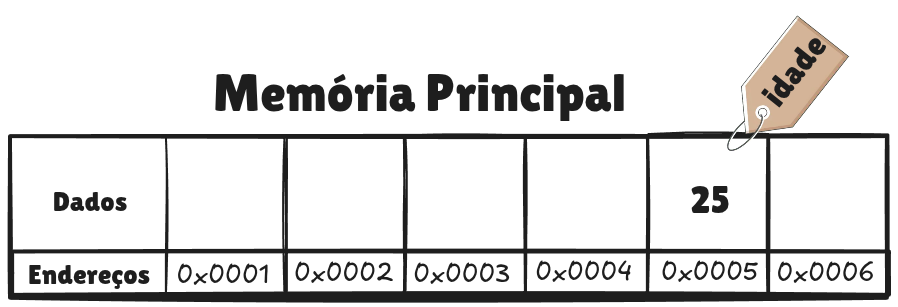

# Variáveis

Acesso a memória é um recurso fundamental dos processadores, e por consequência precisa ser também algo que uma linguagem de alto nível seja capaz de fazer. A forma mais básica que uma linguagem de programação tem de expor o acesso à memória é por meio de variáveis. **Uma variável é uma localização na memória que possui um nome atribuído a ela**. Não é tão difícil quanto parece, vamos aos poucos.

Geralmente linguagens de programação atribuem valores a um nome usando o sinal de igual, por exemplo, `idade = 25`, onde o valor `25` está sendo atribuído ao nome `idade`. O compilador lê o nome `idade`, reserva um endereço de memória para armazenar o valor `25` e substitui todas as ocorrências de `idade` no código pelo endereço reservado. Ou seja, um programador consegue atribuir um nome para um intervalo de endereços e então acessar os dados disponíveis nesses endereços por meio do nome, é como se criássemos um apelido para esse conjunto de endereços onde nossos dados estão armazenados. Veja a imagem abaixo, onde tento elucidar esse processo.



Após a compilação, o nome `idade` simplesmente não existe mais no código de máquina, apenas o endereço. É exatamente por isso que assembly e código de máquina não têm variáveis no sentido que estamos acostumados. Lembra do programa de fatorial que fizemos? Trabalhamos direto com `r0` e `r3`, sem dar nome a nada. A linguagem de alto nível cria essa abstração do nome justamente para poupar o programador de lidar com endereços manualmente, caso contrário você teria que decorar que a idade está armazenada no endereço `0x0005`, e é evidente que utilizar `idade` é muito mais fácil.

Além de um valor e um nome, variáveis também podem especificar de qual **tipo** ela é. O tipo de uma variável varia de acordo com o dado que queremos armazenar, retornando ao exemplo anterior, o `25` é um número inteiro, logo o tipo dele será inteiro também. Se, ao invés do número `25`, a variável fosse uma palavra, como sua cor favorita por exemplo, o tipo seria `string`. Existem diversos tipos possíveis para uma variável, podendo variar inclusive de acordo com a linguagem de programação escolhida, sendo os mais comuns o inteiro, o ponto flutuante, o booleano e a string, ou texto.

Outra característica, na qual não vamos nos aprofundar muito por enquanto, é que variáveis possuem **escopo**, o que significa que elas podem ser acessadas apenas de partes do programa que estejam no mesmo escopo do qual foram criadas.

## Variáveis em C

Vamos dar uma olhada em um exemplo de variável na linguagem de programação C, sempre lembrando que, teoricamente, uma variável possui três elementos principais, um nome, um valor e um tipo. Vejamos como essas características se manifestam em C.

```c
// Declara uma variável e atribui um valor
int pontos = 27;
```

O código acima declara uma variável nomeada `pontos`, que deverá armazenar o valor `27`, e o `int` declara que o tipo da variável é um número inteiro. Vamos declarar uma segunda variável e atribuir um valor a ela.

```c
int pontos = 27;
int ano = 2026;
```

Agora temos duas variáveis, `pontos` e `ano`, declaradas uma após a outra. Como o nome diz, variáveis podem variar. Caso precise mudar, basta atribuir novamente um outro valor, da mesma forma que fizemos antes, como em `int pontos = 30;`.

Para exibir o valor de uma variável, o `printf` usa marcadores de posição chamados de especificadores de formato. O mais comum para inteiros é `%d`:

```c
int pontos = 27;
printf("O valor de pontos é: %d\n", pontos);
```

O `%d` é substituído pelo valor da variável `pontos` na hora da exibição, resultando em `O valor de pontos é: 27`.

Para visualizar o endereço de memória de uma variável, usamos o especificador `%x`, que exibe o valor em hexadecimal, e o operador `&` antes do nome da variável, que retorna o endereço de memória onde ela está armazenada:

```c
int pontos = 27;
printf("pontos tem o valor %d e está armazenada no endereço 0x%08x\n", pontos, &pontos);
```

O `0x%08x` formata o endereço como hexadecimal com 8 dígitos, que é a convenção usada para representar endereços de memória.

### Projeto: Examinando variáveis

Neste projeto vamos escrever um código de alto nível que usa variáveis, e depois examinar como elas funcionam na memória. Usando o editor de texto de sua preferência, crie um arquivo nomeado `variaveis.c`, com o seguinte conteúdo:

```c
#include <stdio.h>
#include <signal.h>

int main() {
	int pontos = 27;
	int ano = 2026;

	printf("ponto tem o valor %d e está armazenada no endereco 0x%08x\n", pontos, &pontos);
	printf("ano tem o valor %d e está armazenada no endereco 0x%08x\n", ano, &ano);

	raise(SIGINT);

	return 0;
}
```

Grande parte das linhas acima contém palavras que ainda não explicamos, não se preocupe com elas, nosso objetivo aqui é entender apenas as variáveis. Depois de copiar esse conteúdo para o arquivo `variaveis.c`, use o comando abaixo para compilá-lo:

```bash
gcc -o variaveis variaveis.c
```

Agora podemos executá-lo:

```bash
./variaveis
```

Uma vez que o programa tenha funcionado, teremos uma saída semelhante à seguinte:

```
$ ./variaveis
ponto tem o valor 27 e está armazenada no endereco 0xe403f69c
ano tem o valor 2026 e está armazenada no endereco 0xe403f698
```

Observe que, como ambos são inteiros, o compilador GCC reservou 32 bits, ou 4 bytes, da memória para armazenar cada valor. Sabemos disso pois existem 4 bytes de diferença de um endereço para o outro.

## Variáveis em Python

As variáveis em C precisam de um tipo, tentar atribuir um texto a uma variável do tipo inteiro, por exemplo, resultaria em erro. Já em Python as coisas são mais simples, pois ele reconhece dinamicamente o tipo de um dado que uma variável possui. Uma variável em Python pode ser criada da seguinte forma:

```python
# Python permite criar novas variáveis sem especificar um tipo

idade = 25 # um tipo inteiro
nome = "Homero" # tipo string
tem_cafe = True # tipo booleano
```

E, ao contrário de C, em Python o tipo da variável pode mudar ao longo da execução do programa:

```python
idade = 25
# ... imagine várias linhas de código até que seja necessário mudar a variável idade
idade = "Vinte e Cinco"
```

Conclui-se então que **o que define o tipo de uma variável em Python é o valor que está sendo atribuído a ela**. E, por consequência, entende-se que o tipo de uma variável está associado ao valor que ela possui, e não ao nome que foi atribuído.

Para exibir o valor de uma variável, basta passá-la como argumento:

```python
pontos = 27
print(pontos)
```

Python também oferece uma forma moderna e elegante de misturar texto e variáveis, chamada de *f-string*, onde o `f` antes das aspas indica que a string pode conter expressões entre chaves que serão avaliadas e substituídas pelo seu valor:

```python
pontos = 27
print(f"O valor de pontos é: {pontos}")
```

A saída seria `O valor de pontos é: 27`, assim como no exemplo em C, porém com uma sintaxe mais limpa e legível. Para descobrir o tipo de uma variável e exibi-lo, podemos usar a função `type()`:

```python
idade = 25
print(f"A variável idade tem o valor {idade} e é do tipo {type(idade)}")
```

A saída seria `A variável idade tem o valor 25 e é do tipo <class 'int'>`. O Python usa o termo `class` porque internamente tudo em Python é um objeto, mas por enquanto basta entender que `int` significa inteiro, `str` significa texto e `bool` significa booleano.

Agora vamos criar um programa que mostra de que tipo cada variável é. Crie um arquivo chamado `variaveis.py` com o seguinte conteúdo:

```python
idade = 25
nome = "Homero"
tem_cafe = True

print(f"A variável idade é do tipo: {type(idade)}")
print(f"A variável nome é do tipo: {type(nome)}")
print(f"A variável tem_cafe é do tipo: {type(tem_cafe)}")
```

Ao executar o arquivo, o resultado deverá ser o seguinte:

```
$ python3 variaveis.py
A variável idade é do tipo: <class 'int'>
A variável nome é do tipo: <class 'str'>
A variável tem_cafe é do tipo: <class 'bool'>
```
