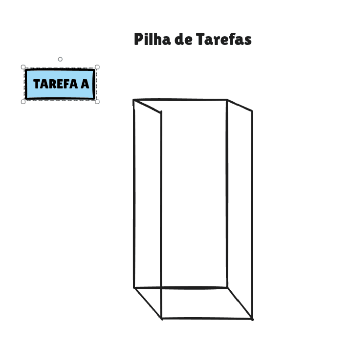
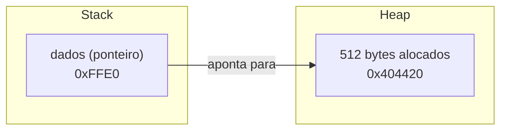

# Stack e Memória Heap

Como vimos no capítulo anterior, ao utilizar linguagens de programação de alto nível, alguns detalhes de como a memória é gerenciada ficam a cargo do compilador e acabam se tornando uma parte obscura do ponto de vista do programador. Linguagens como Python tornam a alocação de memória quase invisível para o desenvolvedor, enquanto C expõe alguns mecanismos de gerenciamento de memória. Seja como for, programas em geral fazem uso de dois tipos de memória, stack e heap.

## Memória stack (pilha)

Imagine um funcionário bem metódico e perfeccionista, que adora anotar as etapas de suas atividades. Hoje sua tarefa é trocar o pneu de um carro. Ele começa a trabalhar nisso, primeiro anotando em uma folha, *tarefa A, trocar pneu do carro*. E onde devemos colocar uma tarefa? Em uma pilha de tarefas, é claro.



Agora no topo da nossa pilha de tarefas temos a *tarefa A*. Mas no meio do processo o funcionário percebe que precisa primeiro retirar o pneu velho. Ele então para o que está fazendo, anota em uma folha onde parou e coloca essa folha em uma pilha ao lado, *tarefa B, retirar pneu velho*.


Agora temos a *tarefa B* no topo da lista, afinal ela precisa ser concluída primeiro para depois conseguirmos concluir a *tarefa A*.

Agora sua atenção está totalmente na tarefa de retirar o pneu velho. Mas para retirar o pneu velho, ele percebe que precisa antes encontrar as ferramentas. Então, pacientemente, o funcionário para novamente, anota onde parou e coloca essa folha por cima da anterior na pilha, criando assim a *tarefa C, buscar ferramentas*.


Ao finalizar, ele percebe que a tarefa que está no topo da pilha agora não tem nenhum pré-requisito, logo ele pode dar início a ela e buscar as ferramentas, a *tarefa C*. Quando termina de encontrar as ferramentas, pega a folha do topo da pilha, que é justamente onde parou na tarefa de retirar o pneu, a *tarefa B*, e retoma de onde estava. Quando termina de retirar o pneu, pega a próxima folha do topo, que é onde parou na tarefa de trocar o pneu, a *tarefa A*, e conclui o trabalho.

Percebe o padrão? A última folha que entrou na pilha foi a primeira a sair. Isso é o que significa LIFO, *last-in first-out*, e é o princípio que governa a stack. Cada folha que ele empilha é o que chamamos de *frame* na stack. Uma subtarefa sempre precisa terminar antes que a tarefa que a chamou possa continuar.

Vamos sair um pouco da metáfora e voltar aos computadores. Cada frame da stack possui um endereço de memória atribuído, e a stack sempre começa nos endereços mais altos da memória disponível. `A`, o primeiro frame adicionado, recebeu o endereço `0xFFF8`, que fica no final da memória. Quando `B` foi adicionado, recebeu o endereço `0xFFF4`, menor que o de `A`. Quando `C` foi adicionado, recebeu `0xFFF0`, menor ainda.

| Frame adicionado | Endereço |
| ----------------- | -------- |
| A | `0xFFF8` |
| B | `0xFFF4` |
| C | `0xFFF0` |

Observe que cada novo frame ocupa um endereço menor que o anterior, ou seja, a stack cresce em direção aos endereços baixos, e é por isso que dizemos que a stack cresce para baixo.

O endereço de memória do valor que está no topo da stack é armazenado em um registrador do processador chamado ponteiro de pilha, ou *stack pointer*. Quando um valor é adicionado ao topo da pilha, o ponteiro de pilha é ajustado para apontar para esse novo topo, aumentando o tamanho da pilha para acomodar o novo valor. Quando uma tarefa é concluída e removida do topo, o ponteiro volta a apontar para a próxima tarefa abaixo dela, como aconteceu quando a tarefa C foi concluída e o ponteiro passou a apontar para a tarefa B.

Podemos usar um exemplo com variáveis, pois além de dar rastreabilidade do programa, a stack também pode ser um local para armazenar variáveis locais. Imagine que foram definidas as seguintes variáveis:

```c
int pontos = 27;
int ano = 2026;
```

Pela lógica da stack, o seguinte aconteceria.

1. O programa define que o valor `27` deve ser armazenado.
2. Esse valor vai para o topo da pilha, no endereço `0x0008`.
3. Ao encontrar a segunda definição, `ano = 2026`, a pilha precisa crescer para o endereço `0x0004`, que passa a ser o novo topo, onde será armazenado o valor `2026`.


A memória stack é limitada, e alocar muitos valores nela resulta em uma falha conhecida como *stack overflow*.

:::warning
Observe que optei por usar endereços baixos, como `0x0004`, para ser mais didático e tentar deixar claro o fato de que as variáveis se empilham ao passo que os endereços passam a ser menores a cada novo valor. Saiba que, na prática, esses endereços serão bem mais altos e mais próximos do final da memória.
:::

## Heap

A stack tem o propósito de armazenar valores pequenos e temporários, mas quando o assunto é alocação de memória maior, ou que precisa persistir armazenada por mais tempo, a memória heap passa a ser a escolha ideal. A memória heap é uma reserva de memória disponível para o programa, e diferentemente da stack, não funciona no modelo LIFO, não existe um modelo padrão para como a memória heap deve ser alocada.

Os programas alocam memória heap, e esse uso de memória persiste até que seja liberado pelo programa, ou até que o programa termine sua execução. Liberar uma alocação de memória significa devolvê-la ao conjunto de memória disponível. Algumas linguagens de programação liberam memória heap automaticamente quando uma alocação não é mais referenciada, uma abordagem comum para fazer isso é conhecida como *garbage collection*, em português, coleta de lixo. Outras linguagens, como C, exigem que o programador escreva código para liberar memória heap. Um vazamento de memória ocorre quando a memória não utilizada não é liberada.

Na linguagem C, um tipo especial de variável chamado ponteiro (*pointer* em inglês) é utilizado para rastrear a alocação de memória. Um ponteiro é simplesmente uma variável que armazena um endereço de memória. O valor do ponteiro, um endereço de memória, pode ser armazenado em uma variável local na stack, e esse valor pode fazer referência a uma localização na heap.

No código abaixo é declarada uma variável chamada `dados`. Essa variável é do tipo `void *`, o que significa que é um ponteiro, indicado pelo `*`, que aponta para um endereço de memória que pode armazenar qualquer tipo de dado, `void` significa que não é de um tipo específico. Por `dados` ser uma variável local, ela é alocada na stack. A próxima linha faz uma chamada para `malloc`, uma função em C que aloca memória da heap, e neste caso estamos alocando 512 bytes de memória. A função `malloc` retorna o endereço do primeiro byte da nova memória alocada, e esse endereço, por sua vez, fica armazenado na stack.

```c
// Declara uma variável de ponteiro
void * dados;

// Aloca da heap e armazena o endereço em uma variável
dados = malloc(512);
```



O ponteiro `dados` mora na stack, mas o endereço que ele guarda aponta para um bloco de memória que vive na heap.

## Projeto: Stack ou Heap

Para conseguir cumprir este exercício é necessário ter feito o projeto de examinar variáveis do capítulo anterior. Neste projeto vamos examinar nossa memória, verificando se as variáveis estão sendo armazenadas na memória stack ou heap durante a execução do programa.

```c
#include <stdio.h>
#include <signal.h>
#include <stdlib.h>

int main() {
	int pontos = 27;
	int ano = 2026;

  void * dados = malloc(512);
  printf("dados tem o valor 0x%08x e está armazenada no endereço 0x%08x\n", dados, &dados);
	raise(SIGINT);

	return 0;
}
```

Compile e execute o programa com o GDB:

```bash
gcc -o variaveis variaveis.c
gdb ./variaveis
```

Dentro do GDB, rode o programa com `run`. Ele vai pausar automaticamente ao chegar no `raise(SIGINT)`, que é o ponto onde inspecionamos a memória. Com o programa pausado, execute:

```
info proc mappings
```

A saída vai mostrar o mapa completo de memória do processo. Procure as linhas marcadas com `[heap]` e `[stack]`:

```
0x0000000000404000 0x0000000000425000   [heap]
0x00007ffffffdd000 0x00007ffffffff000   [stack]
```

Agora compare com os endereços que o programa imprimiu:

```
ponto  = 27    => 0xffffd6cc
ano    = 2026  => 0xffffd6c8
dados  = 0x00404420 => 0xffffd6c0
```

`ponto` e `ano` estão dentro do range da stack (`0x7ffffffdd000` a `0x7ffffffff000`), confirmando que variáveis locais vivem na stack. Observe também que `ponto` foi declarada primeiro e ficou no endereço maior (`0xffffd6cc`), enquanto `ano` foi declarada depois e ficou em um endereço menor (`0xffffd6c8`). A diferença entre os dois é de 4 bytes, exatamente o tamanho de um `int`. A pilha cresceu para baixo, exatamente como descrevemos.

`dados` é diferente. O valor que ela guarda, `0x00404420`, está dentro do range do heap (`0x404000` a `0x425000`). Isso acontece porque usamos `malloc` para alocá-la, que reserva memória no heap. Note que o endereço onde a variável `dados` em si está armazenada (`0xffffd6c0`) ainda é da stack, o que está na stack é o ponteiro, e o que esse ponteiro aponta é que está no heap.

Isso demonstra na prática a diferença entre stack e heap, variáveis locais vão automaticamente para a stack, enquanto memória alocada manualmente com `malloc` vai para o heap.
