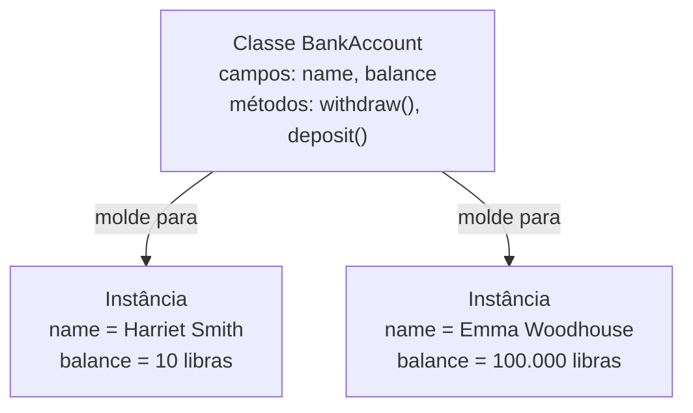

# Programação Orientada a Objetos

Linguagens de programação são projetadas para suportar paradigmas, ou abordagens, de programação. Exemplos incluem programação procedural, programação funcional e programação orientada a objetos. Uma linguagem pode suportar um ou múltiplos paradigmas, e cabe ao desenvolvedor usá-la de forma que se encaixe em um determinado paradigma.

A programação orientada a objetos, ou POO, é uma abordagem em que código e dados são agrupados em uma estrutura chamada **objeto**. Objetos são pensados para representar um agrupamento lógico de dados e funcionalidades que modela conceitos do mundo real, tornando o código mais organizado e mais próximo de como pensamos sobre as coisas na vida cotidiana.

## Classes e objetos

Linguagens orientadas a objetos geralmente utilizam uma abordagem baseada em **classes**. Uma classe é um molde, uma descrição genérica de como um objeto deve ser. Um objeto criado a partir de uma classe é chamado de **instância** dessa classe.

Para tornar isso concreto, imagine que queremos representar uma conta bancária em um programa. Uma conta bancária tem características, como saldo e nome do titular, e comportamentos, como sacar e depositar dinheiro. Em POO, as características são chamadas de **campos** e os comportamentos são chamados de **métodos**.

A classe `ContaBancaria` descreveria uma conta bancária genérica, sem pertencer a ninguém ainda. É apenas o molde. A partir desse molde, podemos criar objetos específicos, cada um com seus próprios valores para os campos.



A classe `BankAccount` define os campos `name` e `balance`, e os métodos `withdraw()` e `deposit()`. A partir dela foram criados dois objetos distintos, um para Harriet Smith, com saldo de £10, e outro para Emma Woodhouse, com saldo de £100.000. Os dois objetos compartilham a mesma estrutura definida pela classe, mas cada um tem seus próprios valores.

## Campos e métodos na prática

Em Python, campos que têm valores diferentes para cada instância de uma classe são chamados de **variáveis de instância**, enquanto campos que têm o mesmo valor para todas as instâncias são chamados de **variáveis de classe**.

Para interagir com um objeto, chamamos seus métodos usando a notação de ponto. Por exemplo, para depositar £25 em um objeto chamado `myAccount`:

```python
myAccount.deposit(25)
```

Essa linha chama o método `deposit` do objeto `myAccount`, passando `25` como parâmetro. Internamente, o método atualiza o campo `balance` daquele objeto específico, sem afetar nenhuma outra conta.

## Por que POO é útil

Sem POO, para representar duas contas bancárias precisaríamos de variáveis soltas espalhadas pelo código, como `nome1`, `saldo1`, `nome2`, `saldo2`, e funções separadas que precisariam receber esses valores como parâmetro toda vez que fossem chamadas. Com POO, agrupamos tudo que pertence a uma conta dentro de um único objeto, tornando o código mais organizado, mais fácil de manter e mais próximo de como pensamos sobre o problema.

POO é mais um exemplo de encapsulamento, que já vimos antes no contexto de hardware e de funções. A classe encapsula os detalhes internos de como uma conta bancária funciona e oferece uma interface, os métodos, para quem quiser interagir com ela. Quem usa o objeto `myAccount` não precisa saber como o método `deposit` calcula o novo saldo, só precisa saber que ao chamá-lo com um valor, o saldo será atualizado.

## Projeto: Conta no banco

Neste projeto vamos escrever uma classe de conta bancária em Python e criar um objeto a partir dela. Use o editor de texto de sua preferência para criar um arquivo chamado `bank.py` e insira o seguinte código:

```python
# Define uma classe de conta bancária em Python
class BankAccount:
    def __init__(self, balance, name):
        self.balance = balance
        self.name = name

    def withdraw(self, amount):
        self.balance = self.balance - amount

    def deposit(self, amount):
        self.balance = self.balance + amount

# Cria um objeto de conta bancária a partir da classe
smithAccount = BankAccount(10.0, 'Harriet Smith')

# Deposita um valor na conta
smithAccount.deposit(5.25)

# Imprime o saldo da conta
print(smithAccount.balance)
```

**`class BankAccount:`**
Define uma nova classe chamada `BankAccount`. Tudo que estiver indentado abaixo dessa linha faz parte da definição da classe.

**`def __init__(self, balance, name):`**
O `__init__` é um método especial do Python chamado de inicializador, que é executado automaticamente quando um objeto é criado a partir da classe. Os dois underscores antes e depois (`__init__`) são uma convenção do Python para indicar que esse método tem um significado especial para a linguagem. Os parâmetros `balance` e `name` são os valores que precisamos fornecer no momento de criar o objeto.

**`self.balance = balance` e `self.name = name`**
O `self` é uma referência ao próprio objeto que está sendo criado. Ao escrever `self.balance`, estamos criando uma variável de instância chamada `balance` que pertence àquele objeto específico. Isso garante que cada objeto criado a partir da classe tenha seu próprio saldo e seu próprio nome, independentes dos demais.

**`def withdraw(self, amount):` e `def deposit(self, amount):`**
São os métodos da classe, que definem os comportamentos que um objeto `BankAccount` pode executar. O método `withdraw` subtrai o valor recebido do saldo, e o método `deposit` adiciona. Ambos recebem `self` como primeiro parâmetro, que é a forma do Python de dar ao método acesso às variáveis de instância do objeto.

**`smithAccount = BankAccount(10.0, 'Harriet Smith')`**
Cria um objeto a partir da classe `BankAccount`, passando `10.0` como saldo inicial e `'Harriet Smith'` como nome. O `__init__` é chamado automaticamente nesse momento, atribuindo esses valores às variáveis de instância do objeto.

**`smithAccount.deposit(5.25)`**
Chama o método `deposit` do objeto `smithAccount`, adicionando `5.25` ao saldo. Após essa linha, `smithAccount.balance` passa a ser `15.25`.

**`print(smithAccount.balance)`**
Acessa a variável de instância `balance` do objeto e exibe seu valor na tela.

Para executar o programa, use o interpretador Python:

```bash
python3 bank.py
```

A saída esperada é o saldo atualizado da conta:

```
15.25
```

:::info
Essa foi uma forma desnecessariamente complexa de somar dois números. O objetivo não era resolver um problema difícil, mas sim mostrar como classes e objetos funcionam na prática. Em um cenário real, uma classe de conta bancária faria muito mais sentido quando precisássemos gerenciar múltiplas contas, aplicar regras de negócio e organizar um sistema maior.
:::
