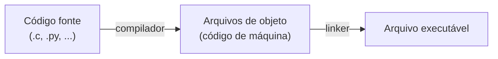

# Programação de Alto Nível

No último capítulo entendemos que um software é fundamentalmente um código de máquina que é executado na CPU, e a linguagem assembly é uma representação desse código de forma mais legível para humanos. Sabemos também que eventualmente todos os softwares se transformam em código de máquina. Porém, apesar de ter sido divertido programar em assembly, saiba que a grande maioria esmagadora dos softwares não é escrita em assembly, pois leva muito tempo para programar tarefas simples, é extremamente suscetível a erros e resulta em um software difícil de manter. Além disso, é pouco portável, um software escrito em assembly só funciona na arquitetura de CPU para a qual foi programado, se quisermos levá-lo para outro tipo de CPU, precisaríamos reescrevê-lo do zero.

Uma solução para esses problemas são as linguagens chamadas de alto nível, muito mais fáceis de serem lidas por humanos, e cujos programas podem ser executados em qualquer tipo de CPU. Elas são chamadas de "linguagens de alto nível" pois não parecem nem um pouco com código de máquina, na verdade são mais semelhantes a escrever um texto em inglês do que a binário, e essa distância do hardware é o que dá nome a elas.

Esse processo de converter algo complicado e de difícil acesso para algo mais simples é chamado de abstração. Na computação, abstrair algo é oferecer ao usuário uma interface para interagir com um sistema complexo sem precisar entender tudo que acontece por baixo.

Um exemplo do dia a dia seria quando você dirige um carro, você usa o volante, o acelerador e o freio. Você não precisa entender o funcionamento do motor de combustão, do sistema de injeção eletrônica ou da caixa de câmbio para chegar ao seu destino. O carro abstrai toda essa complexidade e te oferece uma interface simples.

Na computação é a mesma ideia. Vimos no capítulo anterior como somar dois números em assembly exige mover valores para registradores, chamar a instrução correta e lidar com o resultado manualmente. Em uma linguagem de alto nível, essa mesma operação é escrita de forma muito mais acessível, como `resultado = 2 + 3`.

Todo o trabalho com registradores e instruções de máquina continua acontecendo, mas a linguagem abstrai isso de você. Assim como com os carros, você aprende a dirigir, e não mecânica automotiva, nas linguagens de alto nível você aprende a linguagem e não o código de máquina.

Não podemos nos esquecer que tudo em algum momento é executado em código de máquina, então precisamos de um programa que faça essa conversão da linguagem de alto nível para instruções binárias que a CPU consegue processar. Para alcançar esse objetivo, toda linguagem possui um programa chamado **compilador**, que converte o que foi escrito em alto nível para linguagem de máquina. Esse mesmo compilador poderia, com o mesmo código, gerar um programa capaz de ser executado em outras arquiteturas de CPU, resolvendo assim também o problema da portabilidade que discutimos anteriormente.

O diagrama abaixo descreve o que chamamos de **processo de compilação**, ou **processo de *building***, de um software, onde o arquivo escrito pelo programador na linguagem de alto nível é convertido pelo compilador em arquivos de objeto que contêm código de máquina para aquela arquitetura de CPU específica. Porém, arquivos de objeto ainda não possuem a estrutura necessária para que a CPU consiga executar as instruções, e por isso outro programa chamado *linker* é usado para converter um ou mais arquivos de objeto em um arquivo executável. Cabe destacar também que o arquivo final é chamado de arquivo executável justamente porque contém instruções capazes de serem executadas pela CPU.

Perceba que, antes de estar compilado, o programa não faz nada, ele é apenas um arquivo de texto comum, mas depois de passar pelo processo de compilação conseguimos obter um código de máquina executável, e este sim pode fazer algo que nos traga valor. A "forma final" do que é gerado pelo *linker* é o que chamamos de software ou programa. Já a "forma inicial", escrita em linguagem de alto nível pelo programador, é o que chamamos de código fonte, ou em inglês, *source code*.

:::info
Se acostume com esses ícones. Geralmente código fonte é representado com o símbolo `</>`. O compilador é representado por uma engrenagem. Código de máquina geralmente é representado por uma sequência de 0s e 1s ou simplesmente "BIN" de binário.

Outro fato importante de levar consigo é que compiladores, na maioria dos casos, fazem o processo de compilação e *linking* automaticamente, tornando isso menos visível para o programador, e por conta disso o processo inteiro costuma ser referido apenas como processo de compilação.
:::

Os próximos tópicos passeiam pelos elementos mais comuns entre a maioria das linguagens de alto nível, usando C e Python como exemplo lado a lado. Não é objetivo deste capítulo transformar você em um programador sozinho, a intenção é que você se familiarize com as ideias mais comuns encontradas em linguagens de programação no geral.
