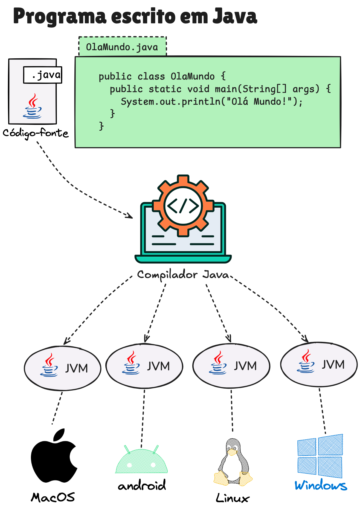

A linguagem de programação Java foi lançada pela Sun Microsystems em 1995 e rapidamente ganhou destaque por algumas características centrais como simplicidade relativa, portabilidade, segurança e robustez.

Um dos principais fatores para sua adoção em larga escala foi a introdução da JVM (Java Virtual Machine). Diferente de linguagens que compilam diretamente para código específico de um sistema operacional, o Java é compilado para um formato intermediário chamado *bytecode*. Esse bytecode é executado pela JVM, que atua como uma camada de abstração entre o programa e o sistema operacional.

Essa arquitetura permite que o mesmo programa Java seja executado em diferentes plataformas sem modificações, desde que exista uma JVM compatível. É desse conceito que surge o famoso slogan:

> "Write once, run anywhere" (Escreva uma vez, rode em qualquer lugar)

Linguagens de programação são formadas por um conjunto de regras sintáticas e semânticas que definem como os programas devem ser escritos e interpretados. No caso do Java, essas regras determinam como estruturar classes, métodos e instruções de forma que o compilador consiga entender e transformar o código em bytecode.

Quando escrevemos código Java, estamos criando instruções que serão posteriormente executadas pelo computador. Para que isso funcione corretamente, é necessário seguir uma estrutura bem definida e rígida, que garante consistência, legibilidade e previsibilidade no comportamento do programa.

Embora o Java possa ser executado em diferentes sistemas operacionais, a forma de escrever o código permanece a mesma. Essa padronização é um dos fatores que tornam a linguagem confiável e amplamente utilizada em diferentes contextos.